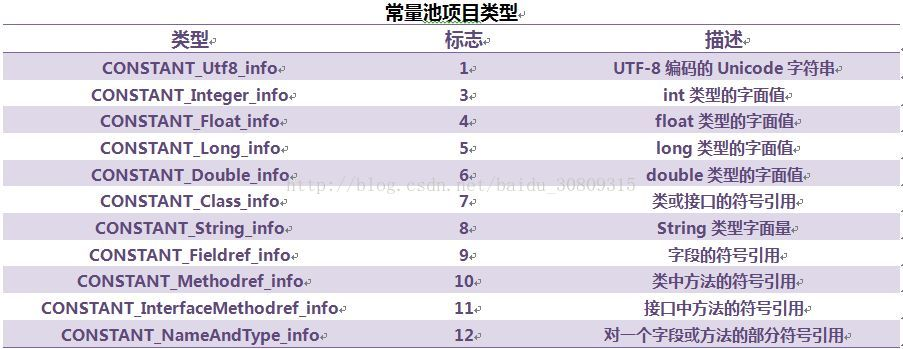
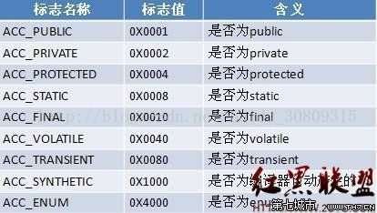
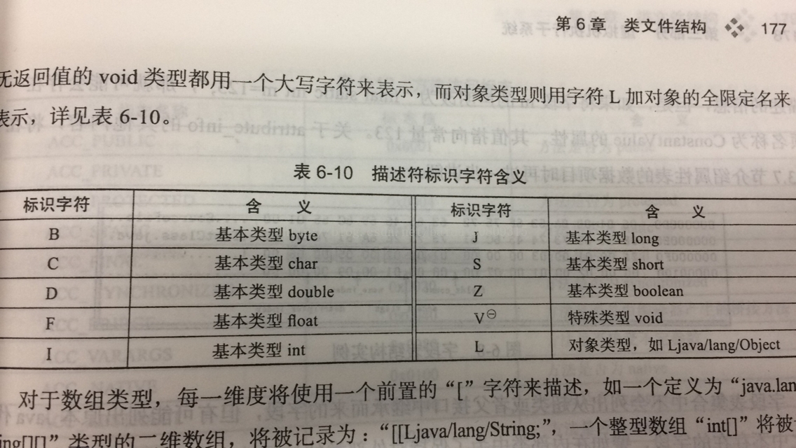
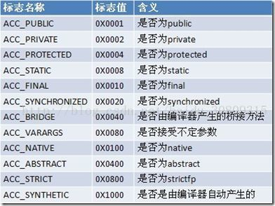

# 概述

> 越来越多的程序语言选择了与操作系统和机器指令集无关的、平台中立的格式作为程序编译后的存储格式；

# 无关性的基石

1. 所有平台都统一使用的程序存储格式——字节码ByteCode是构成平台无关性的基石；
2. Java的规范分为：java语言规范，Java虚拟机规范
3. 目前Clojure、Groovy、JRuby、Jython、Scala等都可以运行在java虚拟机，平台无关性-->语言无关性
4. java虚拟机只与“Class文件”这种特定的二进制文件格式所关联
5. 出于安全考虑，java虚拟机规范要求在class文件中使用许多强制性的语法和结构化约束；

# Class类文件的结构

> 可以参考博客： http://blog.csdn.net/zhoufenqin/article/details/51045890

1. 任何一个class文件都对应着一个类或接口的定义信息，反过来说，类或接口并不一定都得定义在文件里（譬如类或接口也可以通过类加载器直接生成）；

2. class文件是一组以8位字节为基础单位的二进制流，特点：

① 各个数据项目严格按照顺序紧凑地排列在Class文件之中，中间没有添加任何分隔符，这使得整个Class文件中存储的内容几乎全部是程序运行的必要数据，没有空隙存在；

② 当遇到需要占用8个字节以上空间的数据项时，则会按照高位在前的方式分割成若干个8位字节进行存储；

3. 根据java虚拟机规范，Class文件格式采用一种类似c语言结构体的伪结构来存储数据，这种伪结构张只有两种数据类型：无符号数和表

① 无符号数：属于基本的数据类型，以u1、u2、u4、u8来分别代表1个字节、2个字节、4个字节、8个字节的无符号数，无符号数可以用来描述数字、索引引用、数量值或者按照utf-8编码构成的字符串值；

② 表：由多个无符号数或其他作为数据项构成的复合数据类型，所有表都习惯性的以“_info”结尾。表用于描述有层次关系的复合结构的数据，整个Class文件本质上就是一张表；

③ 无论是无符号数还是表，当需要描述同一类型但数量不定的多个数据时，经常会使用一个前置的容量计数器加若干个连续的数据项的形式，此时称这一系列连续的某一类型的数据为某一类型的集合；

4. 魔数与Class文件的版本（可以用16进制编辑器winhex打开class文件查看）

① 每个class文件的头4个字节称为魔数，其唯一作用是确定这个文件是否为一个能被虚拟机接受的class文件（很多文件存储中都使用魔数来进行身份识别，如jpg等，基于安全考虑而不是使用扩展名）；

② class文件的魔数是：0xCAFEBABE；

③ 魔数后存储的是class文件的版本号：5、6字节是次版本号，7、8字节是主版本号，java版本号从45开始，高版本jdk向下兼容前版本的class文件，但不能运行以后版本的class文件（拒绝执行）；

④ 常量池：主版本号后是常量池入口（class文件的资源仓库），它是class文件结构中与其他项目关联最多的数据类型，也是占用空间最大的数据项目之一，同时也是在class文件中第一个出现的表类型数据项目；

⑤ 常量池存放两大类常量：字面量和符号引用

⑥ 字面量：如文本字符串、声明为final的常量值等

⑦ 符号引用：编译原理方面内容（包含类和接口的全限定名、字段的名称和描述符以及方法的名称和描述符）

⑧ 常量池中每一项常量都是一个表，jdk1.7共包含14长表，这些表都有一个特点，即表开始的第一位是一个u1类型的标志位，代表当前这个常量属于那种常量类型

⑨ java程序中如果定义了超过4kb英文字符的变量或方法，将会无法编译；

⑩ 常量池中常量的计算过程可以借助jdk的bin目录下的一个专门用于分析class文件字节码的工具：javap，使用方法如：javap -verbose TestClass 访问标志

5. 访问标志

① 常量池结束之后，紧接着的2个字节代表访问标志，这个标志用于识别一些类或者接口层次的访问信息，访问标志一共有16个

② 当前只定义了8个标志：java虚拟机规范中定义5种，jdk1.5增加了3种

6. 类索引、父类索引与接口索引集合

① 类索引和父类索引都是一个u2类型的数据，而接口索引集合是一组u2类型的数据的集合

② class文件中又这3项数据来确定这个类的继承关系

③ 类索引：用于确定这个类的全限定名

④ 父类索引：用于确定这个类的父类的全限定名，因java是单继承，故父类索引唯一，除java.lang.Object外所有java类均有父类，故父类索引不为0

⑤ 接口索引集合：描述这个类实现了哪些接口，这些接口按implements（若本身就是接口，则应为extends）后的接口顺序从左到右排列在索引集合中

⑥ 他们排列在访问标志之后

7. 字段表集合

① 字段表：用于描述接口或者类中声明的变量；

② 字段：包括类级变量、实例级变量，但不包括在方法内部声明的局部变量；

③ 字段访问标志：

④ 跟随访问标志的是两项索引值：name_index和descriptor_index，都是对常量池的引用，分别代表着字段的简单名称以及字段和方法的描述符；

⑤ 全限定名与简单名称：类似“org/fenixsoft/clazz/TestClass”，结尾添加“；”表示全限定名结束，而简单名称指没有类型和参数修饰的方法或者字段名称；

⑥ 方法的描述符：作用是用来描述字段的数据类型、方法的参数列表（包括数量、类型以及顺序）和返回值；

⑦ 描述符标识字符含义

8. 方法表集合

① Class文件存储格式中对方法的描述和对字段的描述几乎采用了完全一致的方式，同样包含访问标志、名称索引、描述符索引、属性表集合这四项

② 方法访问标志

9. 属性表集合

① 在Class文件、字段表、方法表都可以携带自己的属性表集合，以用于描述某些场景专有的信息；

② 为了正确解析Class文件，java虚拟机规范中定义了21项虚拟机实现应当能识别的属性（Java虚拟机运行时会忽略掉它不认识的属性）

③ code属性：java程序方法体中的代码经过javac编译处理后，最终变为字节码指令存储在Code属性内，接口和抽象类不存在code属性，code属性是class文件中最重要的一个属性，class文件中，code属性用于描述代码，所有其他数据项目都用于描述元数据；

④ java虚拟机执行字节码是基于栈的体系结构，但与一般基于堆栈的零字节指令又不太一样，某些指令后面还会带有参数；

⑤ Exceptions属性：与code属性平级，作用是列举出方法中可能抛出的受查异常，也就是方法描述时在throws关键字后面列举的异常；

⑥ LineNumberTable属性：运行时非必要属性，描述java源码行号与字节码行号（字节码偏移量）之间的对应关系，如不生成此属性（可以在javac中使用-g:none或-g:lines取消生成这项信息），抛出异常时将看不到出错的行号；

⑦ LocalVariableTable属性：运行时非必要属性，描述栈帧中局部变量表中的变量与java源码中定义的变量之间的关系，jdk1.5新增LocalVariableTypeTable来应对泛型；

⑧ SourceFile属性：用于记录生成这个Class文件的源码文件名称，可选属性（运行时非必要），定长属性；

⑨ ConstantValue属性：作用是通知虚拟机自动为静态变量赋值，即static修饰的才可以使用此属性（非static变量赋值是在实例构造器<init>方法中进行；而对于类变量有两种方式可以选择，在类构造器<cinit>方法中或使用ConstantValue属性，Sun Javac编译器是这样的：static+final，使用ConstantValue，若非final或非基本类型及字符串，使用<cinit>方法中进行初始化）；

⑩ InnerClasses属性：定义了内部类与宿主类之间的关联关系；

① Deprecated属性：类似程序中的@Deprecated注解，指某个类或方法，字段不在被作者推荐使用；

② Synthetic属性：代表此字段或方法不是由java源码直接产生，而是编译器自行添加的；

③ StackMapTable属性：复杂的变长属性，位于code属性的属性表中，这个属性会在虚拟机加载的字节码验证阶段被新类型检查验证器使用，目的在于代替以前比较消耗性能的基于数据流分析的类型推导验证器；

④ Signature属性：可选定长属性，可以出现于类、属性表和方法表结构的属性表中，用于记录泛型签名信息；

⑤ BootstrapMethods属性：复杂变长属性，用于保存invokedynamic指令引用的引导方法限定符；

# 字节码指令简介

1. java虚拟机的指令由一个字节长度的、代表着某种特定操作含义的数字（称为操作码，Opcode）以及跟随其后的零至多个代表此操作所需参数（称为操作数，Operands）而构成。

2. 由于java虚拟机采用面向操作数栈而不是寄存器的架构，所以大多数的指令都不包含操作数，只有一个操作码；

3. java虚拟机操作码长度为1字节（0~255），即总数不能超过256条；同时放弃了操作数长度对齐，损失一些性能，追求小数据量、高传输效率的提升；

4. 字节码与数据类型

① Java虚拟机的指令集对于特定的操作只提供了有限的类型相关指令去支持他，即并非每种数据类型和每一种操作都有对应的指令；

② 加载和存储指令：将数据在栈帧中的局部变量表和操作数栈之间来回传输；

③ 两个操作数栈上的值进行某种特定运算，并把结果重新存入到操作栈顶，分两种：对整形数据的运算指令和对浮点型数据运算的指令；

④ 类型转换指令：转型；

⑤ 对象创建与访问指令：jvm对类实例和数组的创建与操作使用了不同的字节码指令；

⑥ 操作数栈管理指令：栈操作；

⑦ 控制转移指令：可以让jvm有条件或无条件地从指定的文职指令而不是控制转移指令的下一条指令继续执行程序；

⑧ 方法调用和返回指令

⑨ 异常处理指令

⑩ 同步指令：两种同步：方法级的同步（隐式的，无需通过字节码指令来控制）和方法内部一段指令序列的同步（通常是java的synchronized语句块），他们都是使用管程来支持的；

5. 公有设计和私有实现

① jvm规范描绘了jvm应有的共同程序存储格式：Class文件格式以及字节码指令集，这些内容与具体硬件、OS及具体jvm的实现是完全独立的，可以称为公有设计，而私有实现是指只要优化后的Class文件依然可以被正确读取，并且其中语义能得到完整的支持，那实现者可以选择任何方式去实现这些语义，只要它在外部接口上看起来与规范描述一致即可；

② vm实现的方式：1.将输入的java虚拟机代码在加载或执行时翻译成另外一种虚拟机的指令集；2.将输入的Java虚拟机代码在加载或执行时翻译成宿主机CPU的本地指令集（即JIT代码生成技术）

