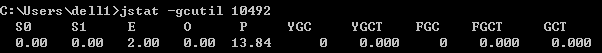

> 说明：书中作者介绍的的基于windows平台下的JDK1.6 Update 21

可以参考：

http://www.cnblogs.com/SilentHYmn/p/5186486.html

http://blog.csdn.net/coslay/article/details/48932277

# JDK命令行工具

## 前言

① JDK命令行工具基本位于bin目录下，主要功能代码位于jdk/lib/tools.jar中，Linux中有很多直接是shell脚本写的；

② 包含功能强大的监控分析功能；

③ JDK1.5要开启JMX管理功能，-Dcom.sun.managerment.jmxremote；1.6默认开启

④ Sun JDK监控和故障处理工具：

|属性	| 作用 |
| ---| --- |
|-p |	只输出LVMID，省略主类的名称|
|-m	|输出虚拟机进程启动时传递给主类main（）函数的参数|
|-l	|输出主类的全名，如果进程执行的是jar包，输出jar路径|
|-v	|输出虚拟机进程启动时jvm参数|

## jps：虚拟机进程状况工具
① 使用频率最高的JDK命令行工具；

② 格式： `jps [ options ]  [ hostid ]`   ；

③ jps可以通过RMI协议查询开启了RMI服务的远程虚拟机进程状态，上面的hostid即为RMI注册表中注册的主机名；

④ 参数：-q、-m、-l、-v；

## jstat：虚拟机统计信息监视工具
① 用于监视虚拟机各种运行状态信息

② 可以显示本地或者远程虚拟机进程中的类装载、内存、垃圾收集、JIT编译等运行数据；

③ 格式：`jstat [ option vmid [ interval[s|ms][count] ]  ]`

④ vmid与lvmid：若是本地虚拟机进程，vmid和lvmid一致；若是远程虚拟机进程，vmid格式为：[  protocol:  ] [  //  ]  lvmid [  @hostname:[ :port ]/servername  ]

⑤ interval和count：查询间隔和次数；

⑥ option：代表用户希望查询的虚拟机信息，分3类：类装载、垃圾收集、运行期编译状况；

⑦ 实例： jstat -gc 2764 250 20；意思是每250ms查询一次进程2764垃圾收集状况，一共查询20次；

⑧ jstat工具主要选项（参数）：

|选项	|作用 |
|---|---|
|-class|监视装载类、卸载类、总空间以及类装载所耗费的时间|
|-gc|监视java堆状况，包括eden区、两个survivor区、老年代、永久代等的容量、已用空间、GC时间合计信息|
|-gccapacity|监视内容与-gc基本相同，但输出主要关注java堆各个区域使用到最大、最小空间|
|-gcutil|监视内容与-gc基本相同，但输出主要关注已使用控件占总空间的百分比|
|-gccause|与-gcutil功能一样，但是会额外输出导致上一次gc产生的原因|
|-gcnew|监视新生代GC情况|
|-gcnewcapacity|监视内容与-gcnew基本相同，输出主要关注使用到的最大、最小空间|
|-gcold|监视老年代GC情况|
|-gcoldcapacity|监视内容与-gcold基本相同，输出主要关注使用到的最大、最小空间|
|-gcpermcapacity	|输出永久代使用到的最大、最小空间|
|-compiler|输出JIT编译过的方法、耗时等信息|
|-printcompilation|输出已经被JIT编译过的方法|

⑨ 执行样例

- E表示Eden区使用了2%的空间；
- S0、S1表示Survivor区为空的；
- O表示老年代为空；
- P表示永久代使用了13.84%；
- YGC表示程序运行以来共发生Minor GC o次；
- FGC表示Full GC共发生0次；
- GCT表示所有GC总耗时0秒；

## jinfo：java配置信息工具
① 作用：实时查看和调整虚拟机各项参数；

② 格式：`jinfo  [ option ]  pid`;

③ 实例：查询CMSInitiatingOccupancyFraction参数值： jinfo -flag CMSInitiatingOccupancyFraction 1444

## jmap：java内存映像工具
① 作用：用于生成堆转储快照（一般称为heapdump或dump文件），查询finalize执行队列、java堆和永久代的详细信息（如空间使用率、当前用的是哪种收集器等）；

② 格式：`jmap  [ option ]  vmid`;

|选项	|作用|
|---|---|
|-dump	|生成java堆转储快照。格式为： -dump:[live,]format=b,file=<filename>,其中live子参数说明是否只dump出存活的对象|
|-finalizerinfo|	显示在F-Queue中等待Finalizer线程执行finalize方法的对象。只在Linux/Solaris平台下有效|
|-heap	|显示java堆详细信息，如使用哪种收集器、参数配置、分代情况等，在Linux/Solaris平台下有效|
|-jisto|	显示堆中对象统计信息，包含类、实例对象、合集容量|
|-permstat|	以ClassLoader为统计口径显示永久代内存状态。只在Linux/Solaris平台下有效|
|-F	|当虚拟机进程对-dump选项没有相应时。可使用这个选项强制生成dump快照。只在Linux/Solaris平台下有效|

③ 实例：使用jmap生成一个正在运行的Eclipse的dump快照文件，例子中3500是通过jps命令查询到的lvmid： jmap  -dump:format=b,file=eclipse.bin 3500

## jhat：虚拟机堆转储快照分析工具
① 与jmap搭配使用，分析结果可在浏览器中查看；

② 作者建议不适用这个工具，有俩原因功能简陋且分析耗时；

## jstack：java堆栈跟踪工具
① 作用：用于生成虚拟机当前时刻的线程快照（一般称为threaddump或者javacore文件），生成目的主要是定位线程出现长时间停顿的原因，如死锁、死循环、请求超时等；

② 格式：`jstack [ option ]  vmid`;

③ 选项（参数）：

|选项	|作用|
|---|---|
|-F	|当正常输出的请求不被响应时，强制输出线程堆栈|
|-l|	除堆栈外，显示关于锁的附加信息|
|-m	|如果调用到本地方法的话，可以显示c/c++的堆栈|

## HSDIS：JIT生成代码反汇编
① 说明：Sun推荐的HotSpot虚拟机JIT编译代码的反汇编插件，包含在HotSpot虚拟机源码中；

② 作用：让HotSpot的-XX:+PrintAssembly指令调用它来把动态生成的动态代码还原为汇编代码输出，同时生成大量非常有价值的注释；

