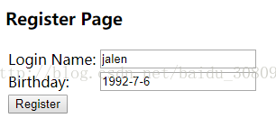
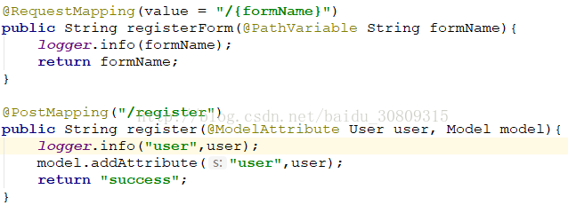
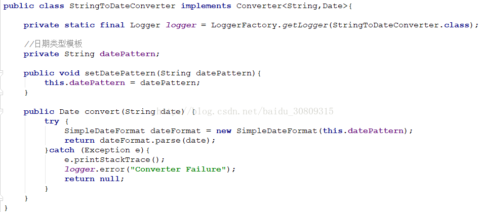
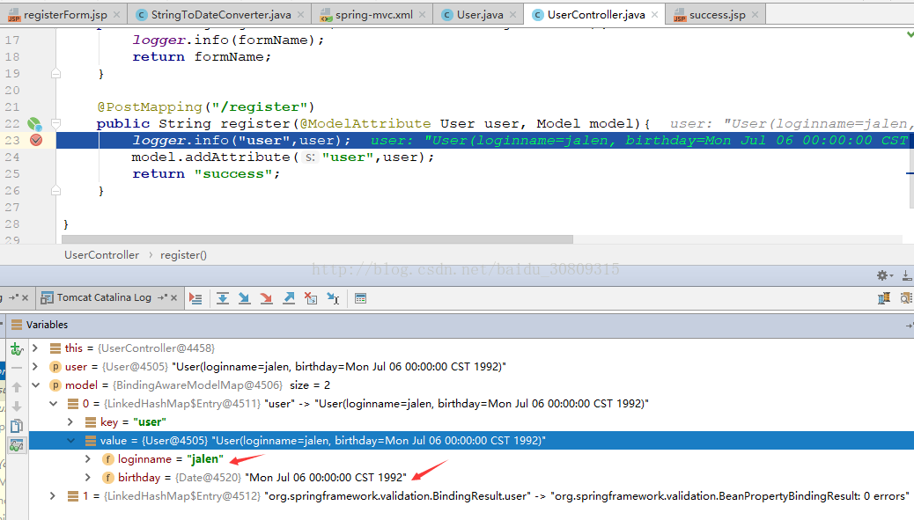

场景：spring mvc中jsp页面向后台传入的数据类型都是String，这里将String转换成Date对象

1. 表单页面与显示效果：registerForm.jsp

```jsp
<%@ page contentType="text/html;charset=UTF-8" language="java" %>
<html>
<head>
    <title>Register</title>
</head>
<body>
 
<h3>Register Page</h3>
<form action="register" method="post">
    <table>
        <tr>
            <td><label>Login Name:</label></td>
            <td><input type="text" id="loginname" name="loginname"></td>
        </tr>
        <tr>
            <td><label>Birthday:</label></td>
            <td><input type="text" id="birthday" name="birthday"></td>
        </tr>
        <tr>
            <td><input type="submit" value="Register"></td>
        </tr>
    </table>
</form>
 
</body>
</html>
```



2. 成功页面：success.jsp

```jsp
<%@ page contentType="text/html;charset=UTF-8" language="java" %>
<html>
<head>
    <title>Success</title>
</head>
<body>
 
<h3>You are success</h3>
 
</body>
</html>
```

3. 控制器：UserController.java



4. 类型转换器：StringToDateConverter.java



5. spring mvc配置文件添加转换器

```xml
<!-- 装载自定义的类型转换器 -->
    <mvc:annotation-driven conversion-service="conversionService"/>
 
    <!-- 自定义的类型转换器 -->
    <bean id="conversionService" class="org.springframework.context.support.ConversionServiceFactoryBean">
        <property name="converters">
            <list>
                <bean class="com.demo.converter.StringToDateConverter" p:datePattern="yyyy-MM-dd"></bean>
            </list>
        </property>
    </bean>
```

6. 结果


