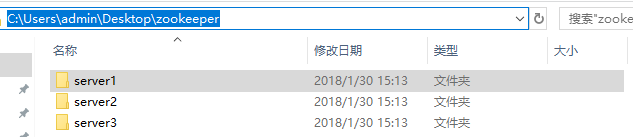
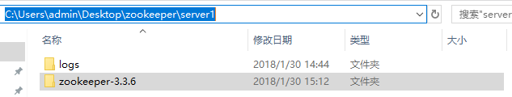
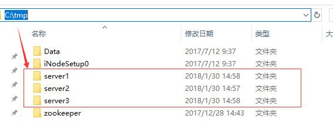
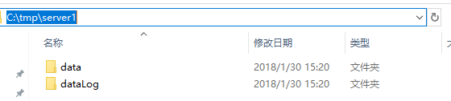
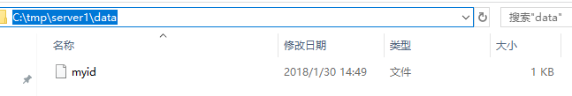
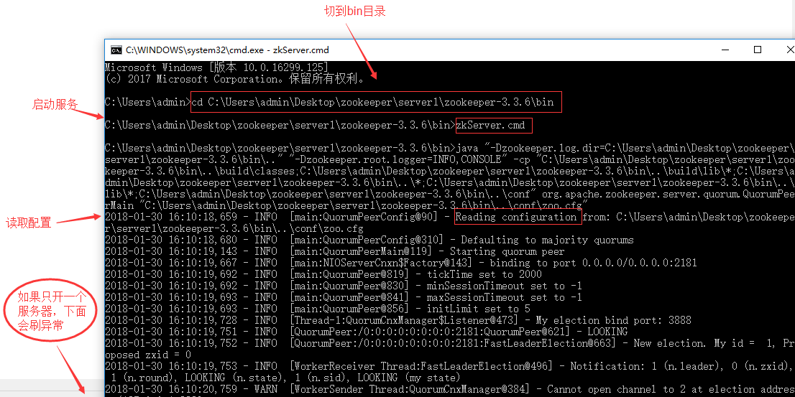
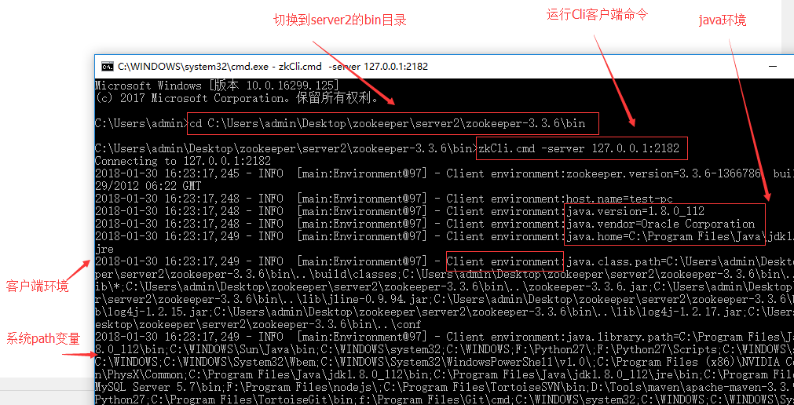
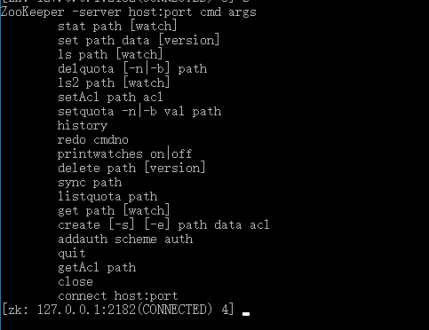

说明：简单尝试使用windows10搭建zookeeper


（1）下载zookeeper（地址见附录），解压下载后的zookeeper-3.3.6.tar.gz。

（2）直接从桌面新建文件夹：zookeeper，在zookeeper文件夹下面新建3个子文件夹server1、server2、server3，分别将上面解压的服务器复制一份过去，代表3个服务器。




（3）在每个server文件夹下创建文件夹：logs。



（4）修改配置文件，在每个zookeeper-3.3.6\conf目录下新建zoo.cfg，每个server的修改如下（注意端口不要一致）：

server1：

```bash
tickTime=2000
initLimit=5
syncLimit=2
dataDir=/tmp/server1/data
dataLogDir=/tmp/server1/dataLog
clientPort=2181
server.1=127.0.0.1:2888:3888
server.2=127.0.0.1:2889:3889
server.3=127.0.0.1:2890:3890
```

server2：

```bash
tickTime=2000
initLimit=5
syncLimit=2
dataDir=/tmp/server2/data
dataLogDir=/tmp/server2/dataLog
clientPort=2182
server.1=127.0.0.1:2888:3888
server.2=127.0.0.1:2889:3889
server.3=127.0.0.1:2890:3890
```

server3：

```bash
tickTime=2000
initLimit=5
syncLimit=2
dataDir=/tmp/server3/data
dataLogDir=/tmp/server3/dataLog
clientPort=2183
server.1=127.0.0.1:2888:3888
server.2=127.0.0.1:2889:3889
server.3=127.0.0.1:2890:3890
```

注意这里面的路径，在第（5）步我们有创建。

（5）直接从C盘创建tmp文件夹，该文件夹下创建3个子文件加，如下



每一个server下创建data文件夹和dataLog文件夹，如下



在每个data文件夹下创建myid文件，注意不要后缀名，如下



server1的myid文件里写1，server2的myid文件里写2，server3的myid文件里写3（注意都是只写一个数字，然后保存）.

（6）此时我们切换到server1的zookeeper的bin目录，按住win+R，打开cmd命令行，如下操作



开第一个服务器会有异常，不用理会，因为现在集群只起了1台server，zookeeper服务器端起来会根据zoo.cfg的服务器列表发起选举leader的请求，因为连不上其他机器而报错，当打开server2服务就好了。那么当我们起第二个zookeeper实例后，leader将会被选出，从而一致性服务开始可以使用，这是因为3台机器只要有2台可用就可以选出leader并且对外提供服务(2n+1台机器，可以容n台机器挂掉)。

（7）接下来就可以使用了，我们来测试一下2182端口的服务，新打开一个cmd窗口



从下面光标处键入命令就可以了。



附录（参考地址）：

博客园：

http://www.blogjava.net/BucketLi/archive/2010/12/21/341268.html

CSDN：

http://blog.csdn.net/morning99/article/details/40426133

官方网站：

http://zookeeper.apache.org/doc/current/zookeeperStarted.html

Zookeeper基本命令简介：

https://leehao.me/ZooKeeper%E5%91%BD%E4%BB%A4%E7%AE%80%E4%BB%8B/


zookeeper官方镜像下载地址：

http://mirrors.hust.edu.cn/apache/zookeeper/
http://mirrors.hust.edu.cn/apache/zookeeper/zookeeper-3.3.6/  我下载的是3.3.6


zookeeper+tomcat+sorl集群网上比较多，有时间尝试下
