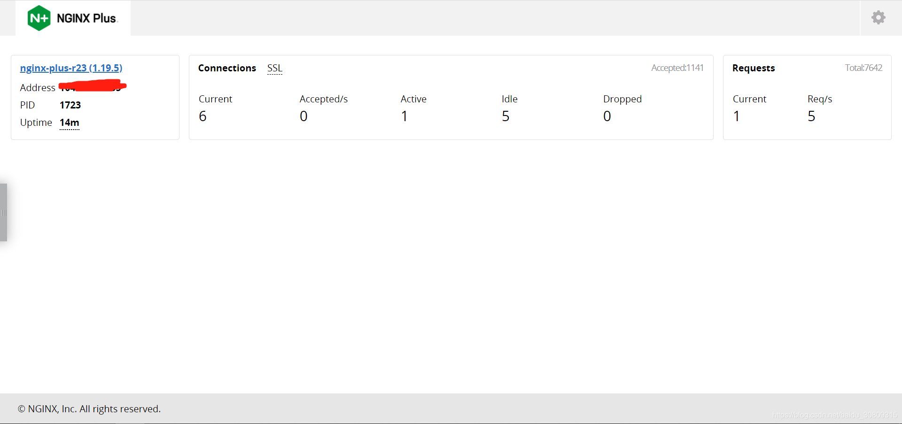
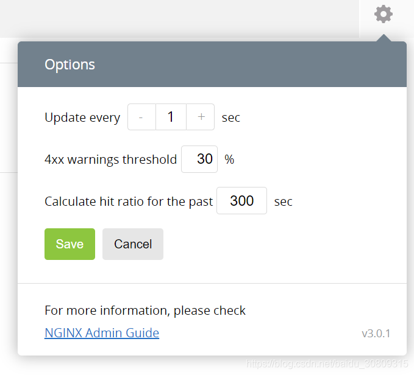

```
nginx plus实时活动监控
 
参考：https://www.nginx.com/blog/live-activity-monitoring-nginx-plus-3-simple-steps
 
1.安装
（1）下载配置文件样例：
cd /etc/nginx/conf.d/
wget https://gist.githubusercontent.com/nginx-gists/a51341a11ff1cf4e94ac359b67f1c4ae/raw/bf9b68cca20c87f303004913a6a9e9032f24d143/nginx-plus-api.conf
或者去https://gist.github.com/nginx-gists/a51341a11ff1cf4e94ac359b67f1c4ae上复制内容
（2）Reload
nginx -t && nginx -s reload
（3）打开http://nginx-plus-server-address:8080/
 
 
 
2.配置文件
# This sample NGINX Plus configuration enables the NGINX Plus API, for live 
# activity monitoring and the built-in dashboard, dynamic configuration of 
# upstream groups, and key-value stores. Keep in mind that any features 
# added to the API in future NGINX Plus releases will be enabled 
# automatically by this file.
# Created in May 2018 by NGINX, Inc. for NGINX Plus R14 and later.
 
# Documentation: 
# https://docs.nginx.com/nginx/admin-guide/monitoring/live-activity-monitoring/
# https://www.nginx.com/blog/live-activity-monitoring-nginx-plus-3-simple-steps
 
# To conform with the conventional configuration scheme, place this file in 
# the /etc/nginx/conf.d directory and add an 'include' directive that 
# references it in the main configuration file, /etc/nginx/nginx.conf, 
# either by name or with a wildcard expression. Then validate and reload
# the configuration, for example with this command:
#
#     nginx -t && nginx -s reload
 
# Note that additional directives are required in other parts of the 
# configuration:
#
# For metrics to be gathered for an HTTP or TCP/UDP virtual server, you must 
# include the 'status_zone' directive in its 'server' block. See: 
# http://nginx.org/r/status_zone
#
# Similarly, for metrics to be gathered for an upstream server group, you 
# must include the 'zone' directive in the 'upstream' block. See:
# http://nginx.org/r/zone
#
# For more information and instructions, see:
# https://docs.nginx.com/nginx/admin-guide/monitoring/live-activity-monitoring#status_data
 
# We strongly recommend that you restrict access to the NGINX Plus API so 
# that only authorized users can view metrics and configuration, change 
# configuration, or both. Here are a few options:
#
# (1) Configure your firewall to limit access to port 8080.
#
# (2) Use SSL/TLS client certificates. See:
#    https://docs.nginx.com/nginx/admin-guide/security-controls/terminating-ssl-http/
#
# (3) Enable HTTP Basic authentication (RFC 7617) by uncommenting the 
#    'auth_basic*' directives in the 'server' block below. You can add users 
#    with an htpasswd generator, which is readily available, or reuse an 
#    existing htpasswd file (from an Apache HTTP Server, for example).  See: 
#    http://nginx.org/en/docs/http/ngx_http_auth_basic_module.html
#
# (4) Enable access from a defined network and disable it from all others, 
#    by uncommenting the 'allow' and 'deny' directives in the 'server' block
#    below and specifying the appropriate network ranges. See: 
#    http://nginx.org/en/docs/http/ngx_http_access_module.html
#
# You can create further restrictions on write operations, to distinguish
# between users with read permission and those who can change configuration.
# Uncomment the sample 'limit_except' directive in the 'location api' 
# block below. In addition to the HTTP Basic authentication shown, other 
# authentication schemes are supported. See: 
# http://nginx.org/r/limit_except
 
server {
    # Conventional port for the NGINX Plus API is 8080
    listen 8080;
 
    # Uncomment to use HTTP Basic authentication; see (3) above
    #auth_basic "NGINX Plus API";
    #auth_basic_user_file /etc/nginx/users;
 
    # Uncomment to use permissions based on IP address; see (4) above
    #allow 10.0.0.0/8;
    #deny all;
 
    # Conventional location for accessing the NGINX Plus API 
    location /api/ {
        # Enable in read-write mode
        api write=on;
 
        # Uncomment to further restrict write permissions; see note above
        #limit_except GET {
            #auth_basic "NGINX Plus API";
            #auth_basic_user_file /etc/nginx/admins;
        #}
    }
 
    # Conventional location of the NGINX Plus dashboard
    location = /dashboard.html {
        root /usr/share/nginx/html;
    }
 
    # Redirect requests for "/" to "/dashboard.html"
    location / {
        return 301 /dashboard.html;
    }
 
    # Redirect requests for pre-R14 dashboard
    location /status.html {
        return 301 /dashboard.html;
    }
}
```



