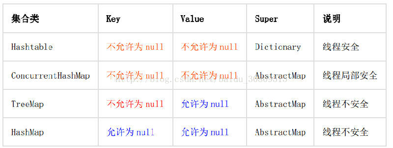

1. 【强制】 Map/Set 的 key 为自定义对象时，必须重写 hashCode 和 equals。
   正例： String 重写了 hashCode 和 equals 方法，所以我们可以非常愉快地使用 String 对象作
   为 key 来使用。
   （不想重写，可以把你的对象转成String）

2. 【强制】 ArrayList 的 subList 结果不可强转成 ArrayList，否则会抛出 ClassCastException
   异常： java.util.RandomAccessSubList cannot be cast to java.util.ArrayList ;
   说明： subList 返回的是 ArrayList 的内部类 SubList，并不是 ArrayList ，而是 ArrayList
   的一个视图，对于 SubList 子列表的所有操作最终会反映到原列表上。
   （对于 SubList 子列表的所有操作最终会反映到原列表，就像对Arrays.asList操作，最终还会反映到array上）

3. 【强制】在 subList 场景中， 高度注意对原集合元素个数的修改，会导致子列表的遍历、增加、
   删除均产生 ConcurrentModificationException 异常。

4. 【强制】使用集合转数组的方法，必须使用集合的 toArray(T[] array)，传入的是类型完全
   一样的数组，大小就是 list.size()。
   反例： 直接使用 toArray 无参方法存在问题，此方法返回值只能是 Object[]类，若强转其它
   类型数组将出现 ClassCastException 错误。
   正例：
```java
List<String> list = new ArrayList<String>(2);
list.add("guan");
list.add("bao");
String[] array = new String[list.size()];
array = list.toArray(array);
```
说明： 使用 toArray 带参方法，入参分配的数组空间不够大时， toArray 方法内部将重新分配
内存空间，并返回新数组地址；如果数组元素大于实际所需，下标为[ list.size() ]的数组
元素将被置为 null，其它数组元素保持原值，因此最好将方法入参数组大小定义与集合元素个数一致。

5. 【强制】使用工具类 Arrays.asList()把数组转换成集合时，不能使用其修改集合相关的方法，
   它的 add/remove/clear 方法会抛出 UnsupportedOperationException 异常。
   说明： asList 的返回对象是一个 Arrays 内部类，并没有实现集合的修改方法。 Arrays.asList
   体现的是适配器模式，只是转换接口，后台的数据仍是数组。
   String[] str = new String[] { "a", "b" };
   List list = Arrays.asList(str);
   第一种情况： list.add("c"); 运行时异常。
   第二种情况： str[0]= "gujin"; 那么 list.get(0)也会随之修改。
（list底层以数组实现，默认长度为10）

6. 【强制】泛型通配符<? extends T>来接收返回的数据，此写法的泛型集合不能使用 add 方法。
   说明： 苹果装箱后返回一个<? extends Fruits>对象，此对象就不能往里加任何水果，包括苹果。
   （还没用过）

7. 【强制】不要在 foreach 循环里进行元素的 remove/add 操作。 remove 元素请使用 Iterator
   方式，如果并发操作，需要对 Iterator 对象加锁。
   反例：
```java
List<String> a = new ArrayList<String>();
a.add("1");
a.add("2");
for (String temp : a) {
    if("1".equals(temp)){
        a.remove(temp);
    }
}
```
说明： 这个例子的执行结果会出乎大家的意料，那么试一下把“1” 换成“2” ，会是同样的结吗？
正例：
```java
Iterator<String> it = a.iterator();
while(it.hasNext()){
    String temp = it.next();
    if(删除元素的条件){
        it.remove();
    }
}
```

8. 【强制】在 JDK7 版本以上， Comparator 要满足自反性，传递性，对称性，不然 Arrays.sort，
   Collections.sort 会报 IllegalArgumentException 异常。
   说明：
   - 1） 自反性： x， y 的比较结果和 y， x 的比较结果相反。
   - 2） 传递性： x>y,y>z,则 x>z。
   - 3） 对称性： x=y,则 x,z 比较结果和 y， z 比较结果相同。

   反例： 下例中没有处理相等的情况，实际使用中可能会出现异常：
```java
new Comparator<Student>() {
    @Override
    public int compare(Student o1, Student o2) {
    return o1.getId() > o2.getId() ? 1 : -1;
    }
}
```
（考虑要全面）

9. 【推荐】集合初始化时，尽量指定集合初始值大小。
   说明： ArrayList 尽量使用 ArrayList(int initialCapacity) 初始化。

10. 【推荐】使用 entrySet 遍历 Map 类集合 KV，而不是 keySet 方式进行遍历。
说明： keySet 其实是遍历了 2 次，一次是转为 Iterator 对象，另一次是从 hashMap 中取出 key
所对应的 value。而 entrySet 只是遍历了一次就把 key 和 value 都放到了 entry 中，效率更
高。如果是 JDK8，使用 Map.foreach 方法。
正例： values()返回的是 V 值集合，是一个 list 集合对象； keySet()返回的是 K 值集合，是
一个 Set 集合对象； entrySet()返回的是 K-V 值组合集合
（这个在写map计数器时，用了keyset，应该用entrySet的）

11. 【推荐】高度注意 Map 类集合 K/V 能不能存储 null 值的情况，如下表格：

    反例： 很多同学认为 ConcurrentHashMap 是可以置入 null 值。 在批量翻译场景中，子线程分
    发时，出现置入 null 值的情况，但主线程没有捕获到此异常，导致排查困难。

12. 【参考】合理利用好集合的有序性(sort)和稳定性(order)，避免集合的无序性(unsort)和不
稳定性(unorder)带来的负面影响。
说明： 稳定性指集合每次遍历的元素次序是一定的。有序性是指遍历的结果是按某种比较规则
依次排列的。如： ArrayList 是 order/unsort； HashMap 是 unorder/unsort； TreeSet 是
order/sort。
（这个没有注意过）

13. 【参考】利用 Set 元素唯一的特性，可以快速对另一个集合进行去重操作，避免使用 List 的
contains 方法进行遍历去重操作。
（去重）
