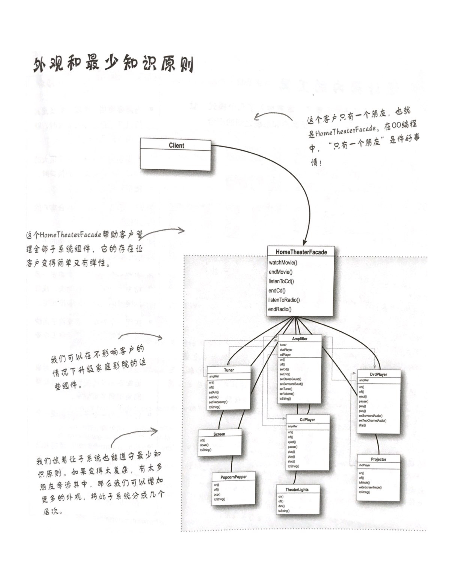

前言：在学习适配器模式与外观模式时，我们会接触到这个原则。

# 什么是最少知识原则？

最少知识（least knowledge）原则：只和你的密友谈话。

什么意思呢？就是告诉我们要减少对象之间的交互，只留下几个“密友”。

所以，当你设计一个系统时，不管是任何对象，你都要注意它所交互的类有哪些，并注意它和这些类是如何交互的。

这个原则希望我们能够在设计中，减少类耦合，免得牵一发而动全身，使系统变得易碎、复杂、维护成本增加等。

# 违反该原则的例子

```java
    public float getTemp(){
        // 这里违反最少知识原则了，因为在此调用的方法属于另一次调用的返回对象
        return station.getThermoeter().getTemperature();
    }
```

# 怎样避免违反呢？

即我们只调用以下范围的方法：

（1）该对象本身；

（2）被当作方法的参数而传递进来的对象；

（3）此方法所创建或实例化的任何对象；

（4）对象的任何组件；

例子：

```java
    /**
     * 反例
     * 这里，我们从气象站取得了温度计（thermometer）对象，然后在从温度计对象取得温度
     *
     * @return 温度
     */
    public float getTemp(){
        Thermometer thermometer = station.getThermometer();
        return thermometer.getTemperature();
    }
```

```java
    /**
     * 正例
     * 此时我们直接在气象站加进一个方法，用来向温度计请求温度，这可以减少我们所依赖的类的数目
     *
     * @return 温度
     */
    public float getTemp(){
        return station.getTemperature();
    }
```

# 将方法调用保持在界限内

```java
public class Car {
 
    /**
     * 发动机（这是类的一个组件，我们能够调用它的方法）
     */
    Engine engine;
    
    public Car(){
        // 初始化发动机
    }
 
    /**
     * 例子
     * 
     * @param key key是被当作参数传递进来的对象，它的方法可以被调用
     */
    public void start(Key key){
        // 这里创建了一个新的对象，其方法可以被调用
        Doors doors = new Doors();
 
        boolean authorized = key.turns();
 
        if (authorized){
            engine.start(); // 可以调用对象组件的方法
            updateDashboardDisplay();  //可以调用同一个对象内的本地方法
            doors.lock();  //可以调用你所创建或实例化的对象的方法
        }
    }
 
    public void updateDashboardDisplay(){
        // 更新显示
    }
}
```

# 相关问答

（1）还有另一个原则，叫做得墨忒耳法则（law of demeter），它和最少知识原则有什么关系？

答：它们指的是同一个原则。我们倾向于使用最少知识原则来称呼它。

（2）采用最少知识原则有什么缺点吗？

答：是的，虽然这个原则减少了对象之间的依赖，研究显示这会减少软件的维护成本；但是采用这个原则也会导致更多的“包装”类被制造出来，以处理和其他组件的沟通，这可能会导致复杂度和开发时间的增加，并降低运行时的性能。

# 外观模式和最少知识原则（外观模式中最少知识原则的体现）



# java中有些违反最少知识原则的例子，如

```java
System.out.println();
```
