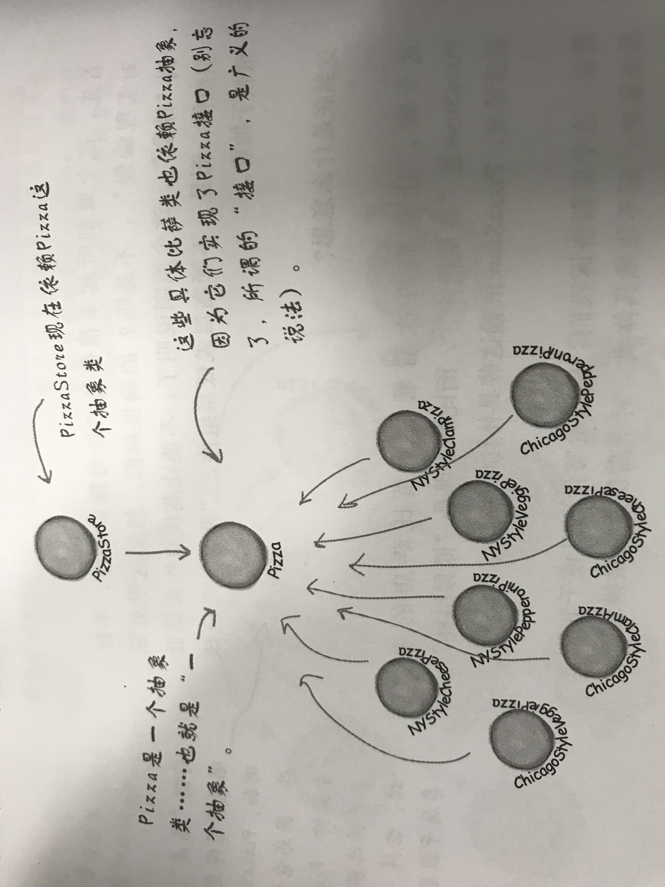

# 先看一个例子

假如你是一个比萨店店长，现在你这样管理你的产品。

```java
public class DependentPizzaStore {
 
    public Pizza createPizza( String style, String type ){
        Pizza pizza = null;
 
        // 合肥/深圳风味比萨具体实例化对象
        if ( style.equals("HF") ){
            if ( type.equals("cheese") ){
                pizza = new HFStyleCheesePizza();
            }else if ( type.equals("veggie") ){
                pizza = new HFStyleVeggiePizza();
            }else if ( type.equals("clam") ){
                pizza = new HFStyleClamPizza();
            }else if ( type.equals("pepperoni") ){
                pizza = new HFStylePepperoniPizza();
            }
        }else if ( style.equals("SZ") ){
            if ( type.equals("cheese") ){
                pizza = new HFStyleCheesePizza();
            }else if ( type.equals("clam") ){
                pizza = new HFStyleClamPizza();
            }else if ( type.equals("pepperoni") ){
                pizza = new HFStylePepperoniPizza();
            }
        }else {
            System.out.println("Error: invalid type of pizza");
            return null;
        }
        
        pizza.prepare();
        pizza.bake();
        pizza.cut();
        pizza.box();
        
        return pizza;
    }
}
```

由上面代码可以看出：

- 这个版本的PizzaStore依赖于所有的比萨对象，因为它直接创建这些比萨对象；
- 如果这些类的实现改变了，那么可能必须修改PizzaStore；
- 因为对于比萨具体实现的任何改变都会影响到PizzaStore。我们说PizzaStore依赖于比萨的实现；
- 每增加一个比萨种类，就等于让PizzaStore多了一个依赖；

可以看到上面代码中，依赖对象很多。

当你实例化一个对象时，就是在依赖它的具体类。

上面的例子中，是由比萨店类来创建所有的比萨对象，而不是委托给工厂。

# 依赖倒置原则（DIP-Dependency Inversion Principle）

由上面的反例，我们可以看到，PizzaStore是“高层组件”，而比萨实现是“底层组件”，很清楚地，PizzaStore依赖这些具体的比萨类。

其实，代码里减少对于具体类的依赖是意见“好事”。这就引出了一个OO设计原则，即依赖倒置原则DIP。

依赖倒置原则定义：要依赖抽象，不要依赖具体类。

工厂方法模式是依赖倒置原则的一种体现。如图



此时高层组件PizzaStore和底层组件（就是这些比萨）都依赖了Pizza抽象。

# 遵循依赖倒置原则

- 变量不可以持有具体类的引用；
- 不要让类派生自具体类；
- 不要覆盖基类中已实现的方法；
- 高层次的模块不应该依赖于低层次的模块，他们都应该依赖于抽象。
- 抽象不应该依赖于具体实现，具体实现应该依赖于抽象。
