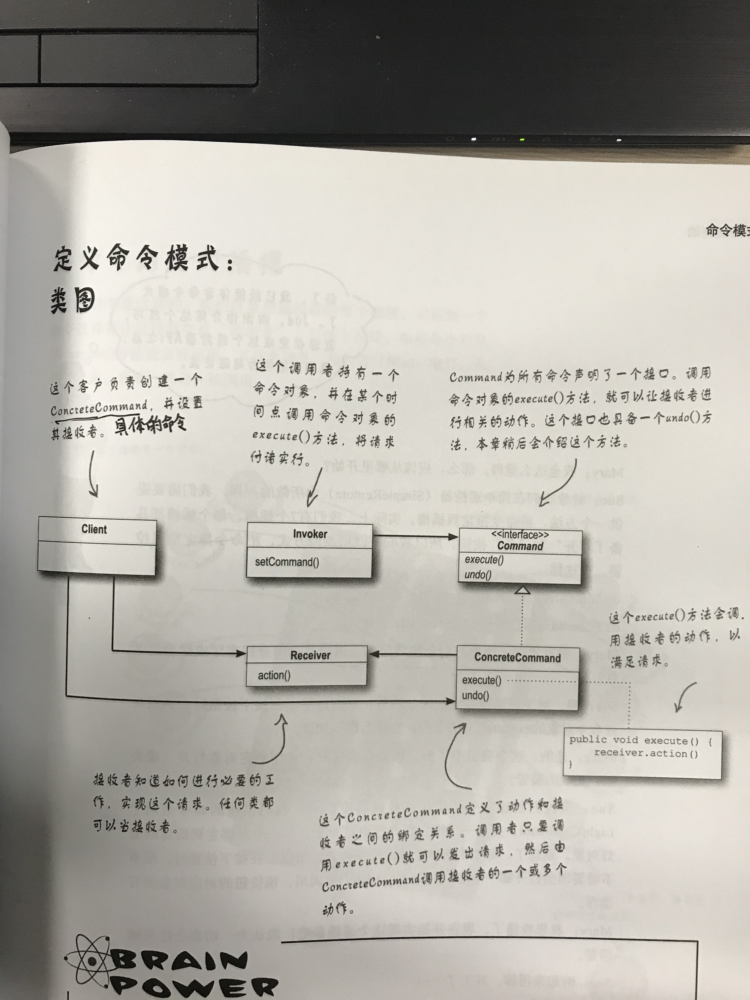
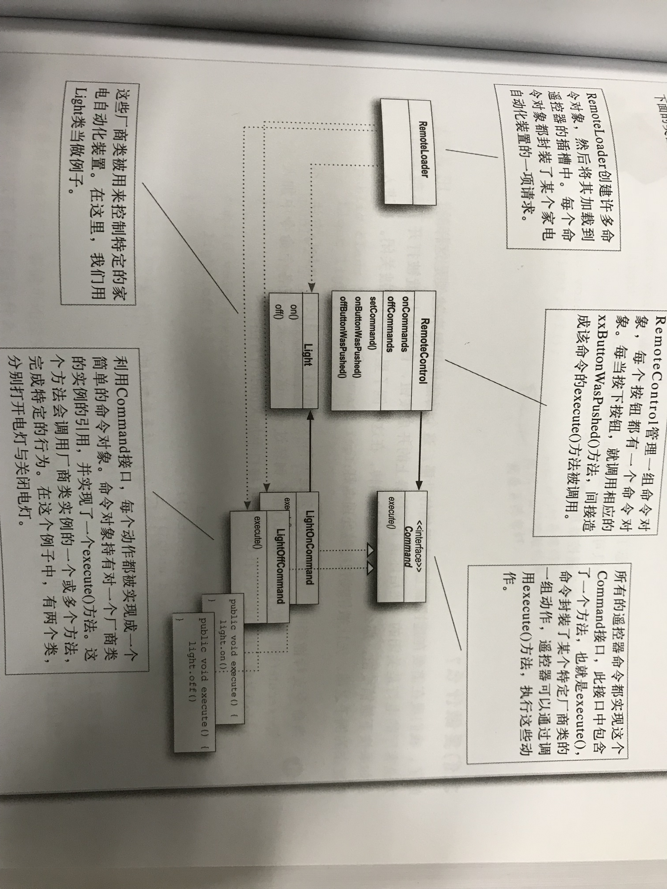

本文转自：《Head First设计模式》第六章

# 什么是命令模式？

将请求封装成对象，这可以让你使用不同的请求、队列，或者日志请求来参数化其他对象。命令模式也可以支持撤销操作。

当需要将发出请求的对象和执行请求的对象解耦的时候，可以考虑使用命令模式。

举个例子，什么是命令，比如说打开灯，这就是一个命令，我们可以将这个命令命名为为LightOnCommand，上面说的将请求封装成对象的意思就是说将打开灯这个请求（命令），封装成LightOnCommand这一对象，但是这个LightOnCommand命令肯定不能自己执行，因为它是一个命令，要确定是谁被执行（注意是被执行）这个命令，而被执行这个命令的对象就是灯（有可能是台灯、节能灯等等，反正是个灯，就是说他们都继承自一个基类Light灯类），此时可以把这个灯，比如说节能灯CellingLight对象注入到命令中，在LightOnCommand命令对象中添加一个execute()方法，用来执行light.on()（就是打开灯）的操作。上面说了命令对象、被执行者（或者叫被命令者）对象，还差一个执行命令的对象，这里可以是一个遥控器（或是具体某个开关），我还是比较习惯叫它控制器（就像spring mvc里的，主要起到一个触发作用），将LightOnCommand对象注入进来，那么，在执行命令的时候，我们就可以直接调用这个命令对象就好了，而不需要知道我的这个命令到底是哪一个具体的灯去执行，这样就达到了程序上的解耦。当然我们除了存在execute()方法做为下一步执行的操作方法，还可以提供一个undo()的撤销方法，当然了，你可以定义一个实例变量作为状态标识，每次执行execute()方法时记录一下上一次的状态。当然在实际生活中，当你回到家打开灯时可能还想要打开电视或是空调，此时你也可以定义一个数组，把这些命令搞进去，让它执行多个操作，这个命令的集合就是宏命令（命令的命令）。

# 命令模式的要点是什么？

- 命令模式将发出请求的对象和执行请求的对象解耦；
- 在被解耦的两者之间是通过命令对象进行沟通的。命令对象封装了接收者和一个或一组动作；
- 调用者通过调用命令对象的execute()方法发出请求，这会使得接收者的动作被调用；
- 调用者可以接受命令当作参数，甚至在运行时动态地进行；
- 命令可以支持撤销，做法是实现一个undo()方法来回到execute()方法被执行前的状态；
- 宏命令是命令的一种简单的延伸，允许调用多个命令。宏方法也可以支持撤销；
- 实际操作时，很常见使用“聪明”命令对象，也就是直接实现了请求，而不是将工作委托给接收者；
- 命令也可以用来实现日志和事务系统；

# 命令模式的类图及书中案例设计图（遥控器）

# 可能遇到的问题有哪些？

（1）接收者一定有必要存在吗？为何命令对象不直接实现execute()方法的细节？

答：一般来说，我们尽量设计“傻瓜”命令对象，它只懂得调用一个接收者的一个行为。然而，有许多“聪明”命令对象会实现很多逻辑，直接完成一个请求。当然你可以设计聪明的命令对象，知识这样以来，调用者和接收者之间的解耦成都比不上“傻瓜”命令对象的，而且，你也不能够把接收者当作参数传给命令。

（2）我如何能够实现多层次的撤销操作？换句话说，我希望能够按下撤销按钮多次，撤销到很早很早以前的状态。

答：使用一个堆栈记录操作过程的每一个命令。然后不管什么时候按下了撤销操作，你都可以从堆栈中取出最上层的命令，然后调用它的undo()方法。

（3）我可以创建——Party-Command，然后在它的execute()方法中调用其他命令，利用这种做法实现Party模式（Party Mode）吗？

答：可以，但是这等于把Party模式“硬编码”到PartyCommand中，其实我们可以利用宏命令，我们可以动态地决定PartyCommand是由哪些命令组成，所以宏命令在使用上更灵活。一般来说，宏命令的做法更优雅，也需要较少的新代码。
