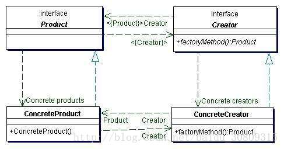

# 例子

加盟比萨店，在上篇简单工厂的介绍中，假设你已经创建了一个比萨店，有了几种拿手的比萨产品，现在你想要在其他地方，比如上海和深圳新开两家加盟店，但是其中上海的加盟店希望工厂能制造上海风味的比萨，而深圳加盟店希望工厂能提供深圳风味的比萨，而你又想要所有加盟店都能利用你的代码，好让比萨的流程能保持一致不变。

考虑到上面的区域因素，我们这里有一种做法：写出两种不同的工厂ShanghaiPizzaFactory、ShenzhenPizzaFactory

此时调用工厂的代码如下：

```java
    public static void main(String[] args) {
        ShanghaiPizzaFactory shFactory = new ShanghaiPizzaFactory();
        PizzaStore shStore = new PizzaStore(shFactory);
        shStore.orderPizza("Veggie");
 
        ShenzhenPizzaFactory szFactory = new ShenzhenPizzaFactory();
        PizzaStore szStore = new PizzaStore(szFactory);
        szStore.orderPizza("Veggie");
    }
```

但是假如说你想要多一些质量控制，虽然这两个加盟店的确是采用你的工厂创建比萨，但是其他部分却开始采用他们自创的流程：比如烘烤的做法有些差异、不要切片、使用其他厂商的盒子等。此时上面的做法就不具有弹性了。

此时我们可以把createPizza()方法放回到PizzaStore中，不过要把他设定为abstract，然后为每个区域的加盟店创建一个PizzaStore的子类。

```java
public abstract class PizzaStore {
 
    public Pizza orderPizza( String type ){
        Pizza pizza;
 
        pizza = createPizza(type);
 
        pizza.prepare();
        pizza.bake();
        pizza.cut();
        pizza.box();
 
        return pizza;
    }
 
    // 实例化比萨的责任被移动到一个方法中，此方法就如同是一个工厂，此时这个方法就可以叫工厂方法
    abstract Pizza createPizza( String type );
}
```

我们先来剖析一下上面的工厂方法：

- abstract：工厂方法是抽象的，所以依赖子类来处理对象的创建；
- Pizza：工厂方法必须返回一个产品。超类中定义的方法，通常使用到工厂方法的返回值；
- createPizza：工厂方法将客户（也就是超类中的代码orderPizza()和实际创建的具体产品代码分隔开来）；
- type：工厂方法可能需要参数（也可能不需要）来指定所要的产品；

此时这个PizzaStore作为超类，让每个域类型（ShanghaiPizzaStore、ShenzhenPizzaStore）都继承这个PizzaStore，就是说让每个子类决定如何制造比萨，把createPizza()这个方法交给子类去处理。

此时，如果想要在合肥新开一个比萨加盟店，只需要继承PizzaStore就可以了。

```java
public class HefeiPizzaStore extends PizzaStore {
    
    @Override
    Pizza createPizza(String type) {
        if ( type.equals("cheese") ){
            return new HFStyleCheesePizza();
        }else if ( type.equals("veggie") ){
            return new HFStyleVeggiePizza();
        }else if ( type.equals("clam") ){
            return new HFStyleClamPizza();
        }else if ( type.equals("pepperoni") ){
            return new HFStylePepperoniPizza();
        }else {
            return null;
        }
    }
}
```

比萨店有了，现在我们来给合肥比萨店创建一个具体的Pizza产品。首先定义Pizza基类。

```java
public abstract class Pizza {
 
    String name;
    String dough;
    String sauce;
    ArrayList toppings = new ArrayList();
    
    void prepare(){
        System.out.println("Preparing " + name);
        System.out.println("Tossing dough...");
        System.out.println("Adding sauce...");
        System.out.println("Adding toppings: ");
        for ( int i=0;i<toppings.size();i++ ){
            System.out.println("    " + toppings.get(i) );
        }
    }   
 
    void bake(){
        System.out.println("Bake for 25 minutes at 350");
    }
 
    void cut(){
        System.out.println("Cutting the Pizza into diagonal slices");
    }
 
    void box(){
        System.out.println("Place pizza in official PizzaStore box");
    }
 
    public String getName() {
        return name;
    }
}
```

然后是具体Pizza类

```java
public class HFStyleCheesePizza extends Pizza {
 
    public HFStyleCheesePizza(){
        name = "HF Style Sauce and Cheese Pizza";
        dough = "Thin Crust Dough";
        sauce = "Marinara Sauce";
        
        toppings.add("Grated Reggiano Cheese");
    }
    
    @Override
    void cut(){
        System.out.println("Cutting the pizza into square slices");
    }
 
    // ...  ...
}
```

此时客人Jalen来了，他订了一份合肥的比萨。

```java
public class Test {
 
    public static void main(String[] args) {
        PizzaStore hfStore = new HefeiPizzaStore();
 
        Pizza pizza = hfStore.orderPizza("cheese");
        System.out.println("Jalen order a " + pizza.getName() );
    }
}
```

输出结果：

```
Preparing HF Style Sauce and Cheese Pizza
Tossing dough...
Adding sauce...
Adding toppings: 
    Grated Reggiano Cheese
Bake for 25 minutes at 350
Cutting the pizza into square slices
Place pizza in official PizzaStore box
Jalen order a HF Style Sauce and Cheese Pizza
```

# 例子解析

上面的例子设计就是运用了工厂方法模式，所有工厂模式都用来封装对象的创建。

工厂方法模式通过让子类决定该创建的对象是什么，来达到将对象创建的过程封装的目的。

上面例子中，有两个基类以供子类继承：创建者（Creator）类-PizzaStore，产品类-Pizza；

可以将他们认为是平行的类层级，即他们都有抽象类，而抽象类都有很多具体的子类，每个子类都有特定的实现。

# 认识工厂方法模式（Factory Method Pattern）

定义：工厂方法模式定义了一个创建对象的接口，但由子类决定要实例化的类是哪一个。工厂方法让类把实例化推迟到子类。




