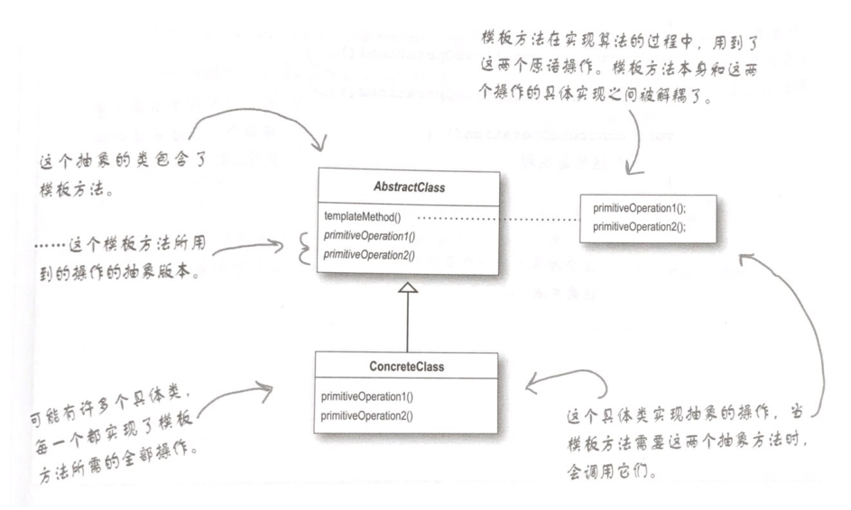

# 什么是模板方法模式？

在一个方法中定义一个算法的骨架，而将一些步骤延迟到子类中。模板方法使得子类可以在不改变算法结构的情况下重新定义算法中的某些步骤。

# 模板方法注意要点

（1）“模板方法”定义了算法的步骤，把这些步骤的实现延迟到子类。

（2）模板方法模式为我们提供了一种代码复用的重要技术。

（3）模板方法的抽象类可以定义具体方法、抽象方法和钩子。

（4）抽象方法由子类实现。

（5）钩子是一种方法，它在抽象类中不做事，或者只做默认的事情，子类可以选择要不要去覆盖它。

（6）为了防止子类改变模板方法中的算法，可以将模板方法声明为final。

（7）好莱坞原则告诉我们，将决策权放在高层模块中，以便决定如何以及何时调用低层模块。

（8）你将在真实的世界代码中看到模板方法模式的许多变体，不要期待它们全都是一眼就可以被你认出的。

（9）策略模式和模板方法模式都封装算法，一个用组合，一个用继承。

（10）工厂方法是模板方法的一种特殊版本。

# 类图

# 问题

（1）当我创建一个模板方法时，怎么才能知道什么时候该使用抽象方法，什么时候使用钩子呢？

答：当你的子类“必须”提供算法中某个方法或步骤的实现时，就使用抽象方法。如果算法的这个部分是可选的，就用钩子。如果是钩子的话，子类可以选择实现这个钩子，但不强制这么做。

（2）使用钩子的真正目的是什么？

答：钩子有几种用法。钩子可以让子类实现算法中可选的部分，或者在钩子对于子类的实现并不重要的时候，子类可以对此钩子置之不理。钩子的另一用法是让子类能够有机会对模板方法中某些即将发生的（或刚刚发生的）步骤做出反应。

（3）子类必须实现抽象类中的所有方法吗？

答：是的，必须为模板方法算法中未定义步骤提供完整的实现。

（4）似乎我应该保持抽象方法的数目越少越好，否则，在子类中实现这些方法将会很麻烦。

答：我们可以让算法内的步骤不要切割的太细，但是如果步骤太少的话，会比较没有弹性，所以要看情况折衷，记住，某些可选步骤可以做成钩子。

（5）在java api中，还有其他模板方法的例子吗？

答：是的，比方说，java.io的InputStream类有一个read()方法，是由子类实现的，而这个方法又被read(byte b[], int off, int len)模板方法使用。
