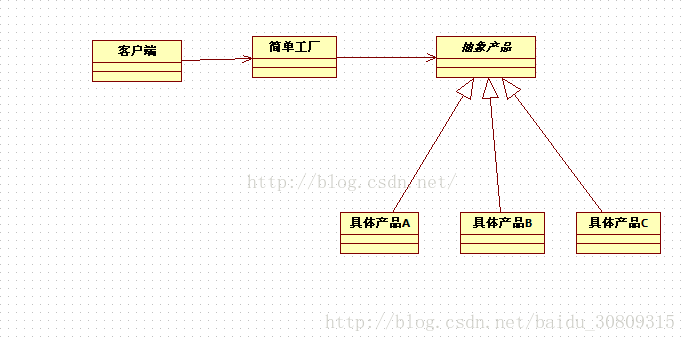
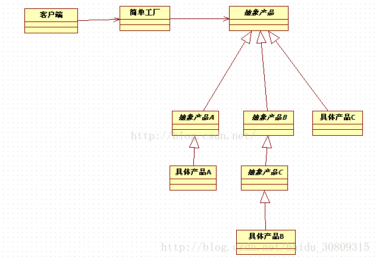

# 简单工厂

当看到“new”时，就会想到“具体”，每当我们程序中new一个对象时，都会绑着一个具体类，代码绑着具体类会导致代码更脆弱，更缺乏弹性。

```java
        // Duck父类还是要new一个具体的绿头鸭实例
        Duck duck = new MallardDuck();
```

当有一群相关的具体类时，类似下面代码。

```java
        Duck duck;
        
        if ( picnic ){
            duck = new MallardDuck();
        }else if ( hunting ){
            duck = new DecoyDuck();
        }else if ( inBathTub ){
            duck = new RubberDuck();
        }
```

这样的代码，一旦有变化或扩展，就必须打开这段代码进行检查和修改。系统会很难维护或更新，也容易犯错。

举个例子说明：

我们可以识别变化的方面，假设你有一个比萨店，作为店长，你可以这样写：

```java
    Pizza orderPizza( String type ){
        Pizza pizza;
 
        // 根据比萨的类型，我们实例化正确的具体类，这里的所有比萨接口都要都必须实现Pizza接口
        if ( type.equals("cheese") ){
            pizza = new CheesePizza();
        }else if ( type.equals("greek") ){
            pizza = new GreekPizza();
        }else if ( type.equals("pepperoni") ){
            pizza = new PepperoniPizza();
        }
 
        // 准备、烘烤、切片、装盒，每个pizza共有的操作步骤
        pizza.prepare();
        pizza.bake();
        pizza.cut();
        pizza.box();
 
        return pizza;
    }
```

随着时间的改变，当前菜单肯定会变化，如新增某个种类比萨。那我们需要new一个新的Pizza实现。此时我们又要添加一个if...else...，导致了无法对修改关闭。

此时我们可以使用封装。将这些创建对象的代码封装起来，迁移到orderPizza()方法外，用于专职创建比萨。

此时，我们可以称这个新对象为“工厂”。将orderPizza()方法称为该对象的客户。客户只需要关心从比萨工厂得到了一个比萨，而且这个比萨实现了Pizza接口。

```java
package com.example.pattern.factory;
 
/**
 * <p>
 * <code>SimplePizzaFactory</code>
 * </p>
 * Description: 比萨简单工厂
 *
 * @author Mcchu
 * @date 2018/1/16 14:59
 */
public class SimplePizzaFactory {
    
    public Pizza createPizza( String type ){
        Pizza pizza = null;
 
        if ( type.equals("cheese") ){
            pizza = new CheesePizza();
        }else if ( type.equals("greek") ){
            pizza = new GreekPizza();
        }else if ( type.equals("pepperoni") ){
            pizza = new PepperoniPizza();
        }
        
        return pizza;
    }
}
```

从表面上看，似乎只是把问题搬到了另一个对象罢了，问题依然存在，其实这里将代码抽离出来作为一个工厂，那么他此时不仅仅可以服务于上面的orderPizza()方法，就是说未来还可以在其他地方调用，服务于其他客户。

通常我们为了避免对象的创建来进行实例化，会利用静态方法定义一个简单的工厂，常称为静态工厂，这是一种技巧，但要注意，此时的缺点是不能通过继承来改变创建方法的行为。

下面我们重做PizzaStore类，即改变我们的客户代码，依仗我们的工厂来创建比萨。

```java
package com.example.pattern.factory;
 
/**
 * <p>
 * <code>Test</code>
 * </p>
 * Description:
 *
 * @author Mcchu
 * @date 2018/1/16 14:28
 */
public class PizzaStore {
 
    SimplePizzaFactory factory;
    
    public PizzaStore( SimplePizzaFactory factory ){
        this.factory = factory;
    }
 
    Pizza orderPizza( String type ){
        Pizza pizza;
 
        pizza = factory.createPizza(type);
 
        pizza.prepare();
        pizza.bake();
        pizza.cut();
        pizza.box();
 
        return pizza;
    }
    
    // ...  ...
}
```

此时SimplePizzaStore就是一个简单工厂，注意，简单工厂其实不是一个设计模式，反而更像是一种编程习惯，不要误认为是“工厂模式”

附：

简单工厂说明图：[来自CSDN](https://blog.csdn.net/xiaofei125145/article/details/50345485)

注意上面只给出了客户和简单工厂，抽象产品其实就是指上面各种具体比萨的所实现的抽象类Pizza。

在这里说明一下：在设计模式中，所谓的“实现一个接口”并“不一定”表示“写一个类，并利用implement关键字来实现某个java接口”。“实现一个接口”泛指“实现某个超类型（可以是类或接口的某个方法）”



实际应用中，抽象可能是多层次的，如


