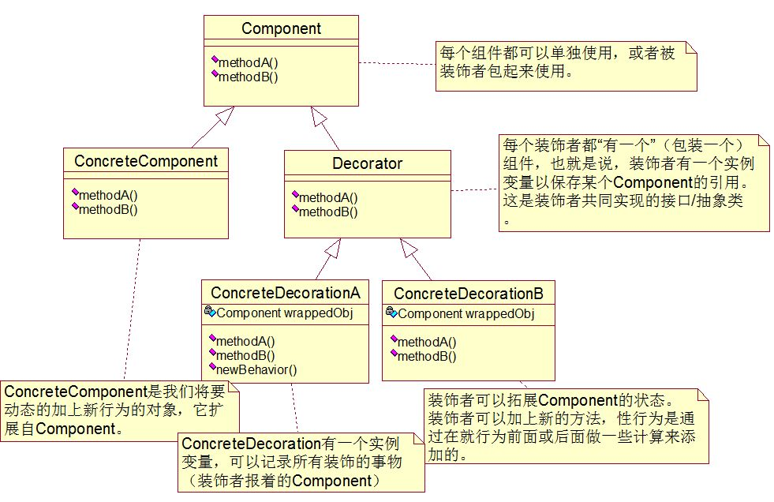
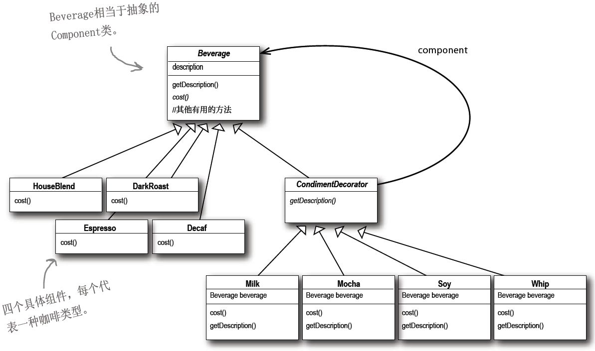
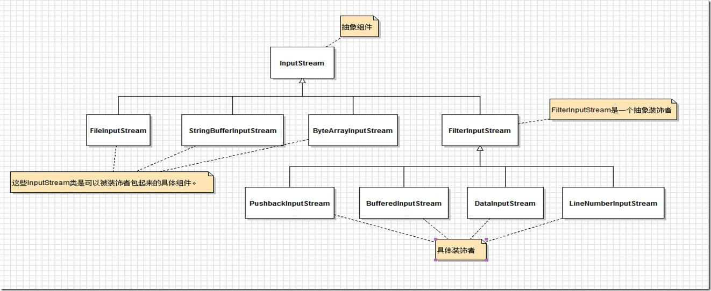

`Head First第三章`

# 装饰者模式

作用：“给爱用继承的人一个全新的设计眼界”，即解决继承滥用，能够在不修改任何底层代码的情况下，给你的（或别人的）对象赋予新的职责。

解决问题：类数量爆炸（指继承）、设计死板、基类加入新功能并不适用于所有子类。

# 符合设计原则：开放-关闭原则

定义：类应该对扩展开放，对修改关闭。即在不修改现有代码的情况下，允许类的扩展。

说明：过度使用开放-关闭原则（选择需要被扩展的代码部分时）要小心，每个地方都使用该原则是一种浪费，因为该原则通常会引入新的抽象层次，导致代码变得复杂而难以理解。

# 解释

（1）装饰者和被装饰者对象有相同的超类型，通常装饰者模式采用的是抽象类；

（2）你可以用一个或多个装饰者包装一个对象；

（3）既然装饰者和被装饰对象有相同的超类型，所以在任何需要原始对象（被包装的）场合，可以用装饰过的对象代替它；

（4）装饰者可以在所委托被装饰者的行为之前/或之后，加上自己的行为，以达到特定的目的；

（5）对象可以在任何时候被装饰，所以可以在运行时动态地、不限量地用你喜欢的装饰者来装饰对象；

# 装饰者模式定义及结构图

装饰者模式动态地将责任附加到对象上。若要扩展功能，装饰者提供了比继承更有弹性的替代方案。



# 例子

（1）将调料作为装饰者，将饮料作为被装饰对象；

（2）一种饮料可以填加多种调料，即可以被多种调料装饰；

（3）他们拥有共同的超类，即他们必须是一样的类型，这样好利用继承达到“类型匹配”，注意这里不是利用继承获得“行为”；



代码：

定义抽象组件-饮料类：

```java
package com.example.test;
 
/**
 * <p>
 * <code>Beverage</code>
 * </p>
 * Description:饮料基类
 * (1)Beverage是一个抽象类，有两个方法：getDescription()及cost()；
 * (2)getDescription()已经在此实现了，但是cost()必须在子类中实现；
 *
 * @author Mcchu
 * @date 2018/1/16 9:24
 */
public abstract class Beverage {
    String description = "Unknown Beverage";
 
    public String getDescription() {
        return description;
    }
    
    public abstract double cost();
}
```

定义调料抽象类，也就是装饰者类：

```java
package com.example.test;
 
/**
 * <p>
 * <code>Condiment</code>
 * </p>
 * Description:调料装饰者类
 * (1)首先，必须让Condiment Decorator能够取代Beverage，所以将Condiment Decorator扩展自Beverage类；
 * (2)所有的调料装饰者都必须重新实现getDescription()方法；
 *
 * @author Mcchu
 * @date 2018/1/16 9:29
 */
public abstract class CondimentDecorator extends Beverage{
 
    public abstract String getDescription();
}
```

定义具体组件-饮料类： 

浓缩咖啡

```java
package com.example.test;
 
/**
 * <p>
 * <code>Espresso</code>
 * </p>
 * Description:具体饮料-浓缩咖啡
 * (1)Espresso类扩展自Beverage类，因为Espresso是饮料的一种
 * (2)构造器是为了设置饮料的描述，description实例变量继承自Beverage
 * (3)cost()方法不需要管调料的价钱，直接把Espresso的价格返回
 * 
 * @author Mcchu
 * @date 2018/1/16 9:36
 */
public class Espresso extends Beverage {
    
    public Espresso(){
        description = "Espresso";
    }
    
    @Override
    public double cost() {
        return 1.99;
    }
}
```

混合咖啡

```java
package com.example.test;
 
/**
 * <p>
 * <code>HouseBlend</code>
 * </p>
 * Description:具体饮料-混合咖啡
 * (1)这里做法和浓缩咖啡类相似
 *
 * @author Mcchu
 * @date 2018/1/16 9:41
 */
public class HouseBlend extends Beverage {
 
    public HouseBlend(){
        description = "House Blend Coffee";
    }
 
    @Override
    public double cost() {
        return .89;
    }
}
```

下面我们定义具体的装饰者类：

```java
package com.example.test;
 
/**
 * <p>
 * <code>Mocha</code>
 * </p>
 * Description:
 * (1)具体装饰者类-摩卡调料
 * (2)摩卡调料是一个装饰者类，扩展自CondimentDecorator，而CondimentDecorator扩展自Beverage类
 *
 * @author Mcchu
 * @date 2018/1/16 9:46
 */
public class Mocha extends CondimentDecorator {
 
    /**
     * 用一个实例变量记录饮料，也就是被装饰者
     */
    Beverage beverage;
 
    /**
     * 想办法让被装饰者（饮料）被记录到实例变量中
     * 这里把饮料当作构造器的参数，再由构造器将此饮料记录在实例变量中
     * 
     * @param beverage 被装饰者
     */
    public Mocha( Beverage beverage ){
        this.beverage = beverage;
    }
 
    /**
     * 我们希望叙述不只是描述饮料，而是完整的连调料也描述出来
     * 这里首先利用委托的做法，得到一个饮料的叙述，然后在其后加上附加的叙述
     * 
     * @return 饮料描述+附加的调料描述
     */
    @Override
    public String getDescription() {
        return beverage.getDescription() + ", Mocha";
    }
 
    /**
     * 计算带摩卡调料的饮料价钱
     * 这里先把调用委托给被装饰对象，以计算价钱，然后加上摩卡的价钱，得到最后结果
     * 
     * @return 摩卡调料价钱+被装饰对象的价钱
     */
    @Override
    public double cost() {
        return .20 + beverage.cost();
    }
}
```

同理，定义奶泡调料装饰者类：

```java
package com.example.test;
 
/**
 * <p>
 * <code>Whip</code>
 * </p>
 * Description:装饰者类-奶油调料
 *
 * @author Mcchu
 * @date 2018/1/16 9:46
 */
public class Whip extends CondimentDecorator {
 
    /**
     * 用一个实例变量记录饮料，也就是被装饰者
     */
    Beverage beverage;
 
    /**
     * 想办法让被装饰者（饮料）被记录到实例变量中
     * 这里把饮料当作构造器的参数，再由构造器将此饮料记录在实例变量中
     *
     * @param beverage 被装饰者
     */
    public Whip(Beverage beverage ){
        this.beverage = beverage;
    }
 
    /**
     * 我们希望叙述不只是描述饮料，而是完整的连调料也描述出来
     * 这里首先利用委托的做法，得到一个饮料的叙述，然后在其后加上附加的叙述
     *
     * @return 饮料描述+附加的调料描述
     */
    @Override
    public String getDescription() {
        return beverage.getDescription() + ", Whip";
    }
 
    /**
     * 计算带奶泡调料的饮料价钱
     * 这里先把调用委托给被装饰对象，以计算价钱，然后加上奶泡的价钱，得到最后结果
     *
     * @return 奶泡调料价钱+被装饰对象的价钱
     */
    @Override
    public double cost() {
        return .30 + beverage.cost();
    }
}
```

再定义豆浆装饰者类：

```java
package com.example.test;
 
/**
 * <p>
 * <code>Soy</code>
 * </p>
 * Description:装饰者类-豆浆
 *
 * @author Mcchu
 * @date 2018/1/16 9:46
 */
public class Soy extends CondimentDecorator {
 
    /**
     * 用一个实例变量记录饮料，也就是被装饰者
     */
    Beverage beverage;
 
    /**
     * 想办法让被装饰者（饮料）被记录到实例变量中
     * 这里把饮料当作构造器的参数，再由构造器将此饮料记录在实例变量中
     *
     * @param beverage 被装饰者
     */
    public Soy(Beverage beverage ){
        this.beverage = beverage;
    }
 
    /**
     * 我们希望叙述不只是描述饮料，而是完整的连调料也描述出来
     * 这里首先利用委托的做法，得到一个饮料的叙述，然后在其后加上附加的叙述
     *
     * @return 饮料描述+附加的调料描述
     */
    @Override
    public String getDescription() {
        return beverage.getDescription() + ", Soy";
    }
 
    /**
     * 计算带豆浆调料的饮料价钱
     * 这里先把调用委托给被装饰对象，以计算价钱，然后加上豆浆的价钱，得到最后结果
     *
     * @return 豆浆调料价钱+被装饰对象的价钱
     */
    @Override
    public double cost() {
        return .40 + beverage.cost();
    }
}
```

至此，饮料基类，装饰者基类，具体饮料类（被装饰），具体调料类（装饰者）已定义完毕，如果引入了一种新的饮料或调料，只需增加具体的类即可，下面是测试：

```java
package com.example.test;
 
/**
 * <p>
 * <code>StarbuzzCoffee</code>
 * </p>
 * Description: 测试类
 *
 * @author Mcchu
 * @date 2018/1/16 10:06
 */
public class StarbuzzCoffee {
 
    public static void main(String[] args) {
        // 一杯Espresso，不加调料，打印描述与价钱
        Beverage beverage = new Espresso();
        System.out.println( "描述："+beverage.getDescription() );
        System.out.println( "价钱："+ "$" + beverage.cost() );
 
        // 一杯HouseBlend，加两份摩卡，加一份奶泡，再加一份豆浆，打印描述与价钱
        Beverage beverage2 = new HouseBlend();
        beverage2 = new Mocha(beverage2);   //用Mocha装饰HouseBlend
        beverage2 = new Mocha(beverage2);  //再用Mocha装饰HouseBlend
        beverage2 = new Whip(beverage2);  //用奶泡Whip装饰HouseBlend
        beverage2 = new Soy(beverage2);  //用豆浆Soy装饰HouseBlend
        System.out.println( "描述："+beverage2.getDescription() );
        System.out.println( "价钱："+ "$" + beverage2.cost() );
    }
}
```

# JDK中的装饰者： JAVA I/O

我们看一个类图就明白了，很像上面我们的例子



上面是JDK封装的输入流（input...）设计，其实输出流（output...）的设计也是类似，还有Writer流（作为基于字符数据的输入输出）等。

# 装饰者模式引出的缺点

利用装饰者模式，常常造成设计中有大量的小类，数量实在太多，可能会造成使用此API的程序员的困扰。

# 模拟JDK中JAVA I/O的设计，自己编写一个装饰者，把输入的所有大写字符转小写

```java
package com.example.test;
 
import java.io.FilterInputStream;
import java.io.IOException;
import java.io.InputStream;
 
/**
 * <p>
 * <code>LowerCaseInputStream</code>
 * </p>
 * Description: 自定义java i/o装饰者
 * 扩展FilterInputStream类，这是所有InputStream的抽象装饰者
 *
 * @author Mcchu
 * @date 2018/1/16 10:37
 */
public class LowerCaseInputStream extends FilterInputStream {
 
    /**
     * Creates a <code>FilterInputStream</code>
     * by assigning the  argument <code>in</code>
     * to the field <code>this.in</code> so as
     * to remember it for later use.
     *
     * @param in the underlying input stream, or <code>null</code> if
     *           this instance is to be created without an underlying stream.
     */
    protected LowerCaseInputStream(InputStream in) {
        super(in);
    }
 
    /**
     * 针对字节：将大写转成小写
     *
     * @return 小写字节
     * @throws IOException IO异常
     */
    public int read() throws IOException {
        int c = super.read();
        return ( c == -1 ? c : Character.toLowerCase( (char) c ) );
    }
 
    /**
     * 针对字节数组：将大写转成小写
     *
     * @param b 传入字节数组（the buffer into which the data is read）
     * @param offset 起始位移（the start offset in the destination array）
     * @param len 长度（the maximum number of bytes read）
     * @return 小写字节数组（the total number of bytes read into the buffer）
     * @throws IOException IO异常
     */
    public int read(byte[] b, int offset, int len) throws IOException{
        int result = super.read( b, offset, len );
        for ( int i=offset; i<offset+result; i++ ){
            b[i] = (byte)Character.toLowerCase( (char)b[i] );
        }
        return result;
    }
}
```

测试

```java
package com.example.test;
 
import java.io.BufferedInputStream;
import java.io.FileInputStream;
import java.io.IOException;
import java.io.InputStream;
 
/**
 * <p>
 * <code>TestLowerCaseInputStream</code>
 * </p>
 * Description: 测试我们自定义的LowerCaseInputStream
 *
 * @author Mcchu
 * @date 2018/1/16 10:47
 */
public class TestLowerCaseInputStream {
 
    public static void main(String[] args) throws IOException{
        int c;
        
        try {
            // 设置FileInputStream
            FileInputStream fis = new FileInputStream("text.txt");
            
            // 先用BufferedInputStream装饰她，再用我们新定义的LowerCaseInputStream装饰她
            InputStream in = new LowerCaseInputStream( new BufferedInputStream( fis ));
            
            while( ( c = in.read() ) >= 0 ){
                System.out.println( (char)c );
            }
            
            in.close();
        }catch (IOException e){
            e.printStackTrace();
        }
    }
}
```

