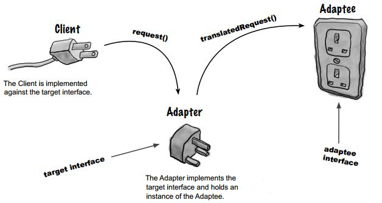
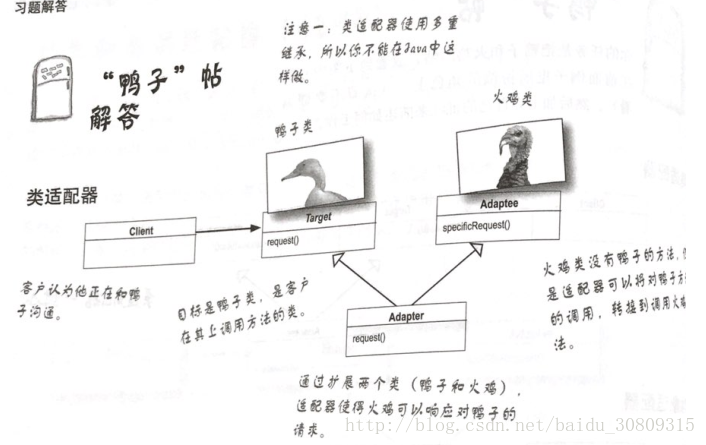
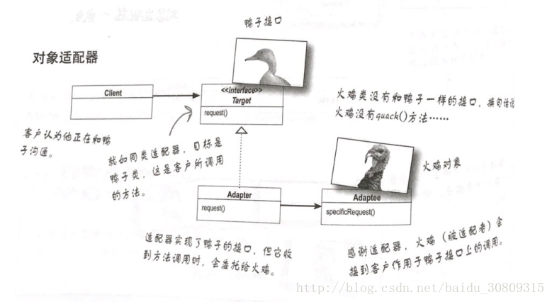
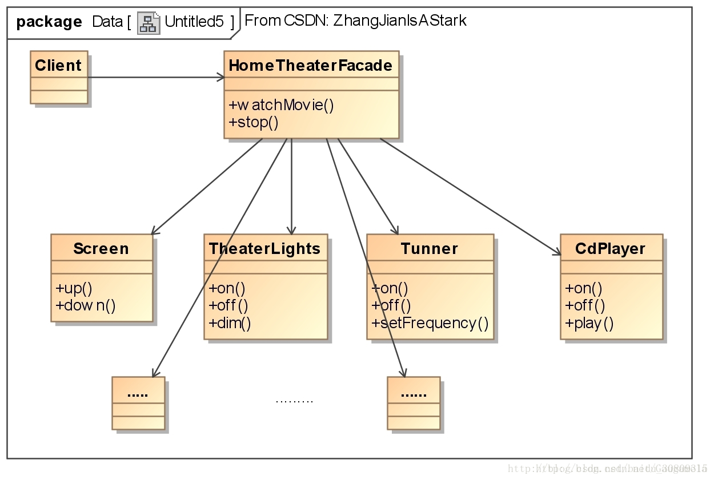

说明: 当我们学习适配器模式时，可以对比外观模式一起学习。 `《Head First设计模式》第七章`

# 适配器模式定义

将一个类的接口，转换成客户期望的另一个接口。适配器让原本不兼容的类可以合作无间。可划分为类适配器（多重继承）和对象适配器（组合）。

适配器模式就想下面这幅图：

假设你缺鸭子对象，想用一些火鸡对象来冒充，案例图如下：

（1）类适配器（继承）

（2）对象适配器

# 外观模式定义

提供了一个统一的接口，用来访问子系统中的一群接口。外观定义了一个高层接口，让子系统更容易使用。

以看电影为例，当你看电影时，你需要多个操作，如打开CD，放入CD片，打开显示器等一些列子操作。如过你从一个方法里直接包含了这些操作，那么想要看电影，就只需要调用一个watchMovie()方法即可，简化了操作。

# 说明

（1）当需要使用一个现有的类而其接口并不符合你的需要时，就使用适配器；

（2）当需要简化并统一一个很大的接口或者一群复杂的接口时，使用外观；

（3）适配器改变接口以符合客户的期望；

（4）外观将客户从一个复杂的子系统中解耦；

（5）实现一个适配器可能需要一番功夫，也可能不费功夫，视目标接口的大小与复杂度而定；

（6）实现一个外观，需要将子系组合进外观中，然后将工作委托给子系统执行；

（7）适配器模式有两种形式：对象适配器和类适配器。类适配器需要用到多重继承；

（8）你可以为一个子系统实现一个以上的外观；

（9）适配器将一个对象包装起来以改变其接口；装饰者将一个对象包装起来以增加新的行为和责任；而外观将一群对象“包装”起来以简化其接口；

# 真实世界的适配器

早期的集合类型（如Vector、Stack、Hashtable）都实现了一个名为elements()的方法。该方法返回一个Enumeration枚举接口。

现在的集合类型开始使用Iterator迭代器，这个接口和枚举接口很想。

根据上面两个接口，可以将老旧的枚举接口转换为迭代器接口，我们可以自己设计适配器使用implements关键字实现Iterator接口即可。没有remove()方法抛异常即可。

# 适配器模式的问题

（1）一个适配器需要多少“适配”的工作？如果我需要实现一个很大的目标接口，似乎有“很多”工作要做。

答：是的，实现一个适配器所需要进行的工作，的确和目标接口的大小成正比。但如不适用适配器而去改写客户端代码，工作量会更大。

（2）一个适配器只能够封装一个类吗？

答：适配器模式的工作是将一个接口转换成另一个。大部分适配器模式所采取的例子都是让一个适配器包装一个被适配者。但现实中可能需要让一个适配器包装多个被适配者，这涉及另一个模式--外观模式。这俩不要混为一谈。

（3）系统中万一新旧接口并存，旧的部分期望旧的厂商接口，但我们却已经使用新厂商的接口编写了这一部分，此时该怎么办？

答：创建一个双向适配器，支持两边的接口，这样就必须实现所涉及的接口。

# 外观模式的问题

（1）如果外观封装子系统的类，那么需要低层功能的客户如何接触这些类？

答：外观没有“封装”子系统的类，只是提供简化的接口。所以客户依然可以直接使用子系统的类，外观模式的特征：提供简化的接口的同时，依然将系统完整的共能暴露出来，以供需要的人使用。

（2）外观会新增功能吗，或者它只是将每一个请求转由子系统执行？

答：可以新增，让使用子系统更方便。

（3）每个子系统只能有一个外观吗？

答：不，可以创建多个外观。

（4）除了能够提供一个比较简单的接口外，外观模式还有其他优点吗？

答：外观模式也允许你将客户实现从任何子系统中解耦。

（5）我可不可以这样说，适配器模式和外观模式之间的差异在于：适配器包装一个类，而外观可以代表许多类？

答：不可以，适配器模式将一个或多个类接口变成客户所期望的一个接口。虽然大多数教科书所采用的例子中适配器只适配一个类，但是你可以适配许多个类来提供一个接口让客户编码。类似地，一个外观也可以只针对一个拥有复杂接口的类提供简化的接口。故两种模式的差异不在于他们包装了几个类，而在于他们的意图。适配器模式的意图是：“改变”接口符合客户的期望；而外观模式的意图是：提供子系统的一个简化接口；
