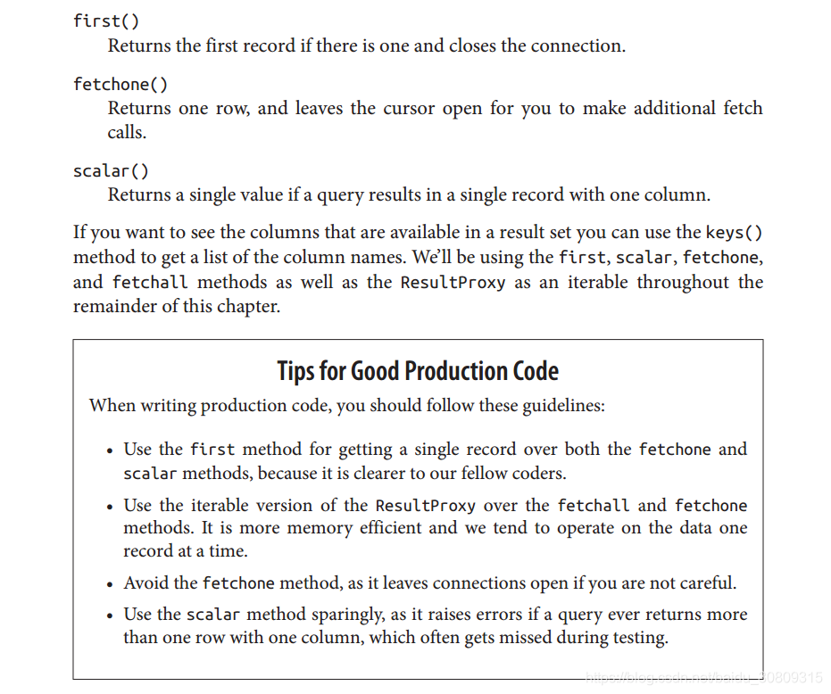
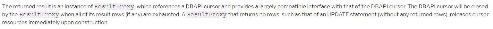

1. 问题

> DatabaseError: (cx_Oracle.DatabaseError) ORA-01000: maximum open cursors exceeded

2. 原因（book/document/source code）





result.py 

```python
    def fetchone(self):
        """Fetch one row, just like DB-API ``cursor.fetchone()``.
        After all rows have been exhausted, the underlying DBAPI
        cursor resource is released, and the object may be safely
        discarded.
        Calls to :meth:`.ResultProxy.fetchone` after all rows have
        been exhausted will return ``None``.
        After the :meth:`.ResultProxy.close` method is
        called, the method will raise :class:`.ResourceClosedError`.
        .. versionchanged:: 1.0.0 - Added "soft close" behavior which
           allows the result to be used in an "exhausted" state prior to
           calling the :meth:`.ResultProxy.close` method.
        """
        try:
            row = self._fetchone_impl()
            if row is not None:
                return self.process_rows([row])[0]
            else:
                self._soft_close()
                return None
        except BaseException as e:
            self.connection._handle_dbapi_exception(
                e, None, None,
                self.cursor, self.context)
```

query.py

```python
    def first(self):
        """Return the first result of this ``Query`` or
        None if the result doesn't contain any row.
        first() applies a limit of one within the generated SQL, so that
        only one primary entity row is generated on the server side
        (note this may consist of multiple result rows if join-loaded
        collections are present).
        Calling :meth:`.Query.first` results in an execution of the underlying query.
        .. seealso::
            :meth:`.Query.one`
            :meth:`.Query.one_or_none`
        """
        if self._statement is not None:
            ret = list(self)[0:1]
        else:
            ret = list(self[0:1])
        if len(ret) > 0:
            return ret[0]
        else:
            return None
```

3. 验证测试fetchone和first方法区别：

```python
def test_cursor():
    """
    first(): Returns the first record if there is one and closes the connection.
    fetchone(): Returns one row, and leaves the cursor open for you to make additional fetch calls.
    scalar(): Returns a single value if a query results in a single record with one column.
    """
    # 测试fetchone(), 当我们获取到execute_1对象时，可以重复使用该对象的fetchone()方法去获取结果（每次获取的结果不同）
    # 此时cursor会一直存在，第一次调用fetchone()方法时cursor在第一行，返回第一个结果，
    # 再次调用方法时cursor会移动到第二行，以此类推，cursor一直向最后一行移动，直到取不到行数时，cursor才会释放
    sql = text("SELECT * FROM STUDENT")  # 该表返回多条学生记录
    execute_1 = engine.execute(sql)
    for item in range(30):
        result_1 = execute_1.fetchone()
        print(result_1)
 
    # 测试first()，当获取到execute_2对象时，仅可以对该对象执行一次first()方法，重复执行first()方法会抛异常
    # 异常信息：ResourceClosedError: This result object is closed.
    # 说明first()方法在获取一次结果后该连接已经关闭，不再提供持续的连接
    sql = text("SELECT * FROM STUDENT")
    execute_2 = engine.execute(sql)
    for item in range(30):
        result_2 = execute_2.first()
        print(result_2)
```

4. 解决方式：

避免使用fetchone，将所有sql查询使用的fetchone()方法替换为first()方法 

参考：

1. 同样的问题：https://blog.csdn.net/heminhao/article/details/73433711

2. 截图1来自《Essential SQLAlchemy》第二章，下载地址：http://vdisk.weibo.com/s/ugG0f_qkHRVY4

3. 截图2来自SQLAlchemy 1.3 Documentation，

     参考：https://docs.sqlalchemy.org/en/latest/core/connections.html#basic-usage

4.oracle查询相关配置信息sql，有点乱，记录一下

```sql
---查询oracle db版本信息
select * from v$version where rownum=1;
 
---查询oracle设置的进程参数
select name,value from v$parameter where name='processes';
 
---查询当前进程数量或详细进程信息
select count(*) from v$process;
select * from v$process;
 
---查询游标cursors信息
select sum(a.value) total_cur,
       avg(a.value) avg_cur,
       max(a.value) max_cur,
       s.username,
       s.machine
  from v$sesstat a, v$statname b, v$session s
 where a.statistic# = b.statistic#
       and s.sid=a.sid
       and b.name = 'opened cursors current'
       group by s.username, s.machine
       order by 1 desc;
 
---查看oracle当前的连接数
select * from v$session where username is not null;
 
---查看不同用户的连接数
select username,count(username) from v$session where username is not null group by username;
 
---总连接数
select count(*) from v$session;
 
---并发连接数
select count(*) from v$session where status='ACTIVE';
 
---游标设置参数
SELECT value FROM v$parameter WHERE name = 'open_cursors';
 
select q.sql_text from v$open_cursor o,v$sql q where q.hash_value=o.hash_value and o.sid=217;
select count(*) from v$open_cursor where user_name='STAPUSER';
select count(*) from v$open_cursor;
 
---通过session查询开启的游标
select a.value,
       s.username,
       s.sid,
       s.serial#
  from v$sesstat a, v$statname b, v$session s
 where a.statistic# = b.statistic#
       and s.sid=a.sid
       and b.name = 'opened cursors current';
 
select a.value, s.username, s.sid, s.serial#
  from v$sesstat a,
       v$statname b,
       v$session s
 where a.statistic# = b.statistic#
   and s.sid = a.sid
   and b.name = 'opened cursors current'
   and s.username is not null
   and a.value>10;
 
select * from v$sesstat where ROWNUM<10;
 
---V_$SESSION表列数
select count(column_name) from dba_tab_columns where table_name='V_$SESSION';
 
select sid, sql_text, USER_NAME
  from v$open_cursor
 where sid in ('388') and user_name='STAPUSER';
 
select  sid ,
        sql_text, 
        count(*) as "OPEN CURSORS", 
        USER_NAME 
  from  v$open_cursor 
 where  sid in ('388') 
        group by count(*);
 
SELECT max(a.value) as highest_open_cur, 
       p.value as max_open_cur
  FROM v$sesstat a,
      v$statname b,
      v$parameter p
 WHERE a.statistic# = b.statistic#
   and b.name = 'opened cursors current'
   and p.name = 'open_cursors'
       group by p.value;
```


https://stackoverflow.com/questions/5669878/when-to-close-cursors-using-mysqldb
