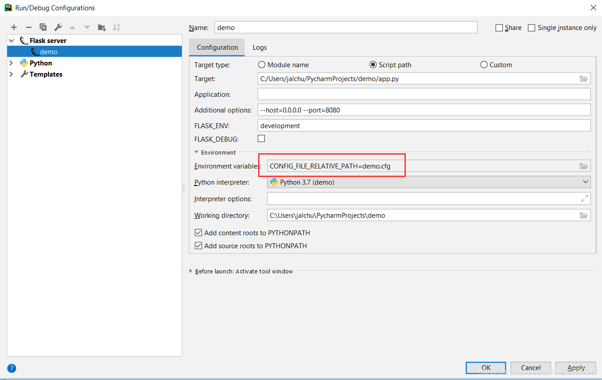
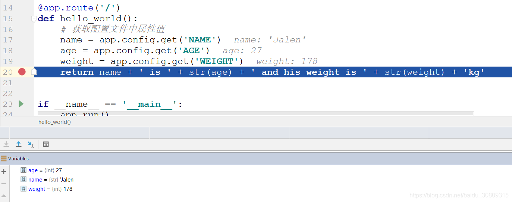

# 方法一

```python
from flask import Flask
 
# 初始化Flask应用，调用源码中wsgi_app方法(请求调用过程：Client->WSGI Server(like apache/nginx)->Flask Application)
# 注意调用方式：__call__和__init__方法的区别
app = Flask(__name__)
# 设置从环境变量读取配置文件路径，可以是绝对路径，也可以是相对路径
# 第一个参数指向这个环境变量，这里是在pycharm的flask server中添加的，可参考截图一
# silent属性会在启动的时候检查文件是否存在：
# 如果文件不存在，且silent=True，此时会正常启动，只有在程序内部调用访问到这个文件时报错
# 如果文件不存在，且silent=False，此时启动会抛异常
app.config.from_envvar('CONFIG_FILE_RELATIVE_PATH', silent=False)
 
 
@app.route('/')
def hello_world():
    # 获取配置文件中属性值
    name = app.config.get('NAME')
    age = app.config.get('AGE')
    weight = app.config.get('WEIGHT')
    return name + ' is ' + str(age) + ' and his weight is ' + str(weight) + 'kg'
 
 
if __name__ == '__main__':
    app.run()
```






# 方法二

在启动设置里将环境变量删掉，即删掉CONFIG_FILE_RELATIVE_PATH变量，修改代码如下，即直接将文件路径写入变量，直接启动，debug如下图


