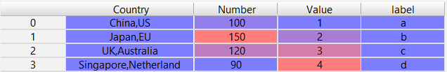
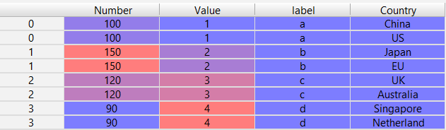
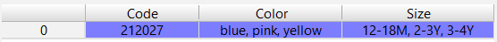
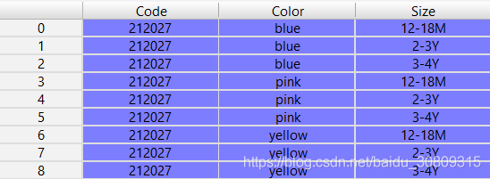

（1） 根据某一列拆分

效果：





代码(注意index，如果index有重复会有问题，最好先reset_index)：

```python
if __name__ == '__main__':
    import pandas as pd
    df = pd.DataFrame({'Country': ['China,US', 'Japan,EU', 'UK,Australia', 'Singapore,Netherland'],
                       'Number': [100, 150, 120, 90],
                       'Value': [1, 2, 3, 4],
                       'label': list('abcd')})
    df_split_row = df.drop('Country', axis=1).join(
        df['Country'].str.split(',', expand=True).stack().reset_index(level=1, drop=True).rename('Country'))
```

（2） 根据多列拆分

效果：





代码：

```python
if __name__ == '__main__':
    import pandas as pd
    df = pd.DataFrame({'Code': ['212027'],
                       'Color': ['blue, pink, yellow'],
                       'Size': ['12-18M, 2-3Y, 3-4Y']})
    split_columns = ['Color', 'Size']
    df_convert = df.drop(columns=split_columns, axis=1)
    for column in split_columns:
        df_convert = df_convert.join(
            df[column].str.split(',', expand=True).stack().reset_index(level=1, drop=True).rename(column))
    df_convert = df_convert.reset_index(drop=True)
```
