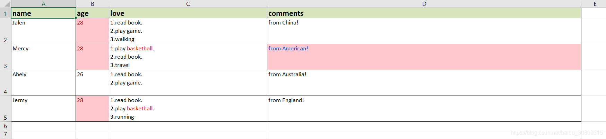

## 需求

（1）导出数据age列如果大于27，设置背景色并且字体红色

（2）导出数据love列如果包含关键字basketball，设置字体为红色

（3）导出数据comments列如果包含关键字American，设置背景色，字体为蓝色

## 要求效果



## 代码

```python
import re
 
import pandas as pd
 
 
def export_ms_excel():
    data = [{'name': 'Jalen',
             'age': 28,
             'love': '1.read book.<br>2.play game.<br>3.walking',
             'comments': 'from China!'},
            {'name': 'Mercy',
             'age': 28,
             'love': '1.play <span style="color:red">basketball</span>.<br>2.read book.<br>3.travel',
             'comments': 'from American!'},
            {'name': 'Abely',
             'age': 26,
             'love': '1.read book.<br>2.play game.',
             'comments': 'from Australia!'},
            {'name': 'Jermy',
             'age': 28,
             'love': '1.read book.<br>2.play <span style="color:red">basketball</span>.<br>3.running',
             'comments': 'from England!'}]
    df = pd.DataFrame(data)
    df = df[['name', 'age', 'love', 'comments']]
 
    # 1. to html
    pd.set_option("display.max_colwidth", 1000, 'display.width', 1000)
    table_html = df.to_html(index=False, border=1, justify='center', na_rep="", escape=False)
    table_html = table_html.replace('class', 'cellspacing=\"0\" class')
    with open('demo.html', 'w') as fo:
        fo.write(table_html)
 
    # 2. to excel
    df['love'] = df.apply(lambda x: x['love'].replace('<br>', '\n'), axis=1)
    writer = pd.ExcelWriter('demo.xlsx', engine='xlsxwriter')
    df.to_excel(writer, index=False, sheet_name='sheet')
    workbook = writer.book
 
    # set excel header format
    header_fmt = workbook.add_format({
        'font_size': 14,
        'bold': True,
        'fg_color': '#D7E4BC',
        'border': 1,
        'text_wrap': True
    })
    sheet_table = writer.sheets['sheet']
    for col_num, value in enumerate(df.columns.values):
        sheet_table.write(0, col_num, value, header_fmt)
 
    # set excel column width
    sheet_table.set_column('A:A', 20)
    sheet_table.set_column('B:B', 10)
    sheet_table.set_column('C:C', 50)
    sheet_table.set_column('D:D', 100)
 
    # set new line for cell in 'love' column
    wrap_format = workbook.add_format({'text_wrap': True, 'align': 'left', 'valign': 'top'})
    for row_num, value in enumerate(df.index.values):
        sheet_table.set_row(row_num + 1, 45, cell_format=wrap_format)
 
    # set red color if cell in 'love' column contain 'basketball'
    red_format = workbook.add_format({'color': 'red'})
    pattern = '.*<span.*>(.*)</span>.*'
    data_list = df.to_dict(orient='records')
    j = 1
    for data in data_list:
        name = data['name']
        age = data['age']
        love = data['love']
        sheet_table.write(j, 0, name)
        sheet_table.write(j, 1, age)
        deal_cell_words(j, 2, love, red_format, pattern, sheet_table)
        j += 1
 
    # set conditional format for 'age'
    age_format = workbook.add_format({'bg_color': '#FFC7CE', 'font_color': '#9C0006'})
    sheet_table.conditional_format(1, 1, len(df), 1,
                                   {'type': 'cell',
                                    'criteria': '>',
                                    'value': 27,
                                    'format': age_format})
 
    # set conditional format for 'comments'
    comments_format = workbook.add_format({'bg_color': '#FFC7CE', 'font_color': '#0052CC'})
    sheet_table.conditional_format(1, 3, len(df), 3,
                                   {'type': 'text',
                                    'criteria': 'containing',
                                    'value': 'American',
                                    'format': comments_format})
 
    # set border
    border_fmt = workbook.add_format({'bottom': 1, 'top': 1, 'left': 1, 'right': 1})
    sheet_table.conditional_format(0, 0, len(df), len(df.columns) - 1,
                                   {'type': 'no_errors', 'format': border_fmt})
 
    workbook.close()
    writer.close()
    writer.save()
 
 
def deal_cell_words(row, column, phrase, red, pattern, worksheet):
    red_keywords = re.findall(pattern, phrase)
    if red_keywords:
        text = phrase.replace('<span style="color:red">', '**').replace('</span>', '**')
        li = [i for i in text.split('**') if i != '']
        new_li = [row, column]
        for j in range(len(li)):
            if li[j] in red_keywords:
                new_li.append(red)
            new_li.append(li[j])
        worksheet.write_rich_string(*new_li)
    else:
        worksheet.write(row, column, phrase)
 
 
if __name__ == '__main__':
    export_ms_excel()
```

## 参考

```
   单元格内字符串换行问题：
	https://stackoverflow.com/questions/41231930/pandas-excel-any-way-to-encode-the-alt-enter-char10-line-break-into-data-wh
   上下左右对齐align问题：
	https://github.com/pandas-dev/pandas/issues/30107
	https://stackoverflow.com/questions/41364380/pandas-dataframe-to-excel-vertical-alignment-of-index
   单元格颜色标红问题：
	https://blog.csdn.net/Miss_Audrey/article/details/105952197
   根据条件设置某列某个单元格特殊颜色：
	https://stackoverflow.com/questions/57997345/how-to-color-text-in-a-cell-containing-a-specific-string-using-pandas
	https://stackoverflow.com/questions/54109548/how-to-save-pandas-to-excel-with-different-colors
   设置单元格border
	https://stackoverflow.com/questions/55928797/python-excelwriter-formatting-all-borders
```
