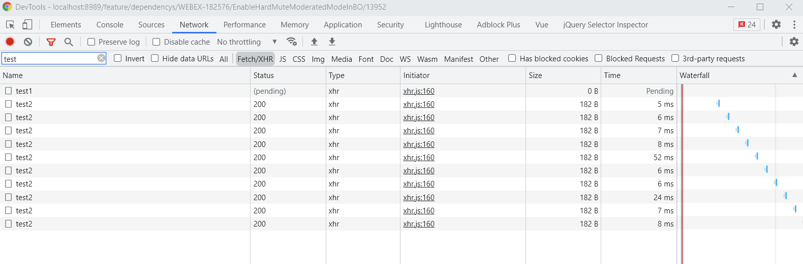
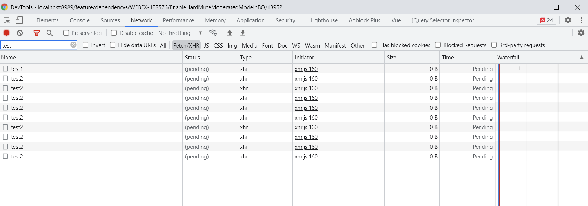
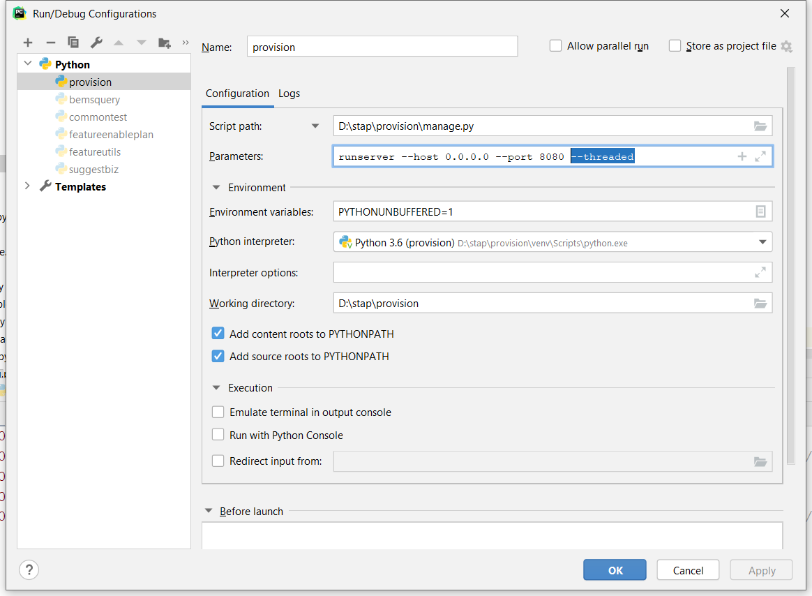

> 后端python flask，前端vue，前端vue里多个axios请求（比如for循环）阻塞（pending），因为ajax是异步调用，请求阻塞就很奇怪了，下面记录该问题

# 效果展示

## 正常情况(此时请求异步，不阻塞)



## 异常情况（此时请求pending）



# 模拟代码

## Python代码
```python
@feature.route('/dependency/test1', methods=['POST'])
@login_required
def test11():
    import time
    logger.info('post')
    time.sleep(60)
    return 'success'


@feature.route('/dependency/test2', methods=['GET'])
@login_required
def test22():
    logger.info('get post')
    return 'success'
```

## Vue代码
```vue
test() {
    this.otimer = setInterval(() => {
        if(this.closeFlag){
            clearInterval(this.otimer)
        }
        getRequest({ url: '/api/dependency/test2'})
    }, 5000)  // 5s一次请求

    postRequest({
        url: '/api/dependency/test1',
        method: 'post'
    }).then(res => {
        this.closeFlag = true
    })
    //let a = 10;
    // while(a < 15){
    //     getRequest({
    //         url: '/api/dependency/test2'
    //     })
    //     a++
    // }
    // for(a; a< 15; a++){
    //     getRequest({
    //         url: '/api/dependency/test2'
    //     })
    // }
}
```

# 原因

因为使用了flask-script组件，启动脚本是manage.py, 在执行manage.py的main方法时需要额外传入一些参数。

因此需要修改pycharm Run/Debug Configurations里的Parameters参数，加上--threaded

`runserver --host 0.0.0.0 --port 8080 --threaded`



可以参考：https://flask-script.readthedocs.io/en/latest/

https://flask-script.readthedocs.io/en/latest/#:~:text=r/%2DR%20flag.-,threaded,-%E2%80%93%20should%20the%20process

threaded – should the process handle each request in a separate thread?


