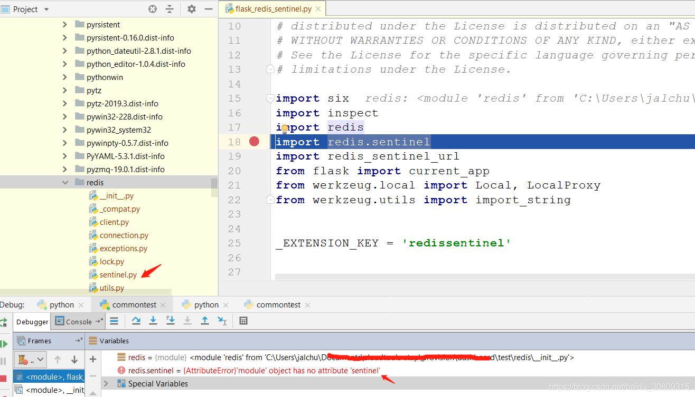

记一次ImportError No module named xxx问题

正常来讲，遇见No moudule named xxx都是直接执行pip install xxx即可，这里不太一样，记一下原因，因为这个本身是很简单的事情，却耗费了挺多时间。

造成原因：
本地venv虚拟环境使用pip安装了redis（pip install redis），同时当前执行的目标文件的目录同级有个redis的package，由于正常我们安装完redis，在venv/Lib/site-packages（windows路径）下会同样生成一个redis的package，导致我们执行目标文件时自动引入了我们自己定义的这个package，而我们自己定义的这个redis的package里肯定会缺少我们实际需要引入的一些方法或属性，所以报了ImportError，解决办法就是保证我们自定义的package不要和pip install的第三方package名字一样，避免引起冲突！

这个容易使我们想到java中的类加载机制，也就是双亲委派原则，后面还是需要具体了解一下python的类加载。

