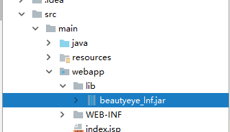

```xml
    <dependency>
      <groupId>com.hope.cloud</groupId>  <!--自定义-->
      <artifactId>cloud</artifactId>    <!--自定义-->
      <version>1.0</version> <!--自定义-->
      <scope>system</scope> <!--system，类似provided，需要显式提供依赖的jar以后，Maven就不会在Repository中查找它-->
      <systemPath>${basedir}/src/main/webapp/lib/beautyeye_lnf.jar</systemPath> <!--项目根目录下的lib文件夹下-->
    </dependency>
```

路径：


