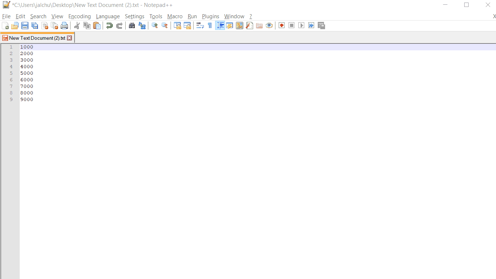

## SQL 

```sql
-- 简单交、并、差集只需要使用intersect、union、minus关键字即可
-- 这里是对用户给予的两个数组（比如excel里的某两列）结合使用oracle的伪列去做交、并、差集运算
-- 实际情况对于比较两个数组有更多选择，这里仅展示oracle sql方式（当然这里使用oracle有些笨，但是某些场景下还是可以使用的，比如excle里某列和db里某列数据的比较）
with t_origin as (select 1000 || ',' ||
                         2000 || ',' ||
                         3000 || ',' ||
                         4000 || ',' ||
                         5000 || ',' ||
                         6000 numbers
                  from dual),
     t_origin_ as (select regexp_substr(t.numbers, '[^,]+', 1, levels.column_value) as numbers
                   from t_origin t,
                        table (cast(multiset(select level from dual connect by level <= length(regexp_replace(t.numbers, '[^,]+')) + 1) as
                                    sys.OdciNumberList)) levels),
     t_target as (select 1000 || ',' ||
                         2000 || ',' ||
                         3000 || ',' ||
                         4000 numbers
                  from dual),
     t_target_ as (select regexp_substr(t.numbers, '[^,]+', 1, levels.column_value) as numbers
                   from t_target t,
                        table (cast(multiset(select level from dual connect by level <= length(regexp_replace(t.numbers, '[^,]+')) + 1) as
                                    sys.OdciNumberList)) levels)
select numbers||'-'||'minus' from (select numbers from t_origin_ minus select numbers from t_target_) union all
select numbers||'-'||'union' from (select numbers from t_origin_ union select numbers from t_target_) union all
select numbers||'-'||'intersect' from (select numbers from t_origin_ intersect select numbers from t_target_);
```

## SQL Output

```raw
5000-minus
6000-minus
1000-union
2000-union
3000-union
4000-union
5000-union
6000-union
1000-intersect
2000-intersect
3000-intersect
4000-intersect
```

## Excel数据处理


