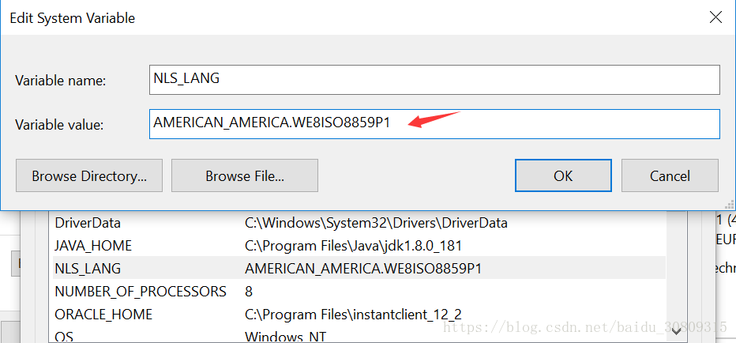

错误原因：oracle服务器编码与客户端编码不一致

解决办法：修改客户端编码（也可以修改服务器端编码，但是服务器一般都是一个局域网所有人共同连接的，私自修改会给他人带来不便）

解决步骤：

（1）查询服务器端编码

```sql
select * from nls_database_parameters
```

（2）查看官方提供的文档

地址：https://docs.oracle.com/cd/A84870_01/doc/nt.816/a73010/appc.htm

（3）修改本地的环境变量



（4）重启pl/sql，再次运行，错误提示正常 
