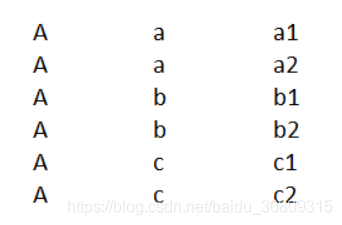
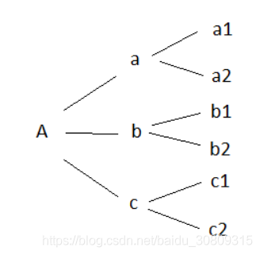

转自：https://stackoverflow.com/questions/49491418/converting-table-directly-to-tree-structure-with-pandas 

1.效果

 

2.代码

```python
def split_to_tree_structure():
    from collections import defaultdict
    import pandas as pd
    df = pd.DataFrame([['A', 'a', 'a1'],
                       ['A', 'a', 'a2'],
                       ['A', 'b', 'b1'],
                       ['A', 'b', 'b2'],
                       ['A', 'c', 'c1'],
                       ['A', 'c', 'c2']],
                      columns=['col1', 'col2', 'col3'])
    d = defaultdict(lambda: defaultdict(list))
 
    for row in df.itertuples():
        d[row[1]][row[2]].append(row[3])
    print(d)
 
 
if __name__ == '__main__':
    split_to_tree_structure()
    print('end!')
```
