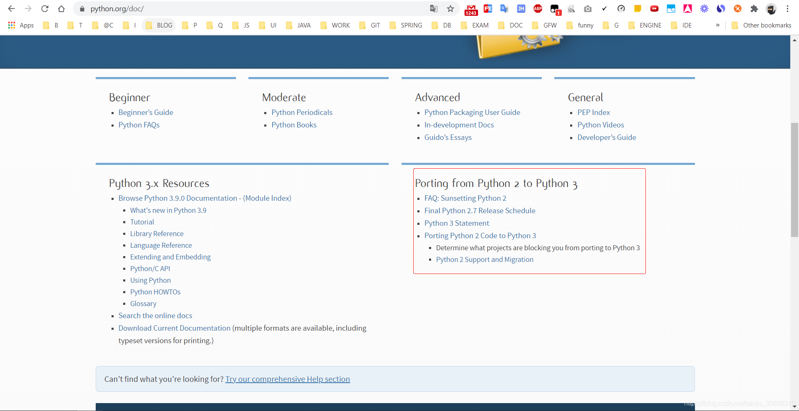

说明：其实py2升py3官网（https://www.python.org/doc/）是有详细文档的



```
由原版本2.7.15 升级到 最新版本3.8.5
 
项目为flask项目
 
升级方法：
本地已经使用py2.7创建了virtualenv，名字叫py2_env，再下载个py3，使用py3创建py3_env
pycharm切换默认env，File-Settings-Python interpreter，
设置py3_env为默认虚拟环境，然后使用py3跑所有code，假如在py2下跑没有问题，而在py3出现了问题，就说明py2和py3不兼容
 
记录一些操作和遇到的问题
 
1. 去官网下载windows安装包3.8.5，注意是64bit的，我用windows下载时默认给了我32位的，所以又自己找download link重下的：
   下载链接：https://www.python.org/ftp/python/3.8.5/python-3.8.5-amd64.exe
   地址：https://www.python.org/downloads/release/python-385/
2. 下载后自定义安装并点击next，安装前可以勾选上自动添加到系统path：
   自定义安装目录：C:\Program Files\Python38
3. 打开cmd，执行python -V测试是否安装成功
4. 使用pycharm打开项目，ctrl+alt+s调出settings面板，搜索Project Interpreter，
   使用python3.8.5构建新的虚拟环境，老的虚拟环境先保留不动，不要删除
5. 构建完使用pip安装requirements.txt的依赖，发现安装gevent>=1.2.2和pandas安装
   失败，查看pip版本为10.0.1，太低了，目前版本已经20+，这是pip版本低导致，
   执行python -m pip install --upgrade pip报AttributeError: 'NoneType' object has no attribute 'bytes'错误
   参考https://github.com/pypa/pip/issues/7069，使用easy_install -U pip安装pip，升级成功（升级到pip20.2.3），
   然后使用新版本pip重新安装gevent和pandas
   注意：
   可以先将requirements.txt的版本写死，尽量不要把版本放开，版本放开后执行下面命令会默认安装每个module的最新版本，
   而python由于自身版本上下不兼容这个坑，所以很多module升级到最新版本，有可能遇到更多的问题
   pip install -r requirements.txt
6. 比较py2和py3的module，需切换环境使用pip list罗列出来并比较，如果每个module的版本都锁定了，那这一步没太大意义，忽略
   py2：C:\Users\jalchu\Documents\demo\py2_env\venv\Scripts\activate
   py3：C:\Users\jalchu\Documents\demo\py3_env\venv\Scripts\activate
7. 启动项目报：configparser.InterpolationSyntaxError: '%' must be followed by '%' or '(',
   参考：https://blog.csdn.net/s740556472/article/details/82889758
   将原来：configparser.ConfigParser()
   修改为：configparser.RawConfigParser()
   这个使用为我们项目使用ini文件保存一些配置性的变量，切换py3后在解析时出了问题
8. 启动项目报：_pydevd_bundle\pydevd_resolver.py:127: SyntaxWarning: "is not" with a literal. Did you mean !=
   参考：https://intellij-support.jetbrains.com/hc/en-us/community/posts/360008175460-Error-pycharm-console
   原因：pycharm版本低，不能更好的支持python3.8新特性
   升级pycharm到最新版本2020.2.1, 原来的版本是2018.2.4
   版本升级参考：https://www.lagou.com/lgeduarticle/90356.html
   安装参数：LFq51qqupnaiTNn39w6zATiOTxZI2JYuRJEBlzmUDv4zeeNlXhMgJZVb0q5QkLr+CIUrSuNB7ucifrGXawLB4qswPOXYG7+ItDNUR/9UkLTUWlnHLX07hnR1USOrWIjTmbytcIKEdaI6x0RskyotuItj84xxoSBP/iRBW2EHpOc (之前是正常的，现在应该不行了)
   安装包：jetbrains-agent-latest.zip
9. flask jsonify(data)，假如data是个字典，如果data里有bytes类型的属性是会报错的，bytes不能jsonify
   python3 str(bytes) 有时会返回有问题字符串，strorbytes.decode('utf-8')可以将bytes转为str
10.reduce函数移动到functools了，使用six做py2和py3的兼容可以省下很多功夫，
   six.moves.reduce(lambda x, y: x+y, df_all['message'].tolist())
   参考https://six.readthedocs.io/
   引入six moves后pycharm报警告，can not resolve the reference，参考：有人说是懒加载，有人说是pycharm的bug，不过运行是正常的，忽略该警告
   https://stackoverflow.com/questions/40560237/pycharm-from-six-moves-import-queue-unresolved-reference-queue
11.有些没有办法用six包解决的，可以在程序里使用six.PY2和six.PY3做人为判断处理，
   即手动编码判断当为py2时执行什么，py3时执行什么
12.假如DB编码是ISO-8859-1，有些西欧字符，py2取出后会因为编码范围窄而部分乱码并在做字符串操作时报错。
   py2默认使用ASCII码，范围很窄，取出来后可能是一个unicode类型数据，即u'xxx', 这种直接做join连接或者做其他一些字符串操作
   会报编码报错，需要xxx.decode('iso-8859-1').encode('utf-8')
   py3则因为默认str类型，使用utf-8，直接做一些字符串操作没有问题
13.在py时try...except...后面我们打印了e.message, 在py3里需要改为getattr(e, 'message', repr(e))，改后也兼容py2
14.下面的map函数会在py3报错（这里主要用map函数实现版本号排序，版本号类似['1.2.0', '2.3.4', '2.5.7']），改为使用tuple实现可兼容py2和py3
   py2：major_versions.sort(key=lambda s: map(int, s.split('.')), reverse=True)
   py3：major_versions.sort(key=lambda x: tuple(int(v) for v in x.split(".")), reverse=True) 
15.ElementTree的tostring方法在py2返回str，在py3返回bytes，这里改成下面的，强制将各种不一样的类型转为str：
   xml_str = six.ensure_str(xml_xxx)
   相当于在py3使用：xml_xxx.decode('utf-8')
16.filter函数修改，在py2是返回一个list，在py3返回一个生成器
   ls = filter(lambda x: x != "", date_list_target)
   ls = list(ls) if six.PY3 else ls
17.pandas 0.24.2和pandas 1.1.2出错的一个地方，py3会出现重复数据
   df_trend = df_trend.groupby([df_trend['timestamp'], df_trend['context']], as_index=False).size().reset_index().fillna(0)
   df_trend = df_trend.pivot_table(index='timestamp', columns='context').reset_index().fillna(0)
18.SQLAlchemy和Flask-SQLAlchemy和cx-Oracle注意升级，该orm在低版本时可能会有些编码方面的问题
19.six==1.11.0  升级至 1.15.0 后才可以使用six.ensure_str()方法
20.对于整数的除法运算，py2返回的是一个int类型的值且向下取整，py3返回float类型值
21.dict_items = {'name': 'jalen', 'age': 12, 'weight': 140}
   dict_values = dict_items.values()
   字典的values()方法在py3会返回dict_values类型数据，而在py2返回的是一个基本数据类型list
22.如果引入了json模块，在使用json.loads(dict_str)返回的字典里key的index顺序可能会有变动，
   如果程序里有直接操作下标的代码需要检查下下标是否对应
 
... ...
```
