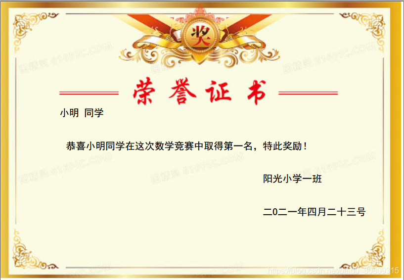

## 说明 

```raw
需求：生成pdf格式的证书，证书其实是有个模板的（下面测试我随便做了一个），不过内容（主要是证书上的文字）需要自己动态填写
语言：python
引入库： PyPDF2 - 负责读写和合并pdf；  （PyPDF2 1.26.0）
        reportlab - 负责绘画（创建）生成一个新的pdf   （reportlab 3.5.67）
        基于Python 3.6.8
思路：使用reportlab的canvas根据坐标（以左下角为原点，使得整个pdf page在第一象限）绘制新的pdf文件放到内存，
      使用PyPDF2读取pdf模板，合并上面生成的新的pdf page，然后将合并后的pdf写入文件
说明：reportlab默认不支持中文，直接绘制中文字符会显示小方框乱码，需要先注册字体，字体直接引用系统ttf文件即可
      注意canvas的坐标系，即第一象限，绘制时可能要多次测试调整x，y的值使得内容显示恰当，然后合并后生成你所需要的pdf
证书模板：我这里是随便找了个证书图片（百度搜一堆，把内容擦掉即可），使用gimp工具导出为pdf（file - export as修改文件名字为test.pdf然后导出）
参考：https://www.reportlab.com/docs/reportlab-userguide.pdf
Demo证书图片：https://www.google.com/url?sa=i&url=http%3A%2F%2F616pic.com%2Fimage%2Fzhengshu.html&psig=AOvVaw2yhE9FezNqC-6U4kgBWDun&ust=1619226823600000&source=images&cd=vfe&ved=0CAIQjRxqFwoTCMCejI-Yk_ACFQAAAAAdAAAAABAD
```

## 效果




## 代码

```python
from PyPDF2 import PdfFileWriter, PdfFileReader
import io
from reportlab.pdfgen import canvas
from reportlab.lib.pagesizes import letter
from reportlab.pdfbase.ttfonts import TTFont
from reportlab.pdfbase import pdfmetrics
pdfmetrics.registerFont(TTFont('SimHei', r'C:\Windows\Fonts\simhei.ttf'))
 
 
if __name__ == '__main__':
    packet = io.BytesIO()
    # create a new PDF with Reportlab
    can = canvas.Canvas(packet, pagesize=letter)
    can.setFillColorRGB(0, 0, 0)  # choose your font colour
    can.setFont("SimHei", 3)  # choose your font type and font size
    can.drawString(18, 50, "小明 同学")  # name
    can.drawString(20, 40, "恭喜小明同学在这次数学竞赛中取得第一名，特此奖励！")
    can.drawString(80, 30, "阳光小学一班")
    can.drawString(80, 20, "二O二一年四月二十三号")
    can.save()
 
    # move to the beginning of the StringIO buffer
    packet.seek(0)
    new_pdf = PdfFileReader(packet)
    # read your existing PDF
    existing_pdf = PdfFileReader(open(r"C:\Users\jalchu\Desktop\test.pdf", "rb"))
    output = PdfFileWriter()
    # add the "watermark" (which is the new pdf) on the existing page
    page = existing_pdf.getPage(0)
    page.mergePage(new_pdf.getPage(0))
    output.addPage(page)
    # finally, write "output" to a real file
    outputStream = open(r"C:\Users\jalchu\Desktop\demo.pdf", "wb")
    output.write(outputStream)
    outputStream.close()
    print('end')
```