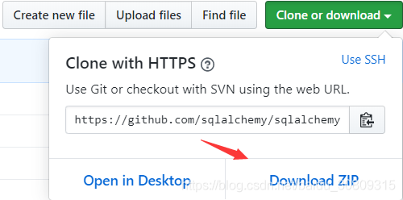

背景： Github上有很多第三方module，有时候我们项目里需要，但是使用pip去安装时发现找不到这个包，这里以sqlalchemy的一个dev版本为例

1.下载 （地址：https://github.com/sqlalchemy/sqlalchemy/archive/rel_1_3.zip）



2.解压zip包

3.进入项目虚拟环境，执行setup.py

> (venv) C:\Users\jalchu\Desktop\New folder\sqlalchemy-rel_1_3>python setup.py install

4.执行后在log里可以看到有egg文件产生

> Copying SQLAlchemy-1.3.11.dev0-py2.7-win-amd64.egg to c:\users\jalchu\documents\cloudtools-stap\provision\venv\lib\site-packages

5.切换目录，安装egg文件

```
(venv) C:\Users\jalchu\Documents\cloudtools-stap\provision\venv\Lib\site-packages>cd c:\users\jalchu\documents\cloudtools-stap\prov
ision\venv\lib\site-packages
 
(venv) C:\Users\jalchu\Documents\cloudtools-stap\provision\venv\Lib\site-packages>easy_install SQLAlchemy-1.3.11.dev0-py2.7-win-amd
64.egg
Processing SQLAlchemy-1.3.11.dev0-py2.7-win-amd64.egg
Copying SQLAlchemy-1.3.11.dev0-py2.7-win-amd64.egg to c:\python27\lib\site-packages
Adding SQLAlchemy 1.3.11.dev0 to easy-install.pth file
 
Installed c:\python27\lib\site-packages\sqlalchemy-1.3.11.dev0-py2.7-win-amd64.egg
Processing dependencies for SQLAlchemy==1.3.11.dev0
Finished processing dependencies for SQLAlchemy==1.3.11.dev0
 
(venv) C:\Users\jalchu\Documents\cloudtools-stap\provision\venv\Lib\site-packages>pip list
sqlalchemy                1.3.11.dev0
```

6.结束
