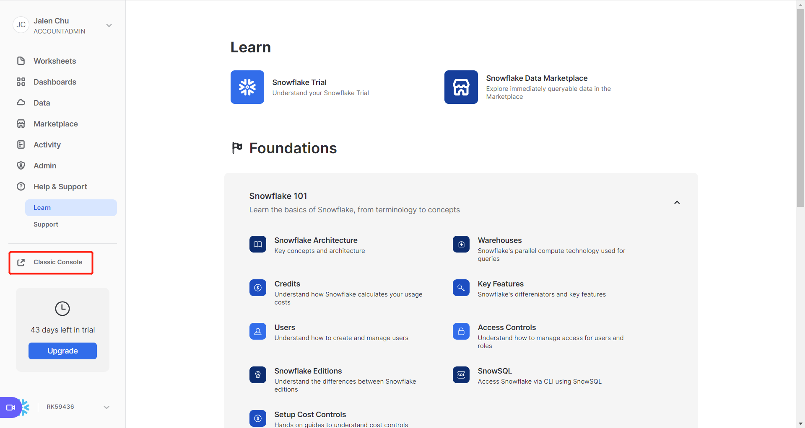
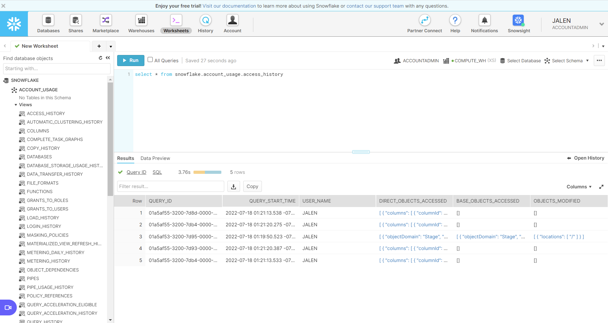

# 简介

snowflake是一家搞云计算仓库的公司，我们这里使用的snowflake类似于一个数据仓库，或者类似于一个database，一种网络db，不是twitter的snowflake算法。

申请（30天试用期）：https://signup.snowflake.com/

登录：https://app.snowflake.com/learn

点击左侧菜单中 Classic Console 进入worksheet:



我的会跳转到:



简单查询：
```sql
select * from snowflake.account_usage.access_history

create or replace database jalen;  -- 默认产生一个名字叫public的schema

select current_database(), current_schema();

create or replace table jalen_table (
  first_name string ,
  last_name string ,
  email string ,
  streetaddress string ,
  city string ,
  start_date date
);
  
insert into jalen_table values
('Clementine','Adamou','cadamou@sf_tuts.com','10510 Sachs Road','Klenak','2017-9-22') ,
('Marlowe','De Anesy','madamouc@sf_tuts.co.uk','36768 Northfield Plaza','Fangshan','2017-1-26');
  
select * from jalen_table;
  
select email from jalen_table where email like '%.uk';
  
select first_name, last_name, dateadd('day',90,start_date) from jalen_table where start_date <= '2017-09-23';
  
create or replace warehouse jalen_warehouse with
warehouse_size='X-SMALL'
auto_suspend = 180
auto_resume = true
initially_suspended=true;
  
select current_warehouse();
  
drop database if exists jalen;

drop warehouse if exists jalen_warehouse;
```


# 连接
```python
if __name__ == '__main__':
    import snowflake.connector

    ctx = snowflake.connector.connect(
        user='xxxxxx',
        password='xxxxxxxx',
        account='xxx'
    )
    cs = ctx.cursor()
    try:
        cs.execute("SELECT current_version()")
        one_row = cs.fetchone()
        print(one_row[0])
    finally:
        cs.close()
    ctx.close()
    print('End!')
```

# 参考

https://docs.snowflake.com/en/

https://docs.snowflake.com/en/user-guide/python-connector.html

https://docs.snowflake.com/en/user-guide/python-connector-install.html

https://docs.snowflake.com/en/user-guide/admin-account-identifier.html

https://docs.snowflake.com/en/user-guide/admin-account-identifier.html#where-are-account-identifiers-used
