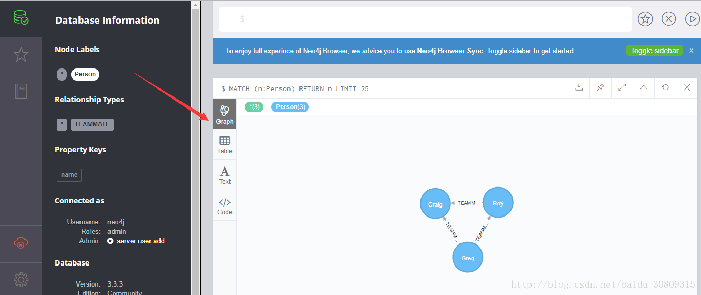

neo4j是一款高性能的NoSQL图形数据库，支持高效遍历，在机器学习、人工智能领域使用越来越广泛。

spring官网guides中有个例子：https://spring.io/guides/gs/accessing-data-neo4j/

完成这个例子前需要手动下载neo4j server，我下载的是win-64bit。

下载地址：https://neo4j.com/download/other-releases/#releases

下载完成并解压后，打开cmd，cd进入bin目录，输入neo4j.bat console并执行，可以开启服务。

```bash
D:\neo4j\neo4j-community-3.3.3\bin>neo4j.bat console
警告: This command does not appear to be running with administrative rights.  Some commands may fail e.g. Start/Stop
2018-02-26 01:00:37.799+0000 INFO  ======== Neo4j 3.3.3 ========
2018-02-26 01:00:37.887+0000 INFO  Starting...
2018-02-26 01:00:41.428+0000 INFO  Bolt enabled on 127.0.0.1:7687.
2018-02-26 01:00:50.256+0000 INFO  Started.
2018-02-26 01:00:52.163+0000 INFO  Remote interface available at http://localhost:7474/
```

出现上面启动日志时表示启动成功。

此时可以在浏览器输入http://localhost:7474/browser/并访问，会进入neo4j server的控制台。

然后我们将spring官网这个例子的代码clone到本地，运行一下。

运行成功后，我们再次进入neo4j server的控制台，在数据库中就可以看到刚刚存储的图形对象了，如下图



如果不太明白，可以参考百度文库的一篇文章：https://wenku.baidu.com/view/4ff40c174a35eefdc8d376eeaeaad1f346931106

