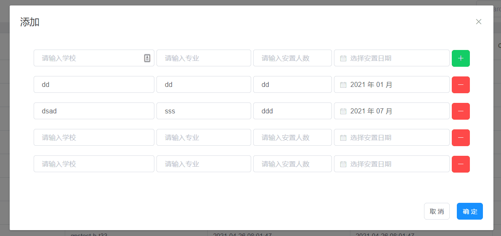

## 效果



## 代码

```html
      <el-dialog title="添加" :visible.sync="dynamicFormVisible" width="920px">
        <el-form :model="dynamicForm">
          <div>
            <el-form-item style="text-align: center;">
              <el-input style="width:230px" placeholder="请输入学校" autocomplete="off"></el-input>
              <el-input style="width:180px" placeholder="请输入专业" autocomplete="off"></el-input>
              <el-input style="width:150px" placeholder="请输入安置人数" autocomplete="off"></el-input>
              <el-date-picker type="month" placeholder="选择安置日期" format="yyyy 年 MM 月" value-format="yyyy-MM-dd"></el-date-picker>
              <el-button type="success" @click="addInput" icon="el-icon-plus"></el-button>
            </el-form-item>
          </div>
          <div v-for="(item, index) in dynamicForm.counter">
            <el-form-item style="text-align: center;">
              <el-input style="width:230px" v-model="item.xxName" placeholder="请输入学校" autocomplete="off"></el-input>
              <el-input style="width:180px" v-model="item.zyName" placeholder="请输入专业" autocomplete="off"></el-input>
              <el-input style="width:150px" v-model="item.azCount" placeholder="请输入安置人数" autocomplete="off"></el-input>
              <el-date-picker v-model="item.azDate" type="month" placeholder="选择安置日期" format="yyyy 年 MM 月" value-format="yyyy-MM-dd"></el-date-picker>
              <el-button type="danger" @click="delInput(item, index)" icon="el-icon-minus"></el-button>
            </el-form-item>
          </div>
        </el-form>
        <span slot="footer" class="dialog-footer">
          <el-button @click="dynamicFormVisible=false">取 消</el-button>
          <el-button type="primary" @click="saveForm()">确 定</el-button>
        </span>
      </el-dialog>
```

```javascript
  export default {
    data() {
      return {
        dynamicFormVisible: true,
        dynamicForm: {
          counter: []
        }
      }
    },
    methods: {
      addInput() {
        this.dynamicForm.counter.push({'xxName': '', 'zyName': '', 'azCount': '', 'azDate': '' })
      },
      delInput(index) {
        this.dynamicForm.counter.splice(index, 1)
      },
      saveForm() {
        console.log(this.dynamicForm.counter)
      }
    }
  }
```
