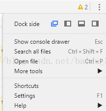
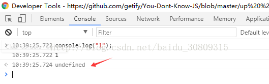

1. 使用chrome的F12 developer console调试，使用window.prompt()方法未弹窗

原因：控制台的Dock side视图设置成了Undock into separate window，改成内嵌的视图即可，官方解释如下

If a document in a background tab calls window.prompt() then the call to prompt() will return immediately, and no dialog will be shown to the user for that call to prompt(). If the tab is foremost (if it is the active tab in the front window), then the call will show a dialog. Specifically, this removes the ability to use window.prompt() to bring a tab to the front against the user’s will.

Dock side位置：

2. 为什么chrome console回车时要多带一行undefined

Every time console.log is executed, a line saying undefined is appended to the output log.

Happens in both Firefox and Chrome on Windows and Linux.like below picture.

原因：和返回值有关系

If you're running console.log() from a JS file, this undefined line should not be appended.

If you're running console.log() from the console itself, it makes sense. This is why: In the console you can type a name of a variable (for example try typing window) and it prints info about it. When you run any void function (like console.log) from the console, it also prints out info about the return value, undefined in this case.

I tested both cases on my Chrome (Mac ver 23.0.1271.101) and indeed I see the undefined line when I run it inside the console. This undefined also appears when I write this line in the console: var bla = "sdfdfs"

