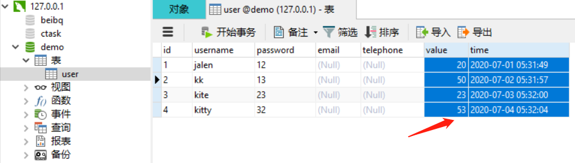
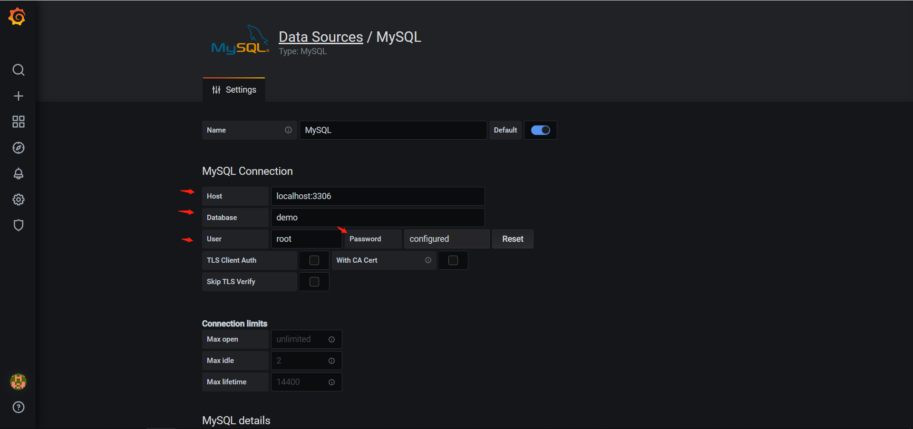
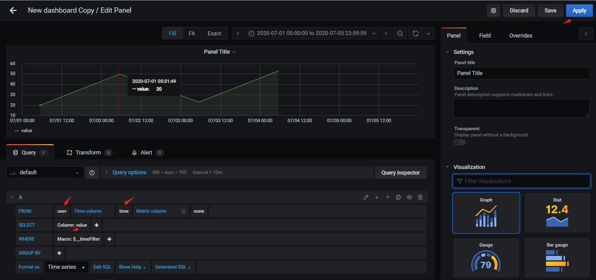
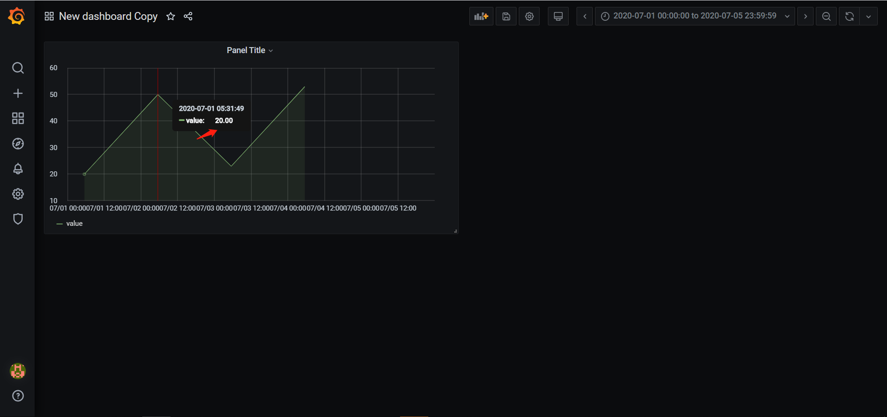

```
   1. 简介
   Grafana是一个多平台的开源的可视化 Web应用程序，用来做数据分析并与用户交互。当连接到支持的数据源时，它会为Web提供图表，图形和警报。
   它可以通过插件系统扩展。最终用户可以使用交互式查询构建器创建复杂的监视仪表板。
   支持数据源有：
   1）Time series databases：Prometheus、Graphite、OpenTSDB、InfluxDB
   2）Logging & document databases：Loki、Elasticsearch
   3）Distributed tracing：Jaeger、Zipkin
   4）SQL：MySQL、PostgreSQL、Microsoft SQL Server
   5）Cloud：Google Cloud Monitoring、CloudWatch、Azure Monitor、Grafana Cloud
   6）Enterprise plugins：Splunk、ServiceNow、Oracle、New Relic、Dynatrace、DataDog、AppDynamics
   7）etc
 
   2. 安装（windows为例）
   windows下载页面：https://grafana.com/grafana/download?platform=windows
   windows安装手册：https://grafana.com/docs/grafana/latest/installation/windows/
   安装方式一：下载地址：https://dl.grafana.com/oss/release/grafana-7.1.1.windows-amd64.msi
               下载msi安装包，直接鼠标点击进行安装，安装完浏览器打开localhost:3000测试
   安装方式二：下载地址：https://dl.grafana.com/oss/release/grafana-7.1.1.windows-amd64.zip
               1）下载zip压缩包，点击zip包邮件选择Properties，选择unblock复选框，点击ok。
               2）解压到磁盘任意位置，然后进入bin目录，shift+鼠标右键在bin目录下打开powershell
                  窗口（cmd也可以），然后执行.\grafana-server.exe
               3）浏览器输入localhost:3000测试，初始用户名和密码都是admin
               4）错误操作：双击执行grafana-server.exe后会弹出cmd窗口打印一堆log，此时在浏览器
                  访问会一直loading，关闭cmd窗口后浏览器loading失败
   附：如果选择zip包安装，并且想要以windows service形式后端运行，可以使用nssm配置，配置如下：
       1）进入nssm官方下载页面：https://nssm.cc/download
       2）下载压缩包，下载地址：https://nssm.cc/release/nssm-2.24.zip
       3）解压，进入win64文件夹，执行.\nssm.exe install grafana（grafana是我自定义的service name，
          这个随意），此时弹出窗口，设置grafana-server.exe的路径。
       4）打开cmd窗口，输入services.msc打开服务列表，找到grafana服务，右键打开（也可以通过nssm命
          令启动服务），然后在浏览器输入localhost:3000测试
       5）此时grafana是以windows services形式后台运行
       6）端口号修改：把conf目录下sample.ini重命名为custom.ini，修改http_port属性，去掉;注释
  
   3. 配置数据源，以本地mysql为例
   1）左侧边栏选择配置Configuration->Data Sources->Mysql，输入DB配置信息
   2）左侧边栏选择Dashboards->Manage->New Dashboard->Add new panel，写sql语句然后apply
```

截图：








