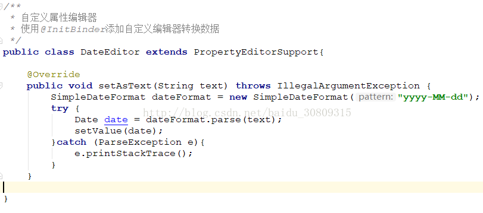

场景：spring mvc中jsp页面向后台传入的数据类型都是String，这里将String转换成Date对象

git：git@github.com:SincerelyUnique/spring-mybatis-databind-conversion-service.git

1. 参考：http://blog.csdn.net/baidu_30809315/article/details/77162809

2. spring mvc配置文件添加

```xml
    <!-- 装载自定义的类型转换器 -->
    <mvc:annotation-driven />
```

3. 新建转换类：DateEditor.java



4. 控制器添加@InitBinder方法

```java
    @InitBinder
    public void initBinder(WebDataBinder binder){
        binder.registerCustomEditor(Date.class,new DateEditor());
    }
```
