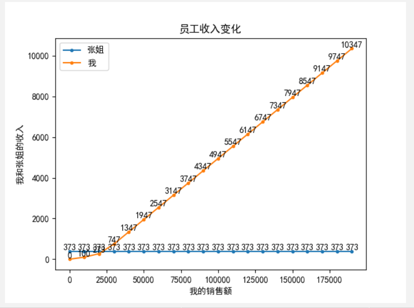
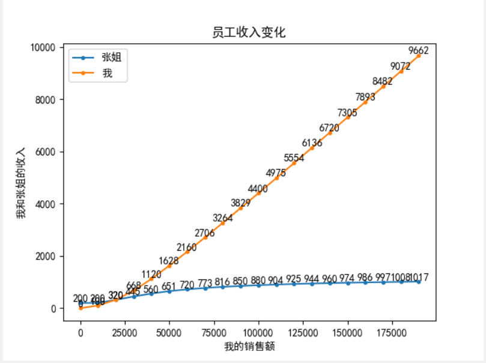

> 我们店里这个月规定要实现的总业绩金额是160000，店里总共3名员工，平均到每个人头上也就是160000/3=53333。这个月总共31天，我因为有事请了14天假，也就是我上了17天班，前面14天班由张姐代班。

# 店铺的绩效标准

个人销售金额 处于 个人应达成金额 的 60% 及以下：获得 1% 提成金额
个人销售金额 处于 个人应达成金额 的 60% - 80% 之间： 获得 4% 提成金额
个人销售金额 处于 个人应达成金额 的 80% - 100% 之间： 获得 5% 提成金额
个人销售金额 大于 100%： 获得 6% 提成金额

# 现总监提出的2种绩效计算方案
1. 分开算：个人总的应完成的绩效金额平均分摊到31天，也就是53333/31=1720，张姐的应完成绩效乘以14(1720\*14=24080)，我的应完成绩效乘以17(1720\*17=29240)，然后再以这个绩效点计算提成;
2. 一块算：直接按53333计算提成金额，计算后按照每个员工的销售金额比例再乘以总的提成金额得到各个员工的提成金额。

# 模拟
假设：张姐销售2w，我销售了8w。张姐的销售金额是固定的常量，因为这个月前14天已经过去了，这个金额不会变，然而这个月还没有结束，我的销售金额是波动的，所以我的销售额是变量。

```
方案一：

24080 * 60% = 14448
24080 * 80% = 19264

29240 * 60% = 17544
29240 * 80% = 23392

张姐提成金额 = 14448 * 0.01 + (19264 - 14448) * 0.04 + (20000 - 19264) * 0.05 = 144.48 + 192.64 + 36.8 = 373.92 

我的提成金额 = 17544 * 0.01 + (23392 - 17544) * 0.04 + (29240 - 23392) * 0.05 + (80000 - 29240) * 0.06 = 175.44 + 233.92 + 292.4 + 3045.6 = 3747.36

老板发给我俩的提成金额 = 373.92 + 3747.36 = 4121.28
```

```
方案二：

53333 * 60% = 31999
53333 * 80% = 42666

总提成金额 = 31999 * 0.01 + （42666 - 31999）* 0.04 + （53333 - 42666）* 0.05 + （20000 + 80000 - 53333）* 0.06 = 319.99 + 426.68 + 533.35 + 2800.02 = 4080.04 ≈ 4080

张姐提成金额 = 4080 * 1/5 = 816  (张姐销售了总金额的五分之一，**注意这里的偷换概念**)

我的提成金额 = 4080 * 4/5 = 3264
```

从上面计算方式来看其实方案二就错的很离谱，销售总金额是一个变量，张姐的销售额2w已经是个定值了，但是后面会随着我卖的金额增加而增加，那么张姐增加的提成是谁或者从哪里来的呢？而我少的那部分提成又去了哪里呢？（注意这里公司总共发放的总提成金额其实相差不大，大约相差40元，也就是说老板不会因为两种算法给公司节约更多的输出成本）

但是从张姐的角度来讲也有一些不平衡因素，因为我就上了14天，我的2w销售额达不到拿6个点（6%）的提成，甚至5个点的提成都拿不到，假如张姐能够上够31天，那么她可能会因为总销售额达到销售指标从而拿到部分6个点的提成，当然此时的完成指标也由14天的24080上升到了53333，以张姐14天每天平均业绩来计算，31天总业绩可能是44285，即便再加5000也达不到53333的销售指标，依然拿不到6个点的提成，5个点的提成也是只能拿到一部分。

所以总体来说，如果按方案二计算，张姐会因为我良好的销售业绩变向的获得了部分6个点的提成以及部分5个点的提成，相当于将她的5个点的提成拉满，并且收获了部分6个点的提成，而她的这些多得的提成金额是从我的提成金额里挪走的，我的提成金额相对而言就变低了。

比较极端的比喻，如果这个月里店铺人员流动很大，前前后后来了5个员工，每个员工实际工作天数为6 + 6 + 6 + 6 + 7 = 31(天)，假如她们其中某一个是非常棒的销售，一个人卖掉了100w，如果按方案二一起算的话，她的销售提成会有一部分落到其他4名员工头上。

# 统计

> 因为我的销售业绩是变量，我们就以它作为输入，依次赋值为0，10000， 20000， ...， 190000，200000，输出张姐和我的提成金额以及变化曲线

## 程序
```python
import matplotlib.pyplot as plt


def single_calculate(sell_b):
    achieve_per_day = 53333 / 31

    sell_a = 20000
    a_100 = achieve_per_day * 14
    a_60 = a_100 * 0.6
    a_80 = a_100 * 0.8
    if sell_a <= a_60:
        a_res = sell_a * 0.01
    else:
        a_res = a_60 * 0.01
        if a_60 < sell_a <= a_80:
            a_res = a_res + (sell_a - a_60) * 0.04
        else:
            a_res = a_res + (a_80 - a_60) * 0.04
            if a_80 < sell_a <= a_100:
                a_res = a_res + (sell_a - a_80) * 0.05
            else:
                a_res = a_res + (a_100 - a_80) * 0.05
                if sell_a > a_100:
                    a_res = a_res + (sell_a - a_100) * 0.06

    b_100 = achieve_per_day * 17
    b_60 = b_100 * 0.6
    b_80 = b_100 * 0.8
    if sell_b <= b_60:
        b_res = sell_b * 0.01
    else:
        b_res = b_60 * 0.01
        if b_60 < sell_b <= b_80:
            b_res = b_res + (sell_b - b_60) * 0.04
        else:
            b_res = b_res + (b_80 - b_60) * 0.04
            if b_80 < sell_b <= b_100:
                b_res = b_res + (sell_b - b_80) * 0.05
            else:
                b_res = b_res + (b_100 - b_80) * 0.05
                if sell_b > b_100:
                    b_res = b_res + (sell_b - b_100) * 0.06
    return a_res, b_res


def double_calculate(sell_b):
    t_100 = 53333
    t_80 = 53333 * 0.8
    t_60 = 53333 * 0.6
    sell_a = 20000
    t_sell = sell_a + sell_b
    if t_sell <= t_60:
        t_res = t_sell * 0.01
    else:
        t_res = t_60 * 0.01
        if t_60 < t_sell <= t_80:
            t_res = t_res + (t_sell - t_60) * 0.04
        else:
            t_res = t_res + (t_80 - t_60) * 0.04
            if t_80 < t_sell <= t_100:
                t_res = t_res + (t_sell - t_80) * 0.05
            else:
                t_res = t_res + (t_100 - t_80) * 0.05
                if t_sell > t_100:
                    t_res = t_res + (t_sell - t_100) * 0.06
    a_res = t_res * sell_a / t_sell
    b_res = t_res * sell_b / t_sell
    return a_res, b_res


if __name__ == '__main__':
    achievement = [i * 10000 for i in range(20)]
    split_a, split_b, merge_a, merge_b = [], [], [], []
    for ach in achievement:
        print('我的销售业绩为 %s 元。' % ach)
        a1, b1 = single_calculate(ach)
        print('分开算，张姐获得 %s 元，我获得 %s 元。老板总共发 %s 元。' % (int(a1), int(b1), (int(a1) + int(b1))))
        split_a.append(int(a1))
        split_b.append(int(b1))
        a2, b2 = double_calculate(ach)
        print('一块算，张姐获得 %s 元，我获得 %s 元。老板总共发 %s 元。' % (int(a2), int(b2), (int(a2) + int(b2))))
        merge_a.append(int(a2))
        merge_b.append(int(b2))
        print('---------------------------------')
    plt.title('员工收入变化')  # 折线图标题
    plt.rcParams['font.sans-serif'] = ['SimHei']  # 显示汉字
    plt.xlabel('我的销售额')  # x轴标题
    plt.ylabel('我和张姐的收入')  # y轴标题
    plt.plot(achievement, split_a, marker='o', markersize=3)  # 绘制折线图，添加数据点，设置点的大小
    plt.plot(achievement, split_b, marker='o', markersize=3)
    for a, b in zip(achievement, split_a):
        plt.text(a, b, b, ha='center', va='bottom', fontsize=10)  # 设置数据标签位置及大小
    for a, b in zip(achievement, split_b):
        plt.text(a, b, b, ha='center', va='bottom', fontsize=10)
    plt.legend(['张姐', '我'])  # 设置折线名称
    plt.show()  # 显示折线图
```

## 程序输出结果：
```
我的销售业绩为 0 元。
分开算，张姐获得 373 元，我获得 0 元。老板总共发 373 元。
一块算，张姐获得 200 元，我获得 0 元。老板总共发 200 元。
---------------------------------
我的销售业绩为 10000 元。
分开算，张姐获得 373 元，我获得 100 元。老板总共发 473 元。
一块算，张姐获得 200 元，我获得 100 元。老板总共发 300 元。
---------------------------------
我的销售业绩为 20000 元。
分开算，张姐获得 373 元，我获得 273 元。老板总共发 646 元。
一块算，张姐获得 320 元，我获得 320 元。老板总共发 640 元。
---------------------------------
我的销售业绩为 30000 元。
分开算，张姐获得 373 元，我获得 747 元。老板总共发 1120 元。
一块算，张姐获得 445 元，我获得 668 元。老板总共发 1113 元。
---------------------------------
我的销售业绩为 40000 元。
分开算，张姐获得 373 元，我获得 1347 元。老板总共发 1720 元。
一块算，张姐获得 560 元，我获得 1120 元。老板总共发 1680 元。
---------------------------------
我的销售业绩为 50000 元。
分开算，张姐获得 373 元，我获得 1947 元。老板总共发 2320 元。
一块算，张姐获得 651 元，我获得 1628 元。老板总共发 2279 元。
---------------------------------
我的销售业绩为 60000 元。
分开算，张姐获得 373 元，我获得 2547 元。老板总共发 2920 元。
一块算，张姐获得 720 元，我获得 2160 元。老板总共发 2880 元。
---------------------------------
我的销售业绩为 70000 元。
分开算，张姐获得 373 元，我获得 3147 元。老板总共发 3520 元。
一块算，张姐获得 773 元，我获得 2706 元。老板总共发 3479 元。
---------------------------------
我的销售业绩为 80000 元。
分开算，张姐获得 373 元，我获得 3747 元。老板总共发 4120 元。
一块算，张姐获得 816 元，我获得 3264 元。老板总共发 4080 元。
---------------------------------
我的销售业绩为 90000 元。
分开算，张姐获得 373 元，我获得 4347 元。老板总共发 4720 元。
一块算，张姐获得 850 元，我获得 3829 元。老板总共发 4679 元。
---------------------------------
我的销售业绩为 100000 元。
分开算，张姐获得 373 元，我获得 4947 元。老板总共发 5320 元。
一块算，张姐获得 880 元，我获得 4400 元。老板总共发 5280 元。
---------------------------------
我的销售业绩为 110000 元。
分开算，张姐获得 373 元，我获得 5547 元。老板总共发 5920 元。
一块算，张姐获得 904 元，我获得 4975 元。老板总共发 5879 元。
---------------------------------
我的销售业绩为 120000 元。
分开算，张姐获得 373 元，我获得 6147 元。老板总共发 6520 元。
一块算，张姐获得 925 元，我获得 5554 元。老板总共发 6479 元。
---------------------------------
我的销售业绩为 130000 元。
分开算，张姐获得 373 元，我获得 6747 元。老板总共发 7120 元。
一块算，张姐获得 944 元，我获得 6136 元。老板总共发 7080 元。
---------------------------------
我的销售业绩为 140000 元。
分开算，张姐获得 373 元，我获得 7347 元。老板总共发 7720 元。
一块算，张姐获得 960 元，我获得 6720 元。老板总共发 7680 元。
---------------------------------
我的销售业绩为 150000 元。
分开算，张姐获得 373 元，我获得 7947 元。老板总共发 8320 元。
一块算，张姐获得 974 元，我获得 7305 元。老板总共发 8279 元。
---------------------------------
我的销售业绩为 160000 元。
分开算，张姐获得 373 元，我获得 8547 元。老板总共发 8920 元。
一块算，张姐获得 986 元，我获得 7893 元。老板总共发 8879 元。
---------------------------------
我的销售业绩为 170000 元。
分开算，张姐获得 373 元，我获得 9147 元。老板总共发 9520 元。
一块算，张姐获得 997 元，我获得 8482 元。老板总共发 9479 元。
---------------------------------
我的销售业绩为 180000 元。
分开算，张姐获得 373 元，我获得 9747 元。老板总共发 10120 元。
一块算，张姐获得 1008 元，我获得 9072 元。老板总共发 10080 元。
---------------------------------
我的销售业绩为 190000 元。
分开算，张姐获得 373 元，我获得 10347 元。老板总共发 10720 元。
一块算，张姐获得 1017 元，我获得 9662 元。老板总共发 10679 元。
```
## 分开算变化趋势


## 一起算变化趋势


## 分析
前期我的销售金额少于张姐，我分摊了张姐的提成金额，

后期我的销售金额上来了，张姐分摊了我的提成金额。但是随着我销售的金额的基数扩大，而张姐始终是2w，导致后期张姐能够拿到的提成金额趋势趋于平缓，但还是会一直增加。

这其实有点像躺着赚钱！
