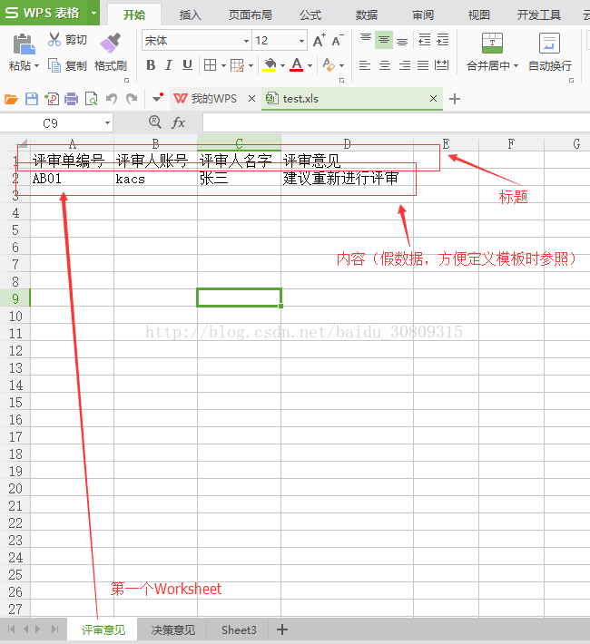
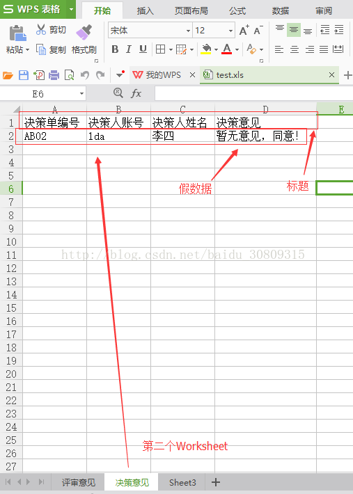
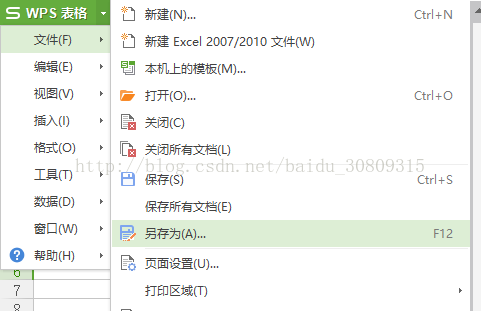
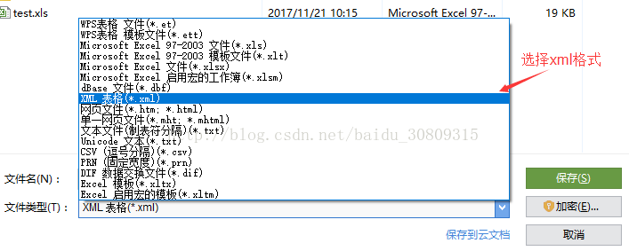

# 使用背景

公司项目中需要导出Excel，使用了freemarker模板。

# 操作步骤

1. 首先自己新建一个Excel表格，在里面写好自己的格式（最好同时写好一行假数据），





2. 然后另存为xml格式的文件





3. 使用nopad++或其他编辑器打开xml文件（最好代码格式化一下），可以看到样式和数据都已经生成好了，我们可以直接将这个xml文件作为我们的free marker模板（拿来即用）

```xml
<?xml version="1.0" encoding="utf-8"?>
<?mso-application progid="Excel.Sheet"?>
 
<Workbook xmlns="urn:schemas-microsoft-com:office:spreadsheet" xmlns:o="urn:schemas-microsoft-com:office:office" xmlns:x="urn:schemas-microsoft-com:office:excel" xmlns:ss="urn:schemas-microsoft-com:office:spreadsheet" xmlns:html="http://www.w3.org/TR/REC-html40" xmlns:dt="uuid:C2F41010-65B3-11d1-A29F-00AA00C14882">
  <DocumentProperties xmlns="urn:schemas-microsoft-com:office:office">
    <Author>mcchu</Author>
    <LastAuthor>mcchu</LastAuthor>
    <Created>2017-11-21T02:10:46Z</Created>
    <LastSaved>2017-11-21T02:22:14Z</LastSaved>
  </DocumentProperties>
  <CustomDocumentProperties xmlns="urn:schemas-microsoft-com:office:office">
    <KSOProductBuildVer dt:dt="string">2052-10.1.0.6930</KSOProductBuildVer>
  </CustomDocumentProperties>
  <ExcelWorkbook xmlns="urn:schemas-microsoft-com:office:excel">
    <WindowWidth>20385</WindowWidth>
    <WindowHeight>8370</WindowHeight>
    <ActiveSheet>1</ActiveSheet>
    <ProtectStructure>False</ProtectStructure>
    <ProtectWindows>False</ProtectWindows>
  </ExcelWorkbook>
  <Styles>
    <Style ss:ID="s46" ss:Name="强调文字颜色 6">
      <Font ss:FontName="宋体" x:CharSet="0" ss:Size="11" ss:Color="#FFFFFF"/>
      <Interior ss:Color="#70AD47" ss:Pattern="Solid"/>
    </Style>
    <Style ss:ID="s33" ss:Name="20% - 强调文字颜色 5">
      <Font ss:FontName="宋体" x:CharSet="0" ss:Size="11" ss:Color="#000000"/>
      <Interior ss:Color="#D9E1F2" ss:Pattern="Solid"/>
    </Style>
    <Style ss:ID="s32" ss:Name="适中">
      <Font ss:FontName="宋体" x:CharSet="0" ss:Size="11" ss:Color="#9C6500"/>
      <Interior ss:Color="#FFEB9C" ss:Pattern="Solid"/>
    </Style>
    <Style ss:ID="s14" ss:Name="60% - 强调文字颜色 2">
      <Font ss:FontName="宋体" x:CharSet="0" ss:Size="11" ss:Color="#FFFFFF"/>
      <Interior ss:Color="#F4B084" ss:Pattern="Solid"/>
    </Style>
    <Style ss:ID="s7" ss:Name="差">
      <Font ss:FontName="宋体" x:CharSet="0" ss:Size="11" ss:Color="#9C0006"/>
      <Interior ss:Color="#FFC7CE" ss:Pattern="Solid"/>
    </Style>
    <Style ss:ID="s8" ss:Name="千位分隔">
      <NumberFormat ss:Format="_ * #,##0.00_ ;_ * \-#,##0.00_ ;_ * "-"??_ ;_ @_ "/>
    </Style>
    <Style ss:ID="s42" ss:Name="40% - 强调文字颜色 4">
      <Font ss:FontName="宋体" x:CharSet="0" ss:Size="11" ss:Color="#000000"/>
      <Interior ss:Color="#FFE699" ss:Pattern="Solid"/>
    </Style>
    <Style ss:ID="s36" ss:Name="40% - 强调文字颜色 1">
      <Font ss:FontName="宋体" x:CharSet="0" ss:Size="11" ss:Color="#000000"/>
      <Interior ss:Color="#BDD7EE" ss:Pattern="Solid"/>
    </Style>
    <Style ss:ID="s20" ss:Name="标题 2">
      <Borders>
        <Border ss:Position="Bottom" ss:LineStyle="Continuous" ss:Weight="2" ss:Color="#5B9BD5"/>
      </Borders>
      <Font ss:FontName="宋体" x:CharSet="134" ss:Size="13" ss:Color="#44546A" ss:Bold="1"/>
    </Style>
    <Style ss:ID="s16" ss:Name="警告文本">
      <Font ss:FontName="宋体" x:CharSet="0" ss:Size="11" ss:Color="#FF0000"/>
    </Style>
    <Style ss:ID="s1" ss:Name="货币[0]">
      <NumberFormat ss:Format="_ "￥"* #,##0_ ;_ "￥"* \-#,##0_ ;_ "￥"* "-"_ ;_ @_ "/>
    </Style>
    <Style ss:ID="s3" ss:Name="输入">
      <Borders>
        <Border ss:Position="Bottom" ss:LineStyle="Continuous" ss:Weight="1" ss:Color="#7F7F7F"/>
        <Border ss:Position="Left" ss:LineStyle="Continuous" ss:Weight="1" ss:Color="#7F7F7F"/>
        <Border ss:Position="Right" ss:LineStyle="Continuous" ss:Weight="1" ss:Color="#7F7F7F"/>
        <Border ss:Position="Top" ss:LineStyle="Continuous" ss:Weight="1" ss:Color="#7F7F7F"/>
      </Borders>
      <Font ss:FontName="宋体" x:CharSet="0" ss:Size="11" ss:Color="#3F3F76"/>
      <Interior ss:Color="#FFCC99" ss:Pattern="Solid"/>
    </Style>
    <Style ss:ID="s6" ss:Name="40% - 强调文字颜色 3">
      <Font ss:FontName="宋体" x:CharSet="0" ss:Size="11" ss:Color="#000000"/>
      <Interior ss:Color="#DBDBDB" ss:Pattern="Solid"/>
    </Style>
    <Style ss:ID="s31" ss:Name="好">
      <Font ss:FontName="宋体" x:CharSet="0" ss:Size="11" ss:Color="#006100"/>
      <Interior ss:Color="#C6EFCE" ss:Pattern="Solid"/>
    </Style>
    <Style ss:ID="s25" ss:Name="计算">
      <Borders>
        <Border ss:Position="Bottom" ss:LineStyle="Continuous" ss:Weight="1" ss:Color="#7F7F7F"/>
        <Border ss:Position="Left" ss:LineStyle="Continuous" ss:Weight="1" ss:Color="#7F7F7F"/>
        <Border ss:Position="Right" ss:LineStyle="Continuous" ss:Weight="1" ss:Color="#7F7F7F"/>
        <Border ss:Position="Top" ss:LineStyle="Continuous" ss:Weight="1" ss:Color="#7F7F7F"/>
      </Borders>
      <Font ss:FontName="宋体" x:CharSet="0" ss:Size="11" ss:Color="#FA7D00" ss:Bold="1"/>
      <Interior ss:Color="#F2F2F2" ss:Pattern="Solid"/>
    </Style>
    <Style ss:ID="s19" ss:Name="标题 1">
      <Borders>
        <Border ss:Position="Bottom" ss:LineStyle="Continuous" ss:Weight="2" ss:Color="#5B9BD5"/>
      </Borders>
      <Font ss:FontName="宋体" x:CharSet="134" ss:Size="15" ss:Color="#44546A" ss:Bold="1"/>
    </Style>
    <Style ss:ID="s13" ss:Name="注释">
      <Borders>
        <Border ss:Position="Bottom" ss:LineStyle="Continuous" ss:Weight="1" ss:Color="#B2B2B2"/>
        <Border ss:Position="Left" ss:LineStyle="Continuous" ss:Weight="1" ss:Color="#B2B2B2"/>
        <Border ss:Position="Right" ss:LineStyle="Continuous" ss:Weight="1" ss:Color="#B2B2B2"/>
        <Border ss:Position="Top" ss:LineStyle="Continuous" ss:Weight="1" ss:Color="#B2B2B2"/>
      </Borders>
      <Interior ss:Color="#FFFFCC" ss:Pattern="Solid"/>
    </Style>
    <Style ss:ID="s9" ss:Name="60% - 强调文字颜色 3">
      <Font ss:FontName="宋体" x:CharSet="0" ss:Size="11" ss:Color="#FFFFFF"/>
      <Interior ss:Color="#C9C9C9" ss:Pattern="Solid"/>
    </Style>
    <Style ss:ID="s5" ss:Name="千位分隔[0]">
      <NumberFormat ss:Format="_ * #,##0_ ;_ * \-#,##0_ ;_ * "-"_ ;_ @_ "/>
    </Style>
    <Style ss:ID="s44" ss:Name="40% - 强调文字颜色 5">
      <Font ss:FontName="宋体" x:CharSet="0" ss:Size="11" ss:Color="#000000"/>
      <Interior ss:Color="#B4C6E7" ss:Pattern="Solid"/>
    </Style>
    <Style ss:ID="s35" ss:Name="20% - 强调文字颜色 1">
      <Font ss:FontName="宋体" x:CharSet="0" ss:Size="11" ss:Color="#000000"/>
      <Interior ss:Color="#DDEBF7" ss:Pattern="Solid"/>
    </Style>
    <Style ss:ID="s27" ss:Name="20% - 强调文字颜色 6">
      <Font ss:FontName="宋体" x:CharSet="0" ss:Size="11" ss:Color="#000000"/>
      <Interior ss:Color="#E2EFDA" ss:Pattern="Solid"/>
    </Style>
    <Style ss:ID="s17" ss:Name="标题">
      <Font ss:FontName="宋体" x:CharSet="134" ss:Size="18" ss:Color="#44546A" ss:Bold="1"/>
    </Style>
    <Style ss:ID="s15" ss:Name="标题 4">
      <Font ss:FontName="宋体" x:CharSet="134" ss:Size="11" ss:Color="#44546A" ss:Bold="1"/>
    </Style>
    <Style ss:ID="s10" ss:Name="超链接">
      <Font ss:FontName="宋体" x:CharSet="0" ss:Size="11" ss:Color="#0000FF" ss:Underline="Single"/>
    </Style>
    <Style ss:ID="s4" ss:Name="货币">
      <NumberFormat ss:Format="_ "￥"* #,##0.00_ ;_ "￥"* \-#,##0.00_ ;_ "￥"* "-"??_ ;_ @_ "/>
    </Style>
    <Style ss:ID="s45" ss:Name="60% - 强调文字颜色 5">
      <Font ss:FontName="宋体" x:CharSet="0" ss:Size="11" ss:Color="#FFFFFF"/>
      <Interior ss:Color="#8EA9DB" ss:Pattern="Solid"/>
    </Style>
    <Style ss:ID="s29" ss:Name="链接单元格">
      <Borders>
        <Border ss:Position="Bottom" ss:LineStyle="Double" ss:Weight="3" ss:Color="#FF8001"/>
      </Borders>
      <Font ss:FontName="宋体" x:CharSet="0" ss:Size="11" ss:Color="#FA7D00"/>
    </Style>
    <Style ss:ID="s23" ss:Name="60% - 强调文字颜色 4">
      <Font ss:FontName="宋体" x:CharSet="0" ss:Size="11" ss:Color="#FFFFFF"/>
      <Interior ss:Color="#FFD966" ss:Pattern="Solid"/>
    </Style>
    <Style ss:ID="s21" ss:Name="60% - 强调文字颜色 1">
      <Font ss:FontName="宋体" x:CharSet="0" ss:Size="11" ss:Color="#FFFFFF"/>
      <Interior ss:Color="#9BC2E6" ss:Pattern="Solid"/>
    </Style>
    <Style ss:ID="Default" ss:Name="Normal">
      <Alignment/>
      <Borders/>
      <Font ss:FontName="宋体" x:CharSet="134" ss:Size="12"/>
      <Interior/>
      <NumberFormat/>
      <Protection/>
    </Style>
    <Style ss:ID="s2" ss:Name="20% - 强调文字颜色 3">
      <Font ss:FontName="宋体" x:CharSet="0" ss:Size="11" ss:Color="#000000"/>
      <Interior ss:Color="#EDEDED" ss:Pattern="Solid"/>
    </Style>
    <Style ss:ID="s47" ss:Name="40% - 强调文字颜色 6">
      <Font ss:FontName="宋体" x:CharSet="0" ss:Size="11" ss:Color="#000000"/>
      <Interior ss:Color="#C6E0B4" ss:Pattern="Solid"/>
    </Style>
    <Style ss:ID="s37" ss:Name="20% - 强调文字颜色 2">
      <Font ss:FontName="宋体" x:CharSet="0" ss:Size="11" ss:Color="#000000"/>
      <Interior ss:Color="#FCE4D6" ss:Pattern="Solid"/>
    </Style>
    <Style ss:ID="s34" ss:Name="强调文字颜色 1">
      <Font ss:FontName="宋体" x:CharSet="0" ss:Size="11" ss:Color="#FFFFFF"/>
      <Interior ss:Color="#5B9BD5" ss:Pattern="Solid"/>
    </Style>
    <Style ss:ID="s28" ss:Name="强调文字颜色 2">
      <Font ss:FontName="宋体" x:CharSet="0" ss:Size="11" ss:Color="#FFFFFF"/>
      <Interior ss:Color="#ED7D31" ss:Pattern="Solid"/>
    </Style>
    <Style ss:ID="s24" ss:Name="输出">
      <Borders>
        <Border ss:Position="Bottom" ss:LineStyle="Continuous" ss:Weight="1" ss:Color="#3F3F3F"/>
        <Border ss:Position="Left" ss:LineStyle="Continuous" ss:Weight="1" ss:Color="#3F3F3F"/>
        <Border ss:Position="Right" ss:LineStyle="Continuous" ss:Weight="1" ss:Color="#3F3F3F"/>
        <Border ss:Position="Top" ss:LineStyle="Continuous" ss:Weight="1" ss:Color="#3F3F3F"/>
      </Borders>
      <Font ss:FontName="宋体" x:CharSet="0" ss:Size="11" ss:Color="#3F3F3F" ss:Bold="1"/>
      <Interior ss:Color="#F2F2F2" ss:Pattern="Solid"/>
    </Style>
    <Style ss:ID="s18" ss:Name="解释性文本">
      <Font ss:FontName="宋体" x:CharSet="0" ss:Size="11" ss:Color="#7F7F7F" ss:Italic="1"/>
    </Style>
    <Style ss:ID="s12" ss:Name="已访问的超链接">
      <Font ss:FontName="宋体" x:CharSet="0" ss:Size="11" ss:Color="#800080" ss:Underline="Single"/>
    </Style>
    <Style ss:ID="s11" ss:Name="百分比">
      <NumberFormat ss:Format="0%"/>
    </Style>
    <Style ss:ID="s48" ss:Name="60% - 强调文字颜色 6">
      <Font ss:FontName="宋体" x:CharSet="0" ss:Size="11" ss:Color="#FFFFFF"/>
      <Interior ss:Color="#A9D08E" ss:Pattern="Solid"/>
    </Style>
    <Style ss:ID="s40" ss:Name="强调文字颜色 4">
      <Font ss:FontName="宋体" x:CharSet="0" ss:Size="11" ss:Color="#FFFFFF"/>
      <Interior ss:Color="#FFC000" ss:Pattern="Solid"/>
    </Style>
    <Style ss:ID="s38" ss:Name="40% - 强调文字颜色 2">
      <Font ss:FontName="宋体" x:CharSet="0" ss:Size="11" ss:Color="#000000"/>
      <Interior ss:Color="#F8CBAD" ss:Pattern="Solid"/>
    </Style>
    <Style ss:ID="s26" ss:Name="检查单元格">
      <Borders>
        <Border ss:Position="Bottom" ss:LineStyle="Double" ss:Weight="3" ss:Color="#3F3F3F"/>
        <Border ss:Position="Left" ss:LineStyle="Double" ss:Weight="3" ss:Color="#3F3F3F"/>
        <Border ss:Position="Right" ss:LineStyle="Double" ss:Weight="3" ss:Color="#3F3F3F"/>
        <Border ss:Position="Top" ss:LineStyle="Double" ss:Weight="3" ss:Color="#3F3F3F"/>
      </Borders>
      <Font ss:FontName="宋体" x:CharSet="0" ss:Size="11" ss:Color="#FFFFFF" ss:Bold="1"/>
      <Interior ss:Color="#A5A5A5" ss:Pattern="Solid"/>
    </Style>
    <Style ss:ID="s22" ss:Name="标题 3">
      <Borders>
        <Border ss:Position="Bottom" ss:LineStyle="Continuous" ss:Weight="2" ss:Color="#ACCCEA"/>
      </Borders>
      <Font ss:FontName="宋体" x:CharSet="134" ss:Size="11" ss:Color="#44546A" ss:Bold="1"/>
    </Style>
    <Style ss:ID="s43" ss:Name="强调文字颜色 5">
      <Font ss:FontName="宋体" x:CharSet="0" ss:Size="11" ss:Color="#FFFFFF"/>
      <Interior ss:Color="#4472C4" ss:Pattern="Solid"/>
    </Style>
    <Style ss:ID="s39" ss:Name="强调文字颜色 3">
      <Font ss:FontName="宋体" x:CharSet="0" ss:Size="11" ss:Color="#FFFFFF"/>
      <Interior ss:Color="#A5A5A5" ss:Pattern="Solid"/>
    </Style>
    <Style ss:ID="s30" ss:Name="汇总">
      <Borders>
        <Border ss:Position="Bottom" ss:LineStyle="Double" ss:Weight="3" ss:Color="#5B9BD5"/>
        <Border ss:Position="Top" ss:LineStyle="Continuous" ss:Weight="1" ss:Color="#5B9BD5"/>
      </Borders>
      <Font ss:FontName="宋体" x:CharSet="0" ss:Size="11" ss:Color="#000000" ss:Bold="1"/>
    </Style>
    <Style ss:ID="s41" ss:Name="20% - 强调文字颜色 4">
      <Font ss:FontName="宋体" x:CharSet="0" ss:Size="11" ss:Color="#000000"/>
      <Interior ss:Color="#FFF2CC" ss:Pattern="Solid"/>
    </Style>
    <Style ss:ID="s49"/>
  </Styles>
  <Worksheet ss:Name="评审意见">
    <Table ss:ExpandedColumnCount="4" ss:ExpandedRowCount="2" x:FullColumns="1" x:FullRows="1" ss:DefaultColumnWidth="54" ss:DefaultRowHeight="14.25">
      <Column ss:Index="1" ss:StyleID="Default" ss:AutoFitWidth="0" ss:Width="69" ss:Span="2"/>
      <Column ss:Index="4" ss:StyleID="Default" ss:AutoFitWidth="0" ss:Width="109.5"/>
      <Row>
        <Cell>
          <Data ss:Type="String">评审单编号</Data>
        </Cell>
        <Cell>
          <Data ss:Type="String">评审人账号</Data>
        </Cell>
        <Cell>
          <Data ss:Type="String">评审人名字</Data>
        </Cell>
        <Cell>
          <Data ss:Type="String">评审意见</Data>
        </Cell>
      </Row>
      <Row>
        <Cell>
          <Data ss:Type="String">AB01</Data>
        </Cell>
        <Cell>
          <Data ss:Type="String">kacs</Data>
        </Cell>
        <Cell>
          <Data ss:Type="String">张三</Data>
        </Cell>
        <Cell>
          <Data ss:Type="String">建议重新进行评审</Data>
        </Cell>
      </Row>
    </Table>
    <WorksheetOptions xmlns="urn:schemas-microsoft-com:office:excel">
      <PageSetup>
        <Header x:Margin="0.511111111111111"/>
        <Footer x:Margin="0.511111111111111"/>
      </PageSetup>
      <TopRowVisible>0</TopRowVisible>
      <LeftColumnVisible>0</LeftColumnVisible>
      <PageBreakZoom>100</PageBreakZoom>
      <Panes>
        <Pane>
          <Number>3</Number>
          <ActiveRow>8</ActiveRow>
          <ActiveCol>2</ActiveCol>
          <RangeSelection>R9C3</RangeSelection>
        </Pane>
      </Panes>
      <ProtectObjects>False</ProtectObjects>
      <ProtectScenarios>False</ProtectScenarios>
    </WorksheetOptions>
  </Worksheet>
  <Worksheet ss:Name="决策意见">
    <Table ss:ExpandedColumnCount="4" ss:ExpandedRowCount="2" x:FullColumns="1" x:FullRows="1" ss:DefaultColumnWidth="54" ss:DefaultRowHeight="14.25">
      <Column ss:Index="1" ss:StyleID="Default" ss:AutoFitWidth="0" ss:Width="69" ss:Span="2"/>
      <Column ss:Index="4" ss:StyleID="Default" ss:AutoFitWidth="0" ss:Width="109.5"/>
      <Row>
        <Cell>
          <Data ss:Type="String">决策单编号</Data>
        </Cell>
        <Cell>
          <Data ss:Type="String">决策人账号</Data>
        </Cell>
        <Cell>
          <Data ss:Type="String">决策人姓名</Data>
        </Cell>
        <Cell>
          <Data ss:Type="String">决策意见</Data>
        </Cell>
      </Row>
      <Row>
        <Cell>
          <Data ss:Type="String">AB02</Data>
        </Cell>
        <Cell>
          <Data ss:Type="String">lda</Data>
        </Cell>
        <Cell>
          <Data ss:Type="String">李四</Data>
        </Cell>
        <Cell>
          <Data ss:Type="String">暂无意见，同意！</Data>
        </Cell>
      </Row>
    </Table>
    <WorksheetOptions xmlns="urn:schemas-microsoft-com:office:excel">
      <PageSetup>
        <Header x:Margin="0.511111111111111"/>
        <Footer x:Margin="0.511111111111111"/>
      </PageSetup>
      <Selected/>
      <TopRowVisible>0</TopRowVisible>
      <LeftColumnVisible>0</LeftColumnVisible>
      <PageBreakZoom>100</PageBreakZoom>
      <Panes>
        <Pane>
          <Number>3</Number>
          <ActiveRow>5</ActiveRow>
          <ActiveCol>4</ActiveCol>
          <RangeSelection>R6C5</RangeSelection>
        </Pane>
      </Panes>
      <ProtectObjects>False</ProtectObjects>
      <ProtectScenarios>False</ProtectScenarios>
    </WorksheetOptions>
  </Worksheet>
  <Worksheet ss:Name="Sheet3">
    <Table ss:ExpandedColumnCount="1" ss:ExpandedRowCount="1" x:FullColumns="1" x:FullRows="1" ss:DefaultColumnWidth="54" ss:DefaultRowHeight="14.25"/>
    <WorksheetOptions xmlns="urn:schemas-microsoft-com:office:excel">
      <PageSetup>
        <Header x:Margin="0.511111111111111"/>
        <Footer x:Margin="0.511111111111111"/>
      </PageSetup>
      <TopRowVisible>0</TopRowVisible>
      <LeftColumnVisible>0</LeftColumnVisible>
      <PageBreakZoom>100</PageBreakZoom>
      <ProtectObjects>False</ProtectObjects>
      <ProtectScenarios>False</ProtectScenarios>
    </WorksheetOptions>
  </Worksheet>
</Workbook>
```

4. 注意替换上面的测试数据，就是刚刚定义的假数据，将他们改成freemarker语法规定的变量格式，因为我们要去后台接收数据，做好和实体属性的映射，以决策为例子，处理后如下，注意有些编辑器对此xml的解析会报错，不用管它：

```xml
<!-- ExpandedRowCount这个属性是做行数显示控制，我们根据返回的List对象长度，再加上1行标题，最为他的总行数显示 -->
    <Table ss:ExpandedColumnCount="4" ss:ExpandedRowCount="${decisions?size+1}" x:FullColumns="1" x:FullRows="1" ss:DefaultColumnWidth="54" ss:DefaultRowHeight="14.25">
      <Column ss:Index="1" ss:StyleID="Default" ss:AutoFitWidth="0" ss:Width="69" ss:Span="2"/>
      <Column ss:Index="4" ss:StyleID="Default" ss:AutoFitWidth="0" ss:Width="109.5"/>
      <Row>
        <Cell>
          <Data ss:Type="String">决策单编号</Data>
        </Cell>
        <Cell>
          <Data ss:Type="String">决策人账号</Data>
        </Cell>
        <Cell>
          <Data ss:Type="String">决策人姓名</Data>
        </Cell>
        <Cell>
          <Data ss:Type="String">决策意见</Data>
        </Cell>
      </Row>
	  
	  <#if decisions?exists && decisions??>  <!-- 这里是给decisions这个对象做判空 -->
      <#list decisions as item>  <!-- 这里是给decisions这个对象做遍历 -->
      <Row>
        <Cell>
          <Data ss:Type="String">  ${item.decisionCode!'这个单元格为空'}  </Data>  <!-- 这里是给decisions这个对象的decisionCode做判空处理，若为空，则显示“这个单元格为空” -->
        </Cell>
        <Cell>
          <Data ss:Type="String">  ${item.decisionAccount!''}  </Data> <!-- 这里是给decisions这个对象的decisionCode做判空处理，若为空，则不显示 -->
        </Cell>
        <Cell>
          <Data ss:Type="String">  ${item.decisionUsername!''}  </Data>
        </Cell>
        <Cell>
          <Data ss:Type="String">  ${item.decisionOpinion!''}  </Data>
        </Cell>
      </Row>
	  </#list>
      </#if>
	  
    </Table>
```

5. 此时，我们的freemarker简单模板就做好了，下面我们定义一个bean，注入freemarker

```xml
	<bean id="freeMarkerConfiguration" class="org.springframework.ui.freemarker.FreeMarkerConfigurationFactoryBean">
		<property name="templateLoaderPath" value="classpath:com/demo/resources/template" />
		<property name="defaultEncoding" value="utf-8" />
	</bean>
```

将我们刚刚创建好的模板放在项目的com/demo/resources/template目录下（就是bean中配置的路径）

6. 注入freemarker bean并实现导出功能：

```java
    @Autowired
    private Configuration freemarkerConfiguration; // 注入bean，这里是属性注入，推荐构造注入
 
    /**
     * 下载Excel
     */
    @RequestMapping("downloadExcel")
    public void downloadExcel( HttpServletRequest request,HttpServletResponse response ){
        try {
            // 封装导出数据
            List<RequisitionReviewExportVo> exportReviewList = requisitionService.exportReviewList(requisitionCondition); 
            List<RequisitionDecisionExportVo> exportDecisionList = requisitionService.exportDecisionList(requisitionCondition);
            Map data=new HashMap();
            data.put("reviews",exportReviewList); //第一个worksheet的数据对象
            data.put("decisions",exportDecisionList); //第二个worksheet的数据对象
            // 导出
            request.setCharacterEncoding("UTF-8");
            response.setContentType("application/x-download;");
            response.setHeader("Content-disposition", "attachment; filename="
                    + new String("导出的文件名字.xls".getBytes("gb2312"), "ISO8859-1"));
            freemarkerConfiguration.getTemplate("export-format-requisition.xml").process(data,response.getWriter());
        }catch (Exception e){
            log.error("文件下载异常", e);
            e.printStackTrace();
        }
    }
```

遇到的问题：

1. 使用xml作为freemarker模板时，一些含有特殊字符的变量会被xml转译，导致导出结果显示错误，此时可以使用apache common lang3包下的工具处理：

```java
org.apache.commons.lang3.StringEscapeUtils.escapeXml( "<张三>!" )
```

2. 使用freemarker在模板中做日期格式处理时遇到问题，处理年月日时显示正常，但如果传值为null时，显示”1900/1/0“，改成了从后台使用SimpleDateFormat处理。

3. 日期处理中时分秒的单独显示未成功，参考使用了以下3中解析方式，都没有解析成功，可能是其他地方错了，改成了从后台使用SimpleDateFormat处理。

```
${reviews.date?string('hh:mm:ss')}
${reviews.date?string('HH:mm:ss')}
${reviews.date?time('hh:mm:ss')}
```

4. 给特定格式的日期做判空，为空时不显示，改成如下

```
${(reviews.createTime?string('yyyy-MM-dd'))!''}
```

