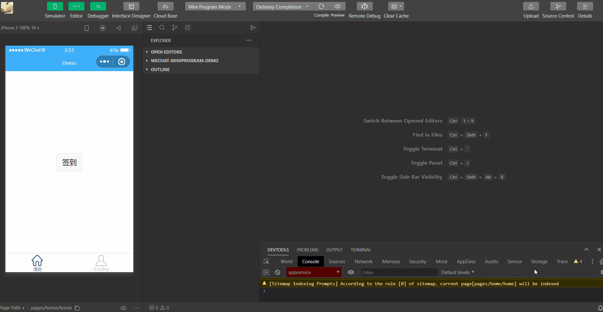

```raw
签到功能转自：https://gitee.com/Suwanbin/positionCheckIn
也可参考：https://github.com/SincerelyUnique/wechat-miniprogram-demo  （其实是上面作者的code拿过来用的）
微信小程序开发入门参考：
	https://www.ruanyifeng.com/blog/2020/10/wechat-miniprogram-tutorial-part-one.html
	http://www.ruanyifeng.com/blog/2020/10/wechat-miniprogram-tutorial-part-two.html
	http://www.ruanyifeng.com/blog/2020/10/wechat-miniprogram-tutorial-part-three.html
	http://www.ruanyifeng.com/blog/2020/11/wechat-miniprogram-tutorial-part-four.html
	https://github.com/ruanyf/wechat-miniprogram-demos/tree/master/demos/19.wx-navigateto
微信小程序官方教程：https://developers.weixin.qq.com/ebook?action=get_post_info&docid=0008aeea9a8978ab0086a685851c0a
微信小程序使用文档：https://developers.weixin.qq.com/miniprogram/dev/framework/
小程序地图组件使用文档：https://developers.weixin.qq.com/miniprogram/dev/component/map.html
腾讯位置服务使用指南：https://lbs.qq.com/miniProgram/jsSdk/jsSdkGuide/jsSdkOverview
 
```


