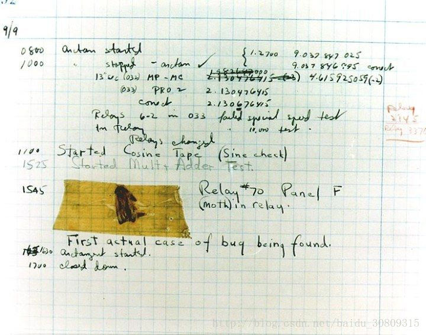
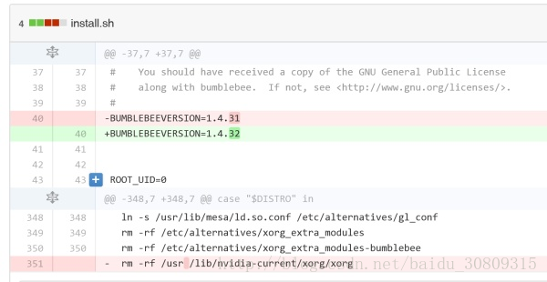
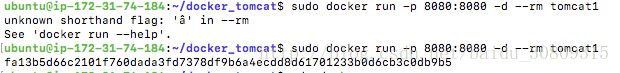

开篇娱乐： 如何写出无法维护的代码. 转自：[COOLSHELL](https://coolshell.cn/articles/4758.html)

1. 人类历史上的第一个程序Bug



你看到的是人类历史上的第一个程序Bug——烧糊的蛾子一枚。 1947年，哈佛大学的计算机哈佛二代（Harvard Mark II）突然停止了运行，程序员们费尽周折找到了这具虫子尸体，程序错误从此被称作Bug。 原来，哈佛二代当时还没有二极管和晶体管，它是一部继电器计算机，无数个喀哒作响的电磁开关在其中运作。当开关断开的时候会有电弧发出闪光，于是这只妖蛾子奋不顾身地飞了上去，用节肢动物的鲜血开辟了脊索动物的Debug史，从此名垂千古，永远地保存在了华盛顿的美国国家历史博物馆中。

3. 1900年闰年Bug

说明：打开你的iphone日历，你会看到1900年是闰年而2100年是平年，事实上如果个位十位都是0，除非能被400整除，否则不是闰年。只有个位为0并能被4整除时才是闰年。除了ios系统的日历问题，还有微软的Excel也是如此。网上是这样说的：在古老的Apple I诞生之日起，苹果的纪元（epoch）就是从1904年1月1日开始，它用32bit记录了从那之后的秒数，所以老的MAC系统最大能够记录到2040年（新的MAC扩展了位数）。而1904年之前则是通过简单的4年一个闰年的方法倒推到之前的年份，所以1900年被错误的认为是闰年而2100年不会。这种方式也被iOS所继承。后来因为兼容性问题，不做修改。曾经有人报告给Apple这个iPhone上的Bug，Apple未有答复。

官方论坛：https://discussions.apple.com/thread/5982489?tstart=0

4. 电磁辐射导致bit丢失

说明：
（1）医院使用的X射线导致电脑内存总是丢失几个 bit 的信息，而导致程序出问题，最终通过把电脑的内存用铅板隔起来解决！

（2）由于山上的辐射过大，导致电脑丢失bit信息.

来自Quara的一篇文章：https://www.quora.com/Whats-the-hardest-bug-youve-debugged/answer/Dave-Baggett

5. 文件在不同文件系统间拷贝文件时间改变的问题

说明：FAT32 文件系统采用FAT表（文件分配表）来存储文件的索引信息，为了尽量减少FAT表中每个文件占用的空间数量， FAT32 文件系统将文件大小限制为小于4GB， 文件时间精度限制为2秒，以偶数对齐。而NTFS文件系统采用的是MFT表（主文件表）来存储文件的元数据，这个主文件表相当于一个小的数据库，它可以存储更多的元数据。所以NTFS文件系统无论是文件大小还是文件时间精度都远远高于FAT32. NTFS的文件精度是100ns。由于两种文件系统的文件精度不一样，如果我们把文件从NTFS文件系统拷贝到FAT32文件，由于时间精度不同，文件时间将被强制以偶数对齐。

转自博客园：http://www.cnblogs.com/eaglet/archive/2012/10/12/2721165.html

6. 噪声震动引起的bug

说明：数据中心里面火灾报警器坏了，并没有真正着火，但是却出现了大面积的磁盘损坏和读写性能下降，对于机械硬盘（非SSD），噪声振动导致的硬盘磨损间接导致性能下降。

参考报告：http://www.availabilitydigest.com/public_articles/0602/inergen_noise.pdf

7. 一个空格引发的惨剧

说明：Bumblebee（一种linux优驰技术）的安装脚本上的一个疏忽，导致整个/usr目录被rm掉



转自github：https://github.com/MrMEEE/bumblebee-Old-and-abbandoned/commit/a047be85247755cdbe0acce6f1dafc8beb84f2ac

8. 配置文件中属性末尾多了个空格

说明：配置文件的标点符号、空格（包括配置文件每条属性的结尾空格）、半角全角、中英分号逗号等也可能会引起程序运行异常，之前有遇到过在配置文件配置某个属性时，在末尾因为存在一个空格（注意是结尾的空格，很难发现），导致上线部署总是读取配置属性失败。

9. 注意写update语句不加where

说明：如果没有备份，那么你的数据就game over了。

10. linux终端输入命令时，中文的-和英文的-不同可能会出现问题

说明：中文的-和英文的-外表没有不同，但是编码就是不一样，下面两个命令是一样的，但是运行结果不一样。



11. 2 +  2 == 4 bug，注意这里的 的编码其实是一个空格

参考：[StackOverflow](https://stackoverflow.com/questions/31507143/why-does-2-40-equal-42)、[codepoints](https://codepoints.net/U+1680)

12. 很熟悉的NPE

```java
if (object == null) {
    object.doSomething();
} else {
    object.doSomethingElse();
}
```

13. 只能发500英里的邮件

说明：大意是，当年麻省的一名系统管理员，忽然收到统计系主任打来的求助电话“咱们的邮件发不了500英里以外的地方，其实，是520英里更准确点”。系统管理员心里￥！&……*&。不过在他开始用自己的邮件测试后，发现邮件的确只能发往520英里以内，其余的收件地点一律失败。于是在他一片纠结中他渐渐开始发现问题，邮件服务器被人更新过操作系统（当年还是SunOS），但是由于操作系统的发行版往往配备了旧版软件，于是在更新操作系统的时候邮件软件反而被降级了（Sendmail 8 -> Sendmail 5）。于是进一步调查发现，在更新操作系统时，管理员自己编写的Sendmail配置文件（sendmail.cf）被保留了下来。这样就出现了这种状况：Sendmail 5尝试解析Sendmail 8的配置文件。但是为什么会是500miles呢？为什么是500miles咧？原因是这样的，Sendmail 5面对陌生的配置文件，凡是不理解的部分都会忽略，凡是没设置过的配置项自动设置成0。这样其中有一个被设置成0，这一项就是 （连接远端SMTP服务器的超时时间）timeout to connect to the remote SMTP server。后来经过实验，发现0秒的timeout会导致Sendmail在3毫秒后中断连接。所以，为啥是500miles？在当年，MIT的校园网是没有那么多router的，也就没那么多网络延迟，所以连接一个远端主机的时间大概就是光所需的时间。于是3毫秒, 就意味着：558英里。也就是558英里以外的服务器，都无法连接到，而558英里以内的服务器，都可以正常通信。

BUG原文：http://web.mit.edu/jemorris/humor/500-miles

转自：[知乎](https://www.zhihu.com/question/21747929)

14. USB设计的一个问题

说明：可能对于熟悉usb子系统的人来说这是常识. 不过我客户报上来这个问题的时候我还是很诧异的.3.0的U盘插3.0的usb口, 插快点儿就被识别成3.0设备. 插慢了... 就识别成2.0的设备...大家可以自己试试看, lsusb -t 可以看出来这个设备被挂在3.0下还是2.0下...

15. int mian()

说明：学过C的都知道，为什么是int main()，现在有很多书写void main()

参考：[int mian（）和void main() 的区别与争议](https://blog.csdn.net/vipleochan/article/details/9922445)
