1. Excel默认禁用宏，需手动启用

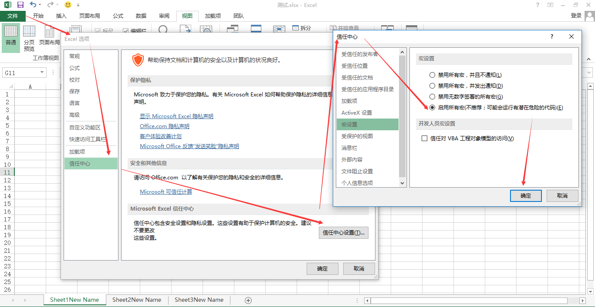

2. 查看宏

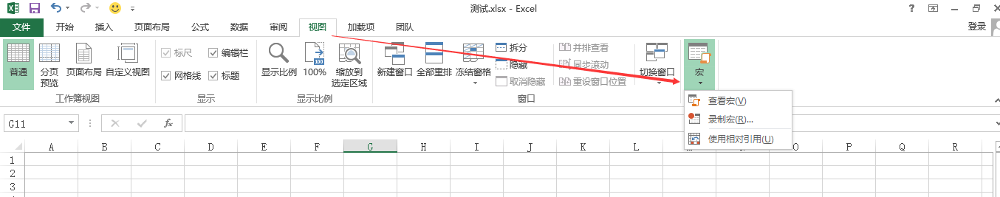

3. 写个简单宏：弹窗

```vba
Sub Hello()
    MsgBox ("Hello,world!")
End Sub
```

4. 将该宏的执行添加到菜单栏

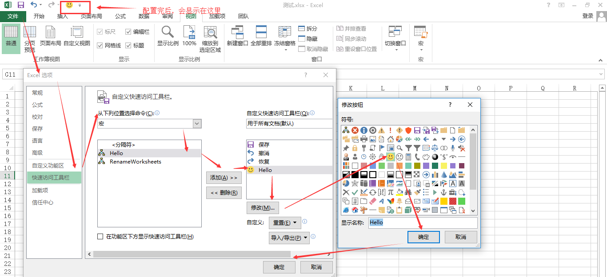

5. 点击刚刚添加的笑脸小图标，会执行刚刚的宏代码，进而弹窗

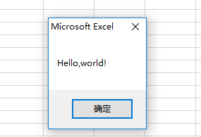

6. 修改某个sheet的名字

```vba
Sub RenameWorksheets()
    Worksheets("Sheet1").Name = "New Name"
End Sub
```

7. 修改所有sheet的名字：for循环的使用，这里workSheetItem是变量，可任意

```vba
Sub RenameWorksheets()
    For Each workSheetItem In Worksheets
        workSheetItem.Name = workSheetItem.Name & "New Name"
    Next
End Sub
```

8. 用当前sheet的B1单元格内容作为当前sheet的名字

```vba
Sub Test()
    For Each workSheetItem In Worksheets
        workSheetItem.Name = workSheetItem.Range("B1").Value
    Next
End Sub
```

9. 判空处理：<>意思是不等于，双引号指空文本，if和end if之间代码是符合当前条件的可执行语句

```vba
Sub Test()
    For Each workSheetItem In Worksheets
        If workSheetItem.Range("B1").Value <> "" Then
            workSheetItem.Name = workSheetItem.Range("B1").Value
        End If
    Next
End Sub
```

10. 定义变量：使用Dim定义，As后面是VBA的数据类型

```vba
Sub Test()
    Dim workSheetItem As Worksheet
    
    For Each workSheetItem In Worksheets
        If workSheetItem.Range("B1").Value <> "" Then
            workSheetItem.Name = workSheetItem.Range("B1").Value
        End If
    Next
End Sub
```

11. 创建图表：

ActiveSheet指当前所在的sheet，（100，50，300，200）指左上角坐标为（100，50），图标长为300，宽为200，With…End With 构造来对该对象执行操作

```vba
Sub Chart()
    Dim myChart As ChartObject
    Set myChart = ActiveSheet.ChartObjects.Add(100, 50, 300, 200)
    
    With myChart
        .Chart.SetSourceData Source:=Selection
    End With
    
End Sub
```

随便在A1至A5写几个数字，选中该区域（=Selection），执行宏，效果如下（默认是条形图）

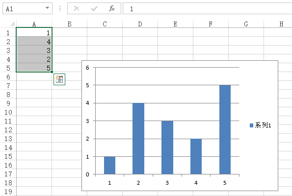

我们还可以让输出为饼图，注意ChartType

```vba
Sub Chart()
    Dim myChart As ChartObject
    Set myChart = ActiveSheet.ChartObjects.Add(100, 50, 300, 200)
    
    With myChart
        .Chart.SetSourceData Source:=Selection
        .Chart.ChartType = xlPie
    End With
    
End Sub
```

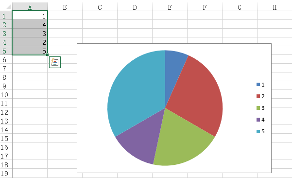

或是指定修改A4的值为8，此时单元格和图表都会变成8

```vba
Sub Chart()
    Dim myChart As ChartObject
    Set myChart = ActiveSheet.ChartObjects.Add(100, 50, 300, 200)
    Application.ActiveSheet.Range("a4").Value = 8
    
    With myChart
        .Chart.SetSourceData Source:=Selection
        .Chart.ChartType = xlPie
    End With
    
End Sub
```

或是让用户手动修改A5的值

```vba
Sub Chart()
    Dim myChart As ChartObject
    Set myChart = ActiveSheet.ChartObjects.Add(100, 50, 300, 200)
    Application.ActiveSheet.Range("a4").Value = 8
    
    myInput = InputBox("Please type a number:")
    Application.ActiveSheet.Range("a5").Value = myInput
    
    With myChart
        .Chart.SetSourceData Source:=Selection
        .Chart.ChartType = xlPie
    End With
    
End Sub
```

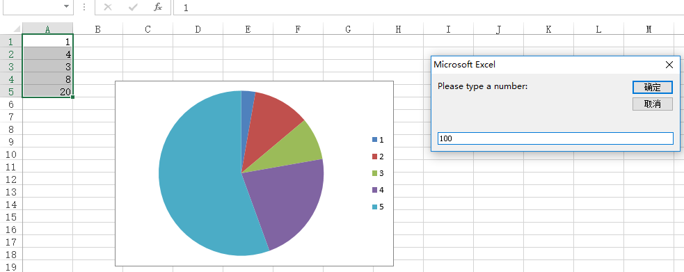

修改为100后输出如下图

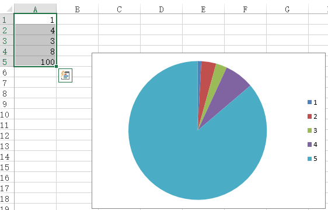

12. 用户窗体：与用户交互

点击 插入-用户窗体，我们以插入一个 button 按钮为例

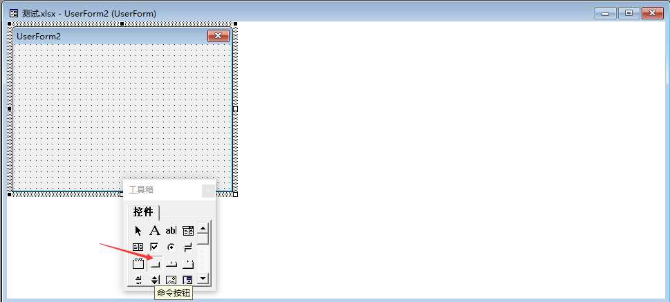

鼠标拖拽到编辑区域

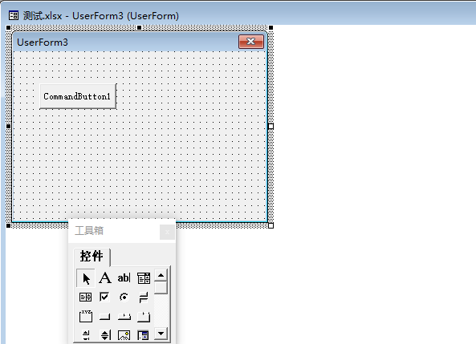

点击按钮，右键，选择-查看代码

修改代码如下，记住Run方法里传入的是已经写好的宏的名字，就是上面的Hello

```vba
Private Sub CommandButton1_Click()
    Run ("Hello")
End Sub
```

此时我们点击运行那个小三角号就可以看到效果了

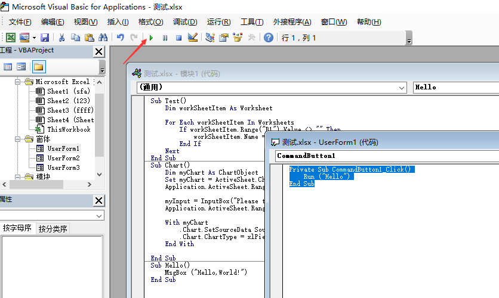

附录：

本文转自：[MSDN](https://docs.microsoft.com/zh-cn/previous-versions/office/ee814737(v=office.14)?redirectedfrom=MSDN#odc_Office14_ta_GettingStartedWithVBAInExcel2010_ARealWorldExample)
