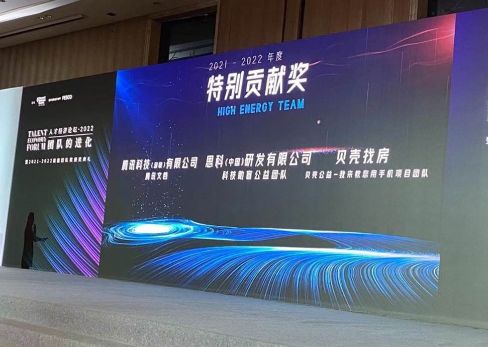
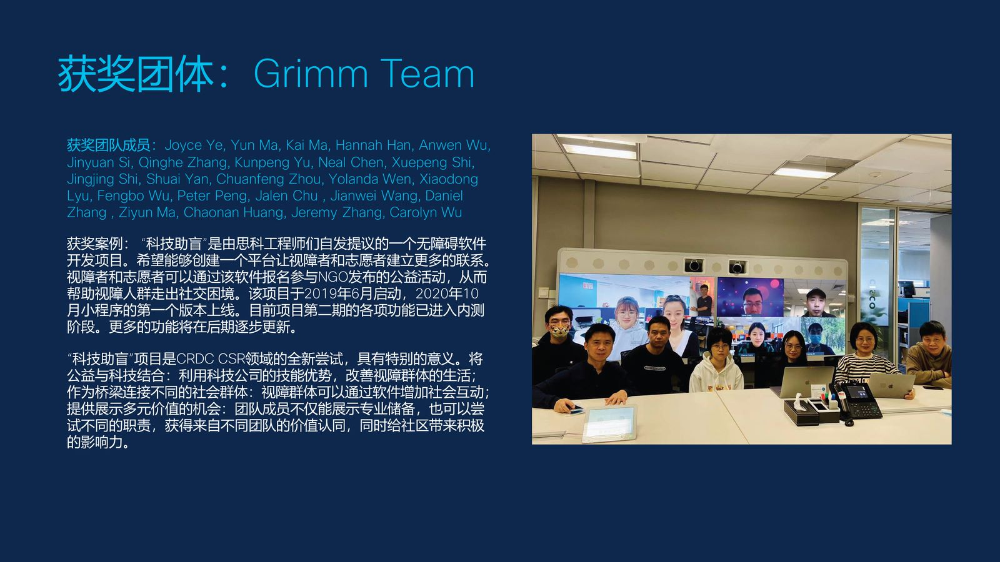

:::info
祝贺思科（中国）研发有限公司 科技助盲公益团队 赢得了哈佛商业评论2021-2022年度特别贡献奖！！！
:::

:::default
Congratulations to the Grimm Project Team!!

We won the high energy team award from Harvard Business Review China Edition!!!

Deeply appreciate every team member for your effort for Grimm project!
:::

:::primary
很荣幸作为团队的一员，也希望以后的公益项目越做越好~
:::

:::success
感谢上海NGO团队以及Alex的热心帮助
感谢PM Joyce，Yun和Judy的信任和帮忙，能够让项目越走越远。
感谢后端Fengbo与Peter支持与信任
感谢小程序端Qinghe与Xuepeng的帮忙
感谢Admin端Neal的帮忙
感谢UI Hanna的精美设计
感谢Team中的每个奉献力量的小伙伴，加油！
:::

:::success
同时祝贺Grimm项目获得2021思科年度最具创意公益项目奖 

Most Innovative Volunteer Program(1 award published)
:::

