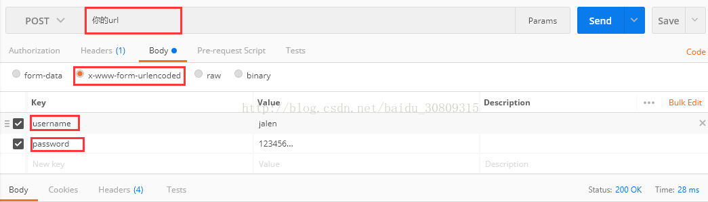

> 说明：访问远程服务器数据，可以使用SUN公司提供的HttpURLConnection对象，也可以使用Apache的HttpClient，这里测试的是HttpClient。

1. POST

```java
public static String post(){
        String result = "";
        HttpClient client = new DefaultHttpClient();
        String url = "http://... ...";
        HttpPost post = new HttpPost(url);
        List<NameValuePair> paramList = new ArrayList<>();
        BasicNameValuePair param1 = new BasicNameValuePair("username","jalen");
        BasicNameValuePair param2 = new BasicNameValuePair("password","123456");
        paramList.add(param1);
        paramList.add(param2);
 
        try {
            post.setEntity(new UrlEncodedFormEntity(paramList,"UTF-8"));
            HttpResponse response = client.execute(post);
            if (response.getStatusLine().getStatusCode()==200){
                result = EntityUtils.toString(response.getEntity());
                System.out.println(result);
            }
        }catch (IOException ioe){
            ioe.printStackTrace();
        }
        return result;
    }
```

使用postman传参，注意当提交参数里带有文件格式的数据，设置contentType，使用form-data进行提交，表单提交的contentType一般默认是x-www-form-urlencoded



2. GET

```java
    public static String get(){
        String result = "";
 
        try{
            HttpClient httpClient = new DefaultHttpClient();
            String url = "http://... ...?username=&password=";
            HttpGet httpGet = new HttpGet(url);
            HttpResponse httpResponse = httpClient.execute(httpGet);
            if(httpResponse.getStatusLine().getStatusCode()==200){
                result = EntityUtils.toString(httpResponse.getEntity());
            }
        }catch(IOException ioe){
            ioe.printStackTrace();
        }
        return result;
    }
```
直接网页访问url即可测试
