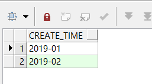
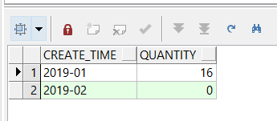
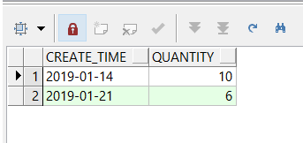
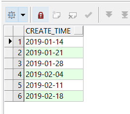
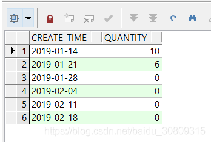
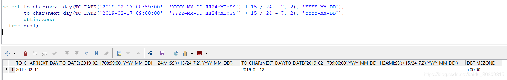
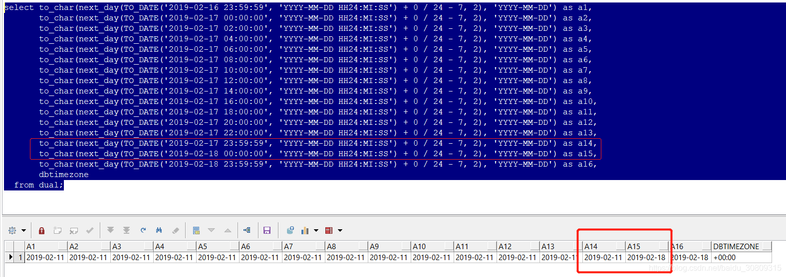

1. 按月

(1) 简单分组查询

```sql
-- 分组后查询数据: 仅1月份6条，2月份因为不存在记录，没有显示
SELECT to_char(r.sys_created_on, 'yyyy-mm') AS create_time, count(*) AS quantity
  FROM table_r r,table_g g
 WHERE r.assignment_group = g.sys_id 
       AND g.name = 'Provisioning Ops'
   AND r.sys_created_on BETWEEN 
                TO_DATE('2019-01-19 00:00:00', 'YYYY-MM-DD HH24:MI:SS') AND
                TO_DATE('2019-02-18 23:59:59', 'YYYY-MM-DD HH24:MI:SS')
 GROUP BY to_char(r.sys_created_on, 'yyyy-mm')
 ORDER BY to_char(r.sys_created_on, 'yyyy-mm');
```


（2）构建虚拟月份表

```sql
-- 虚拟月份
SELECT TO_CHAR(ADD_MONTHS(TO_DATE(substr('2019-01-19 23:59:59', 1, 7), 'yyyy-MM'), ROWNUM - 1),
               'yyyy-MM') AS create_time
  FROM DUAL
CONNECT BY ROWNUM <=
           months_between(TO_DATE(substr('2019-02-18 23:59:59', 1, 7), 'YYYY-MM'),
                          TO_DATE(substr('2019-01-19 23:59:59', 1, 7), 'yyyy-MM')) + 1;
```



（3）连接后分组查询：

```sql
-- 左连接
SELECT a.create_time as create_time, nvl(b.quantity, 0) as quantity
  FROM (SELECT TO_CHAR(ADD_MONTHS(TO_DATE(substr('2019-01-19 23:59:59', 1, 7),
                                          'yyyy-MM'),
                                  ROWNUM - 1),
                       'yyyy-MM') AS create_time
          FROM DUAL
        CONNECT BY ROWNUM <=
                   months_between(TO_DATE(substr('2019-02-18 23:59:59', 1, 7),
                                          'YYYY-MM'),
                                  TO_DATE(substr('2019-01-19 23:59:59', 1, 7),
                                          'yyyy-MM')) + 1) a
  LEFT JOIN (SELECT to_char(r.sys_created_on, 'yyyy-mm') AS create_time,
                    count(*) AS quantity
               FROM table_r r, table_g g
              WHERE r.assignment_group = g.sys_id
                AND g.name = 'Provisioning Ops'
                AND r.sys_created_on BETWEEN
                    TO_DATE('2019-01-19 00:00:00', 'YYYY-MM-DD HH24:MI:SS') AND
                    TO_DATE('2019-02-18 23:59:59', 'YYYY-MM-DD HH24:MI:SS')
              GROUP BY to_char(r.sys_created_on, 'yyyy-mm')
              ORDER BY to_char(r.sys_created_on, 'yyyy-mm')) b
    ON a.create_time = b.create_time
 ORDER BY a.create_time
```



2. 按周

(1) 简单分组查询

```sql
-- 分组查询：仅有2周存在记录，2019-01-14和2019-01-21分别为这两周的周一
SELECT to_char(next_day(r.sys_created_on + 15 / 24 - 7, 2), 'YYYY-MM-DD') create_time,
       count(*) quantity
  FROM table_r r, table_g g
 WHERE r.assignment_group = g.sys_id
   AND g.name = 'Provisioning Ops'
   AND r.sys_created_on BETWEEN
       TO_DATE('2019-01-19 00:00:00', 'YYYY-MM-DD HH24:MI:SS') AND
       TO_DATE('2019-02-18 23:59:59', 'YYYY-MM-DD HH24:MI:SS')
 GROUP BY to_char(next_day(r.sys_created_on + 15 / 24 - 7, 2), 'YYYY-MM-DD')
 ORDER BY to_char(next_day(r.sys_created_on + 15 / 24 - 7, 2), 'YYYY-MM-DD')
```



(2) 构建虚拟周数表：

```sql
-- 虚拟周数
SELECT to_char(trunc(TO_DATE('2019-01-19 00:00:00', 'YYYY-MM-DD HH24:MI:SS') +
                     (ROWNUM - 1) * 7,
                     'd') + 1,
               'yyyy-MM-dd') AS create_time
  FROM DUAL
CONNECT BY ROWNUM <=
           (TRUNC(TO_DATE('2019-02-18 00:00:00', 'YYYY-MM-DD HH24:MI:SS'),
                  'IW') -
           TRUNC(TO_DATE('2019-01-19 23:59:59', 'YYYY-MM-DD HH24:MI:SS'),
                  'IW')) / 7 + 1
```



(3) 连接后分组查询：

```sql
-- 左连接
SELECT a.create_time as create_time, nvl(b.quantity, 0) as quantity
  FROM (SELECT to_char(trunc(TO_DATE('2019-01-19 00:00:00',
                                     'YYYY-MM-DD HH24:MI:SS') +
                             (ROWNUM - 1) * 7,
                             'd') + 1,
                       'yyyy-MM-dd') AS create_time
          FROM DUAL
        CONNECT BY ROWNUM <=
                   (TRUNC(TO_DATE('2019-02-18 00:00:00',
                                  'YYYY-MM-DD HH24:MI:SS'),
                          'IW') - TRUNC(TO_DATE('2019-01-19 23:59:59',
                                                 'YYYY-MM-DD HH24:MI:SS'),
                                         'IW')) / 7 + 1) a
  LEFT JOIN (SELECT to_char(next_day(r.sys_created_on + 15 / 24 - 7, 2),
                            'YYYY-MM-DD') create_time,
                    count(*) quantity
               FROM table_r r, table_g g
              WHERE r.assignment_group = g.sys_id
                AND g.name = 'Provisioning Ops'
                AND r.sys_created_on BETWEEN
                    TO_DATE('2019-01-19 00:00:00', 'YYYY-MM-DD HH24:MI:SS') AND
                    TO_DATE('2019-02-18 23:59:59', 'YYYY-MM-DD HH24:MI:SS')
              GROUP BY to_char(next_day(r.sys_created_on + 15 / 24 - 7, 2),
                               'YYYY-MM-DD')
              ORDER BY to_char(next_day(r.sys_created_on + 15 / 24 - 7, 2),
                               'YYYY-MM-DD')) b
    ON a.create_time = b.create_time
 ORDER BY a.create_time
```




参考：

周数转日期： https://www.cnblogs.com/Innogen/p/8269092.html

构建虚拟表：https://www.cnblogs.com/LLSutdy/p/7998322.html

整体参考：https://blog.csdn.net/weixin_36150793/article/details/81607574

纠正：

按周查询那条sql测试有问题，本地测时发现如下问题：

```sql
select to_char(next_day(TO_DATE('2019-02-17 08:59:00', 'YYYY-MM-DD HH24:MI:SS') + 15 / 24 - 7, 2), 'YYYY-MM-DD'),
       to_char(next_day(TO_DATE('2019-02-17 09:00:00', 'YYYY-MM-DD HH24:MI:SS') + 15 / 24 - 7, 2), 'YYYY-MM-DD'),
       dbtimezone
  from dual;
```




本人猜测应该算法还是这个算法，只是和时区关联上了，因为本公司DB时区统一采用UTC时间（=GMT时间，其实他们还是有区别的），所以找了一个周的交叉点用笨方法测试了一下（就是一个个改数字，好笨啊，毕竟算法没看懂），sql如下：

```sql
select to_char(next_day(TO_DATE('2019-02-16 23:59:59', 'YYYY-MM-DD HH24:MI:SS') + 0 / 24 - 7, 2), 'YYYY-MM-DD') as a1,
       to_char(next_day(TO_DATE('2019-02-17 00:00:00', 'YYYY-MM-DD HH24:MI:SS') + 0 / 24 - 7, 2), 'YYYY-MM-DD') as a2,
       to_char(next_day(TO_DATE('2019-02-17 02:00:00', 'YYYY-MM-DD HH24:MI:SS') + 0 / 24 - 7, 2), 'YYYY-MM-DD') as a3,
       to_char(next_day(TO_DATE('2019-02-17 04:00:00', 'YYYY-MM-DD HH24:MI:SS') + 0 / 24 - 7, 2), 'YYYY-MM-DD') as a4,
       to_char(next_day(TO_DATE('2019-02-17 06:00:00', 'YYYY-MM-DD HH24:MI:SS') + 0 / 24 - 7, 2), 'YYYY-MM-DD') as a5,
       to_char(next_day(TO_DATE('2019-02-17 08:00:00', 'YYYY-MM-DD HH24:MI:SS') + 0 / 24 - 7, 2), 'YYYY-MM-DD') as a6,
       to_char(next_day(TO_DATE('2019-02-17 10:00:00', 'YYYY-MM-DD HH24:MI:SS') + 0 / 24 - 7, 2), 'YYYY-MM-DD') as a7,
       to_char(next_day(TO_DATE('2019-02-17 12:00:00', 'YYYY-MM-DD HH24:MI:SS') + 0 / 24 - 7, 2), 'YYYY-MM-DD') as a8,
       to_char(next_day(TO_DATE('2019-02-17 14:00:00', 'YYYY-MM-DD HH24:MI:SS') + 0 / 24 - 7, 2), 'YYYY-MM-DD') as a9,
       to_char(next_day(TO_DATE('2019-02-17 16:00:00', 'YYYY-MM-DD HH24:MI:SS') + 0 / 24 - 7, 2), 'YYYY-MM-DD') as a10,
       to_char(next_day(TO_DATE('2019-02-17 18:00:00', 'YYYY-MM-DD HH24:MI:SS') + 0 / 24 - 7, 2), 'YYYY-MM-DD') as a11,
       to_char(next_day(TO_DATE('2019-02-17 20:00:00', 'YYYY-MM-DD HH24:MI:SS') + 0 / 24 - 7, 2), 'YYYY-MM-DD') as a12,
       to_char(next_day(TO_DATE('2019-02-17 22:00:00', 'YYYY-MM-DD HH24:MI:SS') + 0 / 24 - 7, 2), 'YYYY-MM-DD') as a13,
       to_char(next_day(TO_DATE('2019-02-17 23:59:59', 'YYYY-MM-DD HH24:MI:SS') + 0 / 24 - 7, 2), 'YYYY-MM-DD') as a14,
       to_char(next_day(TO_DATE('2019-02-18 00:00:00', 'YYYY-MM-DD HH24:MI:SS') + 0 / 24 - 7, 2), 'YYYY-MM-DD') as a15,
       to_char(next_day(TO_DATE('2019-02-18 23:59:59', 'YYYY-MM-DD HH24:MI:SS') + 0 / 24 - 7, 2), 'YYYY-MM-DD') as a16,
       dbtimezone
  from dual;
```



可以看到明显有个时间的跳变，正好和日期对上了！ 
