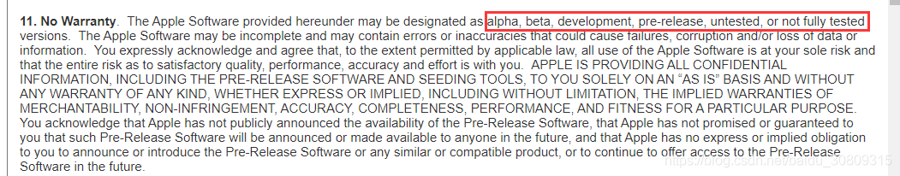

方法一：

1. 进入appstore点击软件下载，此时会提示200M上限，然后home键返回桌面

2. 进入配置，选择通用，选择日期与时间，将自动设置关闭，修改时间到将来的某一天，返回上一级，home键返回桌面

3. 点击一下刚刚下载软件的图标即可

方法二：

升级IOS13版本，但是当前为公测版本，阅读协议发现如下警告，所以不建议尝试

### 参考

https://www.youtube.com/watch?v=K3z513sg8FQ

